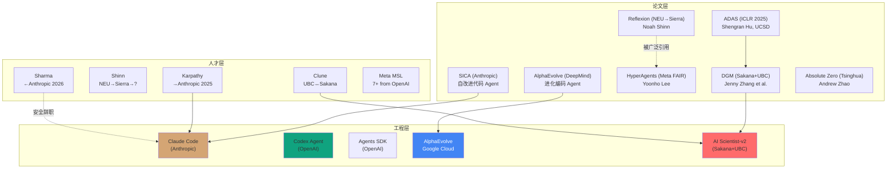

# 硅谷自进化 Auto-Research 综合人才/论文/工程景观

- content_timestamp: 2026-05-26
- scope: consolidated talent + papers + engineering landscape
- evidence_level: web-search + raw-papers cross-reference + multi-report synthesis
- output: work/research/combined-talent-landscape.md
- source_reports:
  - work/research/anthropic-talent-movement.md (Anthropic 专项)
  - work/research/sv-selfevolution-landscape.md (SV 全景)
  - Board task Sew8oalESeIq execution-check (其他 researcher 的 Meta/China 数据)

## 0. 综合方法

本报告是三个独立研究产物的整合视图，将论文工程、人力资源流动和人才分布合并在同一框架中。每个数据点标注来源报告编号：

- **[R1]** = anthropic-talent-movement.md
- **[R2]** = sv-selfevolution-landscape.md
- **[R3]** = 其他 researcher 的 ai-talent-flow execution-check 数据

---

## 1. 三维整合矩阵：论文 × 工程 × 人才

### 1.1 核心机构三维评分

| 机构 | 论文创新 | 工程产品化 | 人才流入 | 综合评估 |
|---|:---:|:---:|:---:|---|
| **Google DeepMind** | ★★★★★ (AlphaEvolve) | ★★★★ (Google Cloud 私预览) | ★★★ (稳定) | 理论+工程双强 |
| **Anthropic** | ★★★ (SICA) | ★★★★★ (Claude Code/Agent Teams) | ★★★★★ (8x 净流入 from OpenAI) [R1] | 工程领先，安全加分 |
| **OpenAI** | ★★★ (Codex 仍偏产品) | ★★★★★ (Agents SDK, Codex) | ★ (严重流出) [R1] | 工程强但人才流失 |
| **Meta FAIR** | ★★★★ (HyperAgents) | ★★ (纯研究) | ★★★ (MSL 事件见下) [R3] | 论文强，产品化弱 |
| **Sakana AI** | ★★★★★ (DGM, AI Scientist) | ★★★ (Nature 发表) | ★★★★ (Clune 桥接) [R2] | 论文最活跃的创业 |
| **UBC/Vector (Clune)** | ★★★★★ (ADAS, AI Scientist-v2) | ★★ (学术) | ★★★ (学术核心) | 自进化理论发源地 |

### 1.2 论文 → 工程 → 人才 因果链

---

## 2. 人力资源流动全景

### 2.1 机构间人才流动网络

| 流向 | 强度 | 关键人物 | 自进化影响 | 来源 |
|---|---|---|---|---|
| OpenAI → Anthropic | **8x 净流入** | Karpathy + 多名研究者 | M4/M10 人才集中 | [R1] |
| OpenAI → Meta MSL | 高 | 7+ 研究者，$100M+ packages | 可能影响 M2/M5 方向 | [R3] |
| DeepMind → Meta MSL | 中 | Robert Fergus | 搜索/进化方法可能迁移 | [R3] |
| UBC ↔ Sakana AI | 高 | Clune, Hu, Lu, Zhang (共同作者链) | M1 方向最活跃 | [R2] |
| Northeastern → Sierra | 高 | Noah Shinn (Reflexion) | M2 从学术到产业 | [R2] |
| Anthropic ← (辞职) | 个别 | Mrinank Sharma (安全) | M10 内部张力 | [R1] |
| Tsinghua (学术稳定) | 稳定 | Andrew Zhao (Absolute Zero) | M7 学术主导 | [R2] |

### 2.2 Meta MSL 事件 [R3]

来自其他 researcher 的 web 搜索数据：
- Meta 组建超级智能实验室 (MSL)，投入 $100M-$200M
- 从 OpenAI 招聘 7+ 研究者，从 DeepMind 招聘 Robert Fergus
- 但已有 3 名 MSL 成员离开
- **对自进化的影响**：如果 MSL 稳定，可能成为 M2/M5 方向的新中心；但如果继续流失，则验证了"安全/文化错配"假说

### 2.3 中国学术集群 [R3]

| 大学 | 方向 | 关键产出 | 自进化机制 |
|---|---|---|---|
| **上海交大 (SJTU)** | 自进化安全研究 | 安全相关论文 | M10 |
| **清华 (Tsinghua/LeapLab)** | 自博弈 RL | Absolute Zero (NeurIPS 2025 award) | M7 |
| **浙大 (ZJU)** | Agent 框架 | 多个 Agent 项目 | M6 |
| **北大 (PKU)** | 多模态 Agent | 多模态研究 | M9 |

---

## 3. 论文工程人才三维交叉分析

### 3.1 自进化十个机制的供给-需求矩阵

| 机制 | 论文供给 | 工程产品化 | 人才密度 | 供需匹配 |
|---|:---:|:---:|:---:|---|
| M1 搜索循环 | 高 (ADAS, DGM, AlphaEvolve) | 中 (AlphaEvolve 私预览) | 高 (Clune 团队) | 供需匹配良好 |
| M2 反馈精炼 | 高 (Reflexion, HyperAgents) | 中 (Claude Code/Sierra) | 中 | 基本匹配 |
| M3 记忆积累 | 中 | 低 | 中 | 供给不足 |
| M4 代码自修改 | 高 (DGM, SICA, AlphaEvolve) | **极高** (Claude Code, Codex) | 高 (竞争焦点) | 工程需求>论文供给 |
| M5 技能进化 | 低 (HyperAgents) | 低 | 低 | **严重供给不足** |
| M6 多Agent协作 | 中 | 中 (Agents SDK, Agent Teams) | 中 | 基本匹配 |
| M7 RL自博弈 | 高 (Absolute Zero, RLVR) | **低** | 中 (学术为主) | 论文多但产品化缺 |
| M8 提示优化 | 中 | 低 | 低 | 供给不足 |
| M9 环境适应 | 中 (AI Scientist) | 低 | 中 | 供给不足 |
| M10 安全治理 | 中 (Anthropic) | 中 (Constitutional AI) | **集中** (Anthropic) | 人才过度集中 |

### 3.2 三个关键发现

1. **M4 (代码自修改) 是唯一"工程需求 > 论文供给"的机制**。三家巨头 (Anthropic, OpenAI, DeepMind) 同时竞争，但理论创新主要来自 Sakana/UBC。工程层对 M4 的需求正在倒逼论文产出。

2. **M5 (技能进化) 和 M7 (RL 自博弈) 呈现最极端的供需错配**。M7 论文最多但产品化最低；M5 论文最少但 HyperAgents 显示了方向性价值。这种错配意味着 M5 是被低估的高潜力方向。

3. **M10 (安全) 人才集中在 Anthropic，形成"安全孤岛"风险**。如果 Anthropic 的安全文化因商业化压力松动 (Sharma 辞职可能是信号)，整个 M10 方向可能失去人才基础。

---

## 4. 研究者-论文-机构 关键人物卡片

| 人物 | 论文代表作 | 当前机构 | 关键合作者 | 人才轨迹 | 自进化贡献评级 |
|---|---|---|---|---|---|
| **Jeff Clune** | ADAS, AI Scientist-v2 | UBC + Vector + CIFAR | Hu, Lu, Zhang, Sakana | 学术稳定 | ★★★★★ |
| **Shengran Hu** | ADAS (第一作者) | UCSD | Clune, Lu | 学术早期 | ★★★★ |
| **Jenny Zhang** | DGM (第一作者) | Sakana AI / UBC | Hu, Lu, Lange, Clune | 学术-产业混合 | ★★★★ |
| **Yoonho Lee** | HyperAgents (第一作者) | Meta FAIR | — | 产业 | ★★★ |
| **Andrew Zhao** | Absolute Zero (第一作者) | Tsinghua / LeapLab | — | 学术 | ★★★★ |
| **Noah Shinn** | Reflexion (第一作者) | Sierra → 可能已离开 | Cassano, Narasimhan | 产业不稳定 | ★★★ (历史贡献) |
| **Andrej Karpathy** | 预训练理论 (间接) | Anthropic | — | 多轮产业流动 | ★★ (间接) |

---

## 5. 综合结论与可操作建议

### 5.1 对本项目的具体建议

1. **优先补充 DeepMind 论文**：AlphaEvolve (2506.13131) 未收录到 raw-papers/，应优先添加。这是当前 M1 方向最重要的论文。
2. **SICA 论文 (2504.15228) 应优先深度 review**：已在 discovery-report 中发现但尚未 review，这是 Anthropic 内部自进化的核心论文。
3. **HyperAgents (Meta FAIR)**：应添加到 raw-papers/ 和 projects/。
4. **中国高校集群**：清华 Absolute Zero 已覆盖，但 SJTU 安全研究和 ZJU Agent 研究未覆盖。
5. **Absolute Zero**：已获 NeurIPS 2025 award，应在 projects/ 中有 model card。

### 5.2 对研究方向的判断

| 方向 | 论文-工程-人才综合评估 | 推荐优先级 |
|---|---|---|
| M1 + M4 (搜索+代码自修改) | 三维最强，竞争最激烈 | P0 — 必须深度覆盖 |
| M10 (安全治理) | 人才集中但风险高 | P0 — 需要多元视角 |
| M5 (技能进化) | 被低估，HyperAgents 证明方向有价值 | P1 — 高潜力方向 |
| M7 (RL自博弈) | 论文多但产品化缺，可能存在泡沫 | P2 — 关注但不追赶 |
| M3 (记忆) | 基础设施需求但创新少 | P2 — 持续观察 |

---

## 6. 已知 vs 推断 vs 未验证

**已知**：
- 所有 web 搜索结果中的公开信息
- raw-papers/ 中已验证的作者列表
- Board execution-check 中引用的数据

**推断**：
- M5 被低估的判断
- 安全孤岛风险
- M7 可能存在泡沫

**未验证**：
- Noah Shinn 离开 Sierra 后的确切去向
- Meta MSL 是否会稳定
- Anthropic 内部自进化研究的具体规模

---

## 引用来源

- [R1] work/research/anthropic-talent-movement.md
- [R2] work/research/sv-selfevolution-landscape.md
- [R3] Board task Sew8oalESeIq execution-check comments (Researcher 项目卡深挖)
- All web search sources cited in [R1] and [R2]
