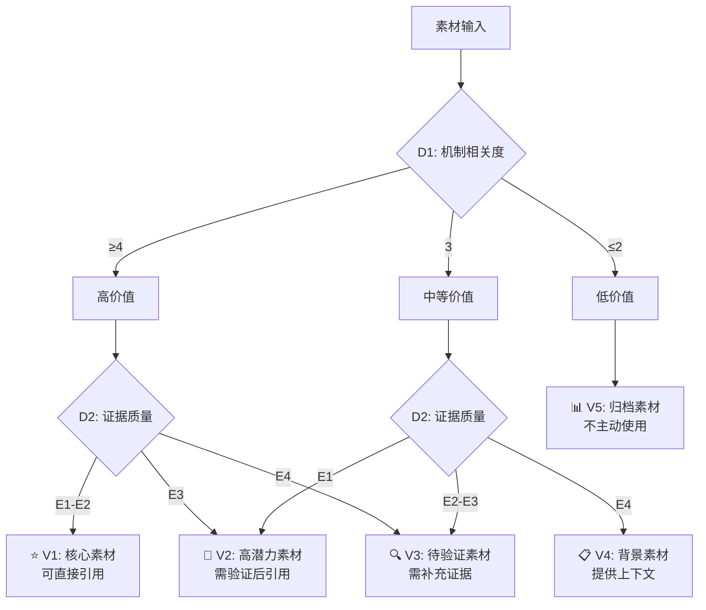

# 素材Rank与价值区分框架

> 核心原则：没有rank的素材=无效素材。每个素材必须回答"它对Agent进化有什么价值"。

## 0. 框架概览

**一句话**：统一所有现有分类系统（6套独立体系）为一个四维评分框架，让每个素材都有明确的价值等级和可操作性。

**现有分类系统统一映射**：

| 现有系统 | 覆盖范围 | 分类维度 | 本框架角色 |
|---------|---------|---------|-----------|
| paper-reviews method_category | 50篇review | 6类方法 | → 机制维度输入 |
| repo-classification.json | 527 repos | category + function_tag + base_theme | → 三维tag输入 |
| paper-method-classification | 196 papers | 7族方法 | → 方法族维度输入 |
| self-evolution-taxonomy | 100+ papers | 4轴(L1-L4) | → 正式分类锚点 |
| 02-pattern-taxonomy | 全域 | 4 loop archetypes | → 进化模式匹配 |
| strategy-taxonomy | 107 repos | 11种策略 | → 策略维度输入 |

---

## 1. 四维评分体系 (4D-Rank)

每个素材在四个维度上获得评分，总分决定价值等级。

### 维度 D1: 进化机制相关度 (Evolution Mechanism Relevance, 0-5分)

| 分数 | 含义 | 标准 | 对应self-evolution-taxonomy轴 |
|------|------|------|-------------------------------|
| 5 | 核心进化机制 | 直接提出/实现新的自我进化方法 | L1+L2+L3覆盖 |
| 4 | 进化使能技术 | 为进化提供关键基础设施（评估器、记忆、搜索） | 覆盖L1或L2中2+ |
| 3 | 进化相关应用 | 在特定领域应用进化方法 | 覆盖L1或L2中1 |
| 2 | 进化背景知识 | 提供上下文但不直接贡献机制 | 间接相关 |
| 1 | 边缘相关 | 题目相关但内容不涉及进化 | 仅主题相关 |
| 0 | 无关 | 与Agent进化无关 | 无映射 |

**判定规则**：
- `method_category` = architecture/search-based → D1 ≥ 4
- `method_category` = feedback-and-refinement → D1 ≥ 3
- `method_category` = reward-based → D1 ≥ 3
- `method_category` = multi-agent co-evolution → D1 ≥ 4
- `method_category` = memory/experience-based → D1 ≥ 3
- `method_category` = general agent self-improvement → D1 ≥ 2

### 维度 D2: 证据质量 (Evidence Quality, E1-E4)

| 等级 | 标签 | 含义 | 判定标准 |
|------|------|------|---------|
| E1 | [VERIFIED] | 有可追溯的原始数据支撑 | 有arXiv ID + 可复现实验 + 开源代码 |
| E2 | [SURVEY] | 来自survey章节或已验证分析 | 引用survey/ch*.tex中的具体论述 |
| E3 | [INFERRED] | 基于交叉验证的分析推断 | 被2+独立来源支持但无直接原始数据 |
| E4 | [UNVERIFIED] | 未经验证的声明 | 无原始数据支撑，需进一步验证 |

**判定规则**：
- 有开源代码 + 可复现实验 → E1
- 来自survey章节 → E2
- 被2+独立来源支持 → E3
- 其他 → E4

### 维度 D3: 加工深度 (Processing Depth, T1-T4)

| 层级 | 标签 | 含义 | 对应目录层 |
|------|------|------|-----------|
| T1 | Raw | 原始采集，未经加工 | raw-github/, raw-papers/, raw-social/, raw-blogs/ |
| T2 | Processed | 经过清洗/分类/统计 | analysis/, research/repo-classification.json |
| T3 | Analyzed | 经过深度分析/评审 | paper-reviews/, projects/, research/*.md |
| T4 | Synthesized | 经过综合提炼/框架化 | paper-drafts/, survey/, work/research/ |

**价值判断**：T1→T4不代表质量递增，而是代表投入的加工深度。Raw素材的价值在于"还没被榨干"，Synthesized的价值在于"已经可以直接使用"。

### 维度 D4: 可操作性 (Actionability, A1-A4)

| 等级 | 含义 | 判定标准 |
|------|------|---------|
| A1 | 可直接用于论文/网站 | 已写好的论点+证据链+引用 |
| A2 | 可直接用于分析 | 已分类/标注，可直接引用 |
| A3 | 需要加工才能使用 | 有价值但需要提取/整理 |
| A4 | 仅作参考 | 背景知识，不直接产出 |

---

## 2. 综合价值等级 (Value Tier)

基于四维评分的综合等级：



### 价值等级定义

| 等级 | 符号 | 标准 | 处理方式 |
|------|------|------|---------|
| V1 | ⭐ | D1≥4 ∧ E1-E2 | 直接用于论文/网站/分析 |
| V2 | 📌 | D1≥4 ∧ E3, 或 D1=3 ∧ E1 | 验证后引用，优先处理 |
| V3 | 🔍 | D1≥3 ∧ E3-E4, 或 D1=4 ∧ E4 | 需补充证据，分配给Researcher |
| V4 | 📋 | D1=2-3 ∧ E2-E4 | 提供上下文，不主动引用 |
| V5 | 📊 | D1≤1 | 归档，不投入资源 |

---

## 3. 各素材层分级统计

### 3.1 Raw层 (T1)

| 素材源 | 总量 | 预估V1-V2 | 预估V3 | 预估V4-V5 | 分类依据 |
|--------|-----:|----------:|-------:|----------:|---------|
| raw-github | 490 | ~50 (10%) | ~150 (31%) | ~290 (59%) | repo-classification.json中evolution-related repos |
| raw-papers | 128 unique | ~40 (31%) | ~50 (39%) | ~38 (30%) | paper-method-classification中code/RL/multi-agent族 |
| raw-social | 650+ md | ~20 (3%) | ~100 (15%) | ~530 (82%) | rank文件是精选子集(234条) |
| raw-blogs | 650+ md | ~15 (2%) | ~80 (12%) | ~555 (85%) | 博客通常为背景知识 |
| raw-social-rank | 234 md | ~30 (13%) | ~80 (34%) | ~124 (53%) | 已排序子集，质量更高 |

**Raw层关键结论**：
- raw-papers的V1-V2比例最高(31%)，应优先深挖
- raw-github数量最大但V1-V2比例低，需配合repo-classification过滤
- raw-social-rank是raw-social的精华子集，优先处理

### 3.2 Processed层 (T2)

| 素材源 | 总量 | 已有分类 | 分类覆盖率 |
|--------|-----:|---------|----------:|
| analysis/ | 16 | 部分有分类 | ~60% |
| research/repo-classification.json | 527 repos | 三维tag | 100% |
| survey/figures/paper-method-classification | 196 papers | 7族方法 | 100% |

**Processed层关键结论**：repo-classification.json是最完整的分类数据，应作为所有GitHub项目的分类锚点。

### 3.3 Analyzed层 (T3)

| 素材源 | 总量 | method_category覆盖 | 预估V1-V2 |
|--------|-----:|-------------------:|----------:|
| paper-reviews/ | 137 | 50 (36%) | ~40 (29%) |
| projects/ | 204 | 外部分类 | ~60 (29%) |
| research/*.md | 38 | 部分有分类 | ~25 (66%) |

**Analyzed层关键结论**：research/目录的V1-V2比例最高(66%)，因为已经过深度分析。

### 3.4 Synthesized层 (T4)

| 素材源 | 总量 | 质量状态 |
|--------|-----:|---------|
| paper-drafts/ | 12 tex + PDF | 8章节survey，可构建 |
| survey/ | 11 | 中文平行调查，需同步 |
| work/research/ | 新建 | 本框架输出目标 |

---

## 4. 按进化机制的素材价值分布

### 4.1 六大方法族的素材覆盖

| 方法族 | 论文数 | Reviews数 | GitHub项目数 | 素材充分度 |
|--------|-------:|----------:|-----------:|----------:|
| prompt/search optimization | 68 | ~15 | ~40 | ⭐⭐⭐ 充分 |
| reward/RL/self-play | 51 | ~12 | ~30 | ⭐⭐⭐ 充分 |
| code/self-modification | 28 | ~8 | ~25 | ⭐⭐ 中等 |
| multi-agent reflection/debate | 16 | ~4 | ~20 | ⭐⭐ 中等 |
| memory/knowledge evolution | 16 | ~4 | ~50 | ⭐⭐⭐ 充分(GitHub多) |
| evaluation/safety/governance | 4 | ~1 | ~15 | ⭐ 不足 |
| web/tool/environment | 13 | ~3 | ~20 | ⭐⭐ 中等 |

**Gap识别**：
- **evaluation/safety/governance** 是最大覆盖缺口 — 论文仅4篇，review仅1篇
- **multi-agent reflection/debate** — review覆盖不足，需要补充
- **code/self-modification** — 虽然论文较多但review覆盖偏低

### 4.2 按四轴分类的素材价值热图

```
                    D1=5(核心)  D1=4(使能)  D1=3(应用)  D1=2(背景)  D1=1(边缘)
L1:What Evolves     ████████    ████████    ████████    ████        ██
L2:How Evolves      ████████    ████████    ██████      ████        ██
L3:When Evolves     ██████      ██████      ████        ████        ████
L4:Feedback Source  ████████    ████████    ██████      ██████      ████
```

---

## 5. 实施建议

### 5.1 优先处理顺序

1. **Phase 1**: 对paper-reviews/剩余87篇(64%未分类)补充method_category → 提升T3层覆盖率
2. **Phase 2**: 对raw-github中490项目的V1-V2项目进行深度分析 → 配合repo-classification过滤
3. **Phase 3**: 对raw-papers中128论文按paper-method-classification排序处理 → 优先code/RL族
4. **Phase 4**: 补充evaluation/safety/governance方向的review → 填补最大gap

### 5.2 自动化建议

- 对raw-papers/使用关键词匹配自动分配paper-method-classification族 → 已有snapshot.csv
- 对raw-github/使用repo-classification.json的function_tag自动分配D1分 → 已有数据
- 对paper-reviews/未分类的87篇使用LLM批量分配method_category → 需要新建流程

### 5.3 与现有系统的兼容性

本框架不替换任何现有分类系统，而是在其之上提供统一的价值视角：
- `method_category` → D1输入
- `repo-classification.json` triple-tag → D1+D3输入
- `paper-method-classification` → D1输入
- `self-evolution-taxonomy` 4轴 → 正式分类锚点
- `02-pattern-taxonomy` 4 loop → 进化模式匹配
- 证据质量(E1-E4) → 新增维度，需在加工过程中标注

---

## 6. 分类系统索引

| 编号 | 系统名 | 路径 | 条目数 | 维度 |
|------|--------|------|-------:|------|
| CS1 | paper-reviews method_category | paper-reviews/*.md frontmatter | 50 | 方法类型(6值) |
| CS2 | repo-classification | research/repo-classification.json | 527 | category+function_tag+base_theme |
| CS3 | paper-method-classification | survey/figures/paper-method-classification-snapshot.csv | 196 | 方法族(7族) |
| CS4 | self-evolution-taxonomy | research/self-evolution-taxonomy.md | 100+ | 4轴(L1-L4) |
| CS5 | pattern-taxonomy | research/formalization/02-pattern-taxonomy.md | 4 patterns | loop archetype |
| CS6 | strategy-taxonomy | cc-materials/strategy-taxonomy/strategy-taxonomy.md | 107 | 策略类型(11种) |
