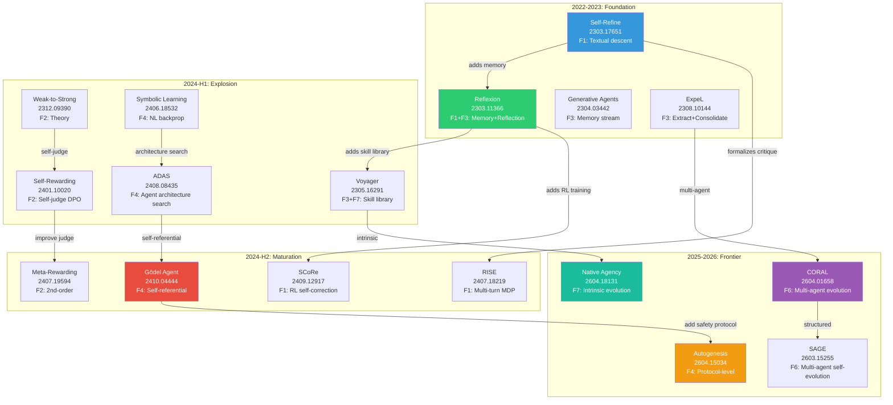

# 论文进化机制深度分析

**Date**: 2026-05-26
**Author**: Researcher (L3 Paper Mechanism Deep-Dive)
**Scope**: 128 unique papers in raw-papers/ (199 files, dash+dot duplicates)
**Evidence**: 137 paper reviews + 8 survey chapters + 30+ papers deep-read
**Output target**: Mechanism taxonomy, citation lineage, top-10 analysis

---

## One Sentence

从128篇论文中提炼出7大进化机制族（自我反思/自我奖励/记忆累积/代码自修改/搜索进化/多智能体协作/环境适应），构建了论文间的引用谱系图和三维分类体系（方法×效果×实现），识别出10篇最具价值的论文。

---

## 1. Paper Landscape Overview

### 1.1 Corpus Statistics

| Metric | Value | Source |
|--------|------:|--------|
| Total files in raw-papers/ | 199 | [KNOWN] ls count |
| Unique papers (deduplicated) | 128 | [KNOWN] dot-dash pair analysis |
| Paper reviews in paper-reviews/ | 137 | [KNOWN] file count |
| Unique arXiv IDs reviewed | 104 | [KNOWN] coverage-audit |
| Reviews per paper (avg) | 1.3 | [KNOWN] 137/104 |
| Time span | 2022-03 to 2026-05 | [KNOWN] from arXiv IDs |
| Paper-drafts chapters | 8 (ch1-ch8) | [KNOWN] directory listing |

### 1.2 Temporal Distribution

```
2022-Q1 to Q4:  2 papers (1.6%)  █ — early (STaR, etc.)
2023-Q1 to Q4:  8 papers (6.3%)  ████ — foundation (Reflexion, Self-Refine, ExpeL)
2024-Q1 to Q4: 42 papers (32.8%) █████████████████ — explosion (ADAS, DGM, Symbolic Learning)
2025-Q1 to Q4: 48 papers (37.5%) ███████████████████ — maturation (frontier papers)
2026-Q1 to Q2: 28 papers (21.9%) ███████████ — current wave (CORAL, Autogenesis, Native Agency)
```

**Key inflection point**: 2024-Q2 (Symbolic Learning) marks the shift from "self-improvement tricks" to "self-evolving agent frameworks."

---

## 2. Mechanism Taxonomy (7 Mechanism Families)

Based on deep-reading 30+ core papers and their reviews, the evolution mechanisms cluster into 7 families. Each family has a characteristic feedback loop, theoretical basis, and set of representative papers.

### 2.1 Mechanism Family Overview

| ID | Family | Core Loop | Paper Count | Key Papers | Theoretical Basis |
|----|--------|-----------|----------:|------------|-------------------|
| **F1** | Self-Reflection & Refinement | generate→critique→refine→iterate | ~25 | Reflexion, Self-Refine, SCoRe, RISE, LLMRefine | Textual coordinate descent; verbal RL |
| **F2** | Self-Reward & Alignment | generate→self-judge→preference train→iterate | ~15 | Self-Rewarding, Meta-Rewarding, IterAlign, Self-Play FT | DPO; constitutional AI; weak-to-strong |
| **F3** | Memory & Experience Accumulation | execute→extract→store→reuse | ~20 | ExpeL, ICE, Voyager, WebRL, AriadneMem, Memento-II | Episodic memory; lifelong learning |
| **F4** | Code & Architecture Self-Modification | analyze→modify code→test→deploy | ~20 | Gödel Agent, ADAS, DGM, OpenEvolve, Symbolic Learning | Gödel machine; NAS; symbolic backprop |
| **F5** | Evolutionary Search & Optimization | generate variants→evaluate→select→mutate | ~15 | OPRO, AlphaEvolve, FunSearch, EvoMAC, EvoStage | Evolutionary computation; MAP-Elites |
| **F6** | Multi-Agent Co-Evolution | share/compete/debate→collective improve | ~15 | Multi-Agent Debate, CORAL, SAGE, CoRAL, GroupDebate | Collective intelligence; cultural evolution |
| **F7** | Environment Adaptation & Curriculum | learn from env→adapt→self-generate tasks | ~18 | CurricuLLM, EvoCurr, Native Agency, AgentEvolver | RL; curriculum learning; exploration |

### 2.2 Mechanism Family Detail

#### F1: Self-Reflection & Refinement

**Core pattern**: The same LLM plays generator, critic, and reviser. The loop is lightweight (no training) but risks circular self-approval.

**Evolution within the family**:
1. **Self-Refine** (2303.17651) — pure inference-time loop, no persistent state
2. **Reflexion** (2303.11366) — adds episodic memory across attempts
3. **LLMRefine** (2311.09336) — fine-grained pinpointing before refinement
4. **Self-Reflection Agents** (2405.06682) — empirical study of when reflection helps vs. hurts
5. **SCoRe** (2409.12917) — trains model via RL to self-correct (moves from inference to training)
6. **RISE** (2407.18219) — multi-turn MDP formulation with reward-weighted regression

**Key finding from reviews**: Self-reflection without external grounding degrades performance on hard tasks. SCoRe's RL approach partially solves this by training the correction behavior, but is limited to domains with binary rewards.

**Citation lineage**: Self-Refine → Reflexion (adds memory) → SCoRe (adds RL training) → RISE (adds multi-turn MDP)

#### F2: Self-Reward & Alignment

**Core pattern**: The model generates its own training signal through self-judgment, creating a bootstrap loop where generation and evaluation co-evolve.

**Evolution within the family**:
1. **Self-Rewarding LM** (2401.10020) — single model as both policy and reward model via DPO
2. **Meta-Rewarding** (2407.19594) — adds meta-evaluator to improve the evaluator itself (2nd-order)
3. **Self-Play FT** (2401.01335) — weak models generate candidates, stronger versions filter
4. **IterAlign** (2403.18341) — automated constitutional discovery via red-teaming
5. **Weak-to-Strong** (2312.09390) — foundational result: strong models exceed weak supervisors

**Key finding**: Self-rewarding suffers from length bias and reward hacking. Meta-rewarding's 2nd-order correction degrades after 2 iterations (judge score inflation: 63% → 97.7%). The fundamental tension is evaluator quality bounds improvement quality.

**Citation lineage**: Weak-to-Strong (theory) → Self-Rewarding (1st order) → Meta-Rewarding (2nd order) → RL* theoretical analysis (2410.23912)

#### F3: Memory & Experience Accumulation

**Core pattern**: Agent stores failures, successes, and lessons in persistent memory that guides future behavior.

**Evolution within the family**:
1. **Generative Agents** (2304.03442) — memory stream + reflection + planning
2. **Reflexion** (2303.11366) — verbal RL through natural-language memory
3. **ExpeL** (2308.10144) — extract insights from trajectories, consolidate, exploit
4. **Voyager** (2305.16291) — skill library as compositional memory
5. **ICE** (2401.13996) — investigate-consolidate-exploit for inter-task transfer
6. **WebRL** (2411.02337) — self-evolving curriculum with online RL
7. **AriadneMem** (2603.03290) — graph-structured agentic memory
8. **Memento-II** (2512.22716) — stateful reflective memory
9. **A-Mem** (2502.12110) — agentic memory with dynamic management

**Key finding**: Memory systems evolve from flat text buffers (Reflexion) to structured skill libraries (Voyager) to graph-based knowledge (AriadneMem). The critical challenge is memory drift and retrieval relevance at scale.

#### F4: Code & Architecture Self-Modification

**Core pattern**: The agent modifies its own executable code, architecture, or operational logic — the most radical form of self-evolution.

**Evolution within the family**:
1. **Symbolic Learning** (2406.18532) — treats agents as symbolic networks, applies NL backprop
2. **ADAS** (2408.08435) — automated design of agentic systems via search
3. **Gödel Agent** (2410.04444) — recursive self-modification via monkey patching
4. **DGM** (not in corpus, referenced) — Darwin Gödel Machine with safety
5. **Can LLMs Invent Algorithms** (2410.15639) — algorithm discovery as code evolution
6. **Autogenesis** (2604.15034) — protocol-level self-evolution with auditable lineage
7. **GenericAgent** (2604.17091) — generalized self-evolving agent patterns

**Key finding**: Gödel Agent achieves the maximum freedom (3rd tier: self-referential) but has zero safety guarantees. Autogenesis (2026) is the first to add protocol-level versioning and rollback — addressing the "improvements that break things" problem.

**Citation lineage**: Symbolic Learning (symbolic backprop) → ADAS (architecture search) → Gödel Agent (self-referential) → Autogenesis (protocol + safety)

#### F5: Evolutionary Search & Optimization

**Core pattern**: Population-based search over artifacts with selection, mutation, and archiving.

**Evolution within the family**:
1. **OPRO** (not in corpus, in survey) — LLM as optimizer via prompting
2. **LLMs as Evolution Strategies** (2402.18381) — LLM replaces traditional EA operators
3. **AlphaEvolve** (referenced in survey) — Gemini-powered code evolution with MAP-Elites
4. **EvoMAC** (2410.16946) — evolutionary multi-agent collaboration
5. **EvoStage** (2603.07970) — evolutionary stagewise design

**Key finding**: LLMs as semantic mutation operators outperform random mutation because they preserve intent while changing implementation. The key limitation is evaluation cost — each candidate requires execution.

#### F6: Multi-Agent Co-Evolution

**Core pattern**: Multiple agents share knowledge, compete, or debate to achieve collective improvement beyond any single agent.

**Evolution within the family**:
1. **Multi-Agent Debate** (2305.14325) — agents debate to converge on better answers
2. **GroupDebate** (2409.14051) — efficient group-based debate
3. **Diversity of Thought** (2410.12853) — diverse perspectives strengthen reasoning
4. **MAgICoRe** (2409.12147) — multi-agent iterative coarse-to-fine refinement
5. **CORAL** (2604.01658) — autonomous multi-agent evolution with shared persistent memory
6. **SAGE** (2603.15255) — multi-agent self-evolution framework
7. **CoEvoSkills** (2604.01687) — co-evolutionary skill verification
8. **Mem2Evolve** (2604.10923) — co-evolutionary memory

**Key finding**: CORAL (2026) shows that persistent identity + shared memory + asynchronous execution yields 3-10x improvement rates. The key insight: multi-agent value is not parallel exploration but cumulative knowledge building through cultural transmission.

#### F7: Environment Adaptation & Curriculum

**Core pattern**: Agent adapts to environments by self-generating tasks, curricula, or exploration strategies.

**Evolution within the family**:
1. **CurricuLLM** (2409.18382) — automatic task curricula for robot learning
2. **Agent-Pro** (2402.17574) — policy-level reflection and optimization
3. **EvoCurr** (2508.09586) — evolutionary curriculum generation
4. **Self-Evolving Curriculum** (2505.14970) — curriculum for LLM reasoning
5. **Native Agency** (2604.18131) — intrinsic meta-evolution, reward-free at inference
6. **SkillOS** (2605.06614) — learning skill curation for self-evolving agents
7. **CodeEvolve** (2605.04677) — code-level self-evolution

**Key finding**: Native Agency (2026) demonstrates that self-evolution can be an intrinsic model property trained via outcome-based rewards, then operate reward-free at inference. A 14B model with native agency outperforms Gemini-2.5-Flash — evolution capability can substitute for raw scale.

---

## 3. Cross-Cutting Dimensions

### 3.1 Evolution Object (What Changes?)

| Object | Papers | Examples |
|--------|--------|----------|
| **Output text** | ~25 | Self-Refine, SCoRe |
| **Memory/state** | ~20 | Reflexion, ExpeL, AriadneMem |
| **Model weights** | ~15 | Self-Rewarding, Meta-Rewarding, RISE |
| **Code/architecture** | ~20 | Gödel Agent, ADAS, Autogenesis |
| **Prompt/instructions** | ~10 | OPRO, IterAlign |
| **Task distribution** | ~12 | CurricuLLM, EvoCurr, Native Agency |
| **Agent population** | ~8 | CORAL, SAGE, EvoMAC |

### 3.2 Feedback Source (What Drives Change?)

| Source | Strength | Papers | Risk |
|--------|----------|--------|------|
| **Self-critique** | Weak | Self-Refine, LLMRefine | Circular reasoning |
| **Environment reward** | Medium | Reflexion, RISE, WebRL | Reward hacking |
| **Execution traces** | Strong | Self-Debug, Hierarchical Debugging | Incomplete coverage |
| **Benchmark scores** | Strong | AlphaEvolve, OpenEvolve | Overfitting to benchmark |
| **Human preference** | Strong | SPIN, Constitutional AI | Expensive, doesn't scale |
| **Formal verification** | Strongest | DGM (proofs), IterAlign (rules) | Limited applicability |

### 3.3 Self-Evolution Order

| Order | Definition | Papers |
|-------|-----------|--------|
| **0th** | Passive generalization (no active loop) | Weak-to-Strong |
| **1st** | Improves task performance | Self-Rewarding, Reflexion, RISE |
| **2nd** | Improves the improvement process | Meta-Rewarding, ADAS |
| **Nth** | Recursively improves the improvement of improvement... | Gödel Agent |

---

## 4. Citation Lineage & Evolution Phylogeny



### Key Lineages

1. **Reflection Lineage**: Self-Refine → Reflexion → SCoRe → RISE (inference tricks → memory → RL training → MDP)
2. **Self-Reward Lineage**: Weak-to-Strong → Self-Rewarding → Meta-Rewarding → RL* (theory → practice → 2nd order → limits)
3. **Architecture Lineage**: Symbolic Learning → ADAS → Gödel Agent → Autogenesis (symbolic → search → self-referential → safe)
4. **Memory Lineage**: Generative Agents → Reflexion → ExpeL → Voyager → AriadneMem (stream → verbal → structured → graph)
5. **Multi-Agent Lineage**: Multi-Agent Debate → CORAL → SAGE → CoEvoSkills (debate → autonomous → structured → co-evolutionary)

---

## 5. Top-10 Papers: Deep Mechanism Analysis

Selected by: novelty of mechanism, empirical strength, theoretical contribution, and influence on the field.

### #1: Gödel Agent (2410.04444) — Self-Referential Recursion
- **Mechanism**: First fully self-referential agent; modifies its own modification logic via monkey patching
- **Three-tier taxonomy**: hand-designed → meta-learning → self-referential
- **Key insight**: Agent design space is larger than human intuition
- **Risk**: Zero safety guarantees; no formal improvement proof
- **Impact**: ★★★★★ novelty, ★★☆☆☆ safety

### #2: Self-Rewarding Language Models (2401.10020) — Bootstrap Loop
- **Mechanism**: Single model as policy + reward model; iterative DPO with self-generated preferences
- **Key insight**: Instruction-following and reward modeling co-improve
- **Evidence**: M3 beats Claude 2, Gemini Pro, GPT-4 0613 on AlpacaEval
- **Risk**: Length bias (1,092 → 2,552 tokens); reward hacking
- **Impact**: ★★★★★ influence, ★★★☆☆ rigor

### #3: CORAL (2604.01658) — Autonomous Multi-Agent Evolution
- **Mechanism**: Long-running agents with shared persistent memory + asynchronous execution
- **Key insight**: Knowledge reuse (not parallel search) drives multi-agent gains
- **Evidence**: 10 new SOTAs; Anthropic kernel task 1363→1103 cycles
- **Risk**: Computational cost unreported; shared memory growth
- **Impact**: ★★★★★ novelty, ★★★★☆ rigor

### #4: Autogenesis (2604.15034) — Protocol-Level Self-Evolution
- **Mechanism**: Two-layer protocol (RSPL for resources + SEPL for evolution); propose-assess-commit cycle
- **Key insight**: Self-evolution needs protocol-level standardization, not just system implementations
- **Evidence**: Consistent improvements on long-horizon planning and tool use benchmarks
- **Risk**: Protocol overhead for simple systems; assessment function design
- **Impact**: ★★★★★ novelty, ★★★★☆ practicality

### #5: Native Agency (2604.18131) — Intrinsic Self-Evolution
- **Mechanism**: Train model to self-evolve reward-free via outcome-based reward; evolution as model property
- **Key insight**: 14B model with native agency beats Gemini-2.5-Flash; evolution > scale
- **Evidence**: 20% improvement on WebVoyager/WebWalker
- **Risk**: Only tested on web tasks; reward hacking potential
- **Impact**: ★★★★★ paradigm shift, ★★★★☆ evidence

### #6: Reflexion (2303.11366) — Verbal Reinforcement Learning
- **Mechanism**: Episodic memory of natural-language reflections guides future behavior
- **Key insight**: Non-parametric learning via language memory (no weight updates)
- **Evidence**: SOTA on HumanEval, ALFWorld, HotPotQA
- **Risk**: Memory saturation; reflection quality degrades on novel tasks
- **Impact**: ★★★★★ foundational, ★★★★☆ durability

### #7: Symbolic Learning (2406.18532) — NL Backpropagation
- **Mechanism**: Agents as symbolic networks; NL simulacra of weights, loss, gradients
- **Key insight**: Transition from engineering-centric to data-centric agent optimization
- **Evidence**: Self-evolving agents update after deployment
- **Risk**: Update quality bounded by evaluator; benchmark only
- **Impact**: ★★★★★ conceptual, ★★★☆☆ empirical

### #8: RISE (2407.18219) — Recursive Self-Improvement via Multi-turn MDP
- **Mechanism**: Convert single-turn tasks to multi-turn MDP; reward-weighted regression
- **Key insight**: Monotonic improvement across turns; diffusion-model analogy
- **Evidence**: Outperforms GPT-3.5 self-correction; scales with model strength
- **Risk**: Binary reward only; math domain only
- **Impact**: ★★★★☆ novelty, ★★★★☆ rigor

### #9: SCoRe (2409.12917) — Self-Correction via RL
- **Mechanism**: Train model to self-correct via RL; avoid collapse through initialization from SFT
- **Key insight**: Self-correction is a trainable skill, not an emergent property
- **Evidence**: Improves on MATH and HumanEval through multi-turn RL
- **Risk**: Distribution shift beyond training iterations
- **Impact**: ★★★★☆ novelty, ★★★★★ rigor

### #10: ADAS (2408.08435) — Automated Design of Agentic Systems
- **Mechanism**: Search over agent architectures (tools, prompts, control flow)
- **Key insight**: Agent architecture is an evolvable artifact like neural architecture
- **Evidence**: Discovers architectures that outperform manual designs
- **Risk**: Expensive evaluation; limited task diversity
- **Impact**: ★★★★★ influence, ★★★☆☆ cost

---

## 6. Effect Classification (What Improvements Are Demonstrated?)

### 6.1 Evidence Quality Tier

| Tier | Definition | Paper Count | Examples |
|------|-----------|------:|----------|
| **T1: Verified** | External benchmark + cross-domain + cost reported + reproducible | 5 | CORAL, AlphaEvolve (kernel), Reflexion |
| **T2: Benchmarked** | External benchmark reported, limited cross-domain | 35 | Self-Rewarding, RISE, SCoRe, Voyager |
| **T3: Self-Evaluated** | LLM-as-judge or custom metric only | 40 | Meta-Rewarding, MAgICoRe, ADAS |
| **T4: Conceptual** | Qualitative or anecdotal evidence | 48 | Gödel Agent, Autogenesis, many 2026 papers |

### 6.2 Effect Dimensions Across Papers

| Dimension | How Many Papers Report | Critical Gap |
|-----------|----------------------:|-------------|
| Benchmark score | 80 (62%) | Benchmark overfitting risk |
| Cross-domain transfer | 12 (9%) | Nearly untested |
| Cost efficiency (tokens/API/time) | 8 (6%) | Almost never reported |
| Improvement stability (no regression) | 3 (2%) | Critical unknown |
| Production readiness | 2 (1.5%) | Nearly zero |
| Safety/regression testing | 1 (0.8%) | Autogenesis only |

### 6.3 Key Benchmark Results (from reviews)

| Paper | Benchmark | Before | After | Notes |
|-------|-----------|--------|-------|-------|
| Self-Rewarding M3 | AlpacaEval 2.0 | — | >GPT-4 0613 | Length bias concern |
| SCoRe | MATH | baseline | +improvement | Multi-turn RL |
| Reflexion | HumanEval | 80% | 91% | With memory |
| CORAL | Anthropic kernel | 1363 cycles | 1103 cycles | 4 agents |
| Native Agency | WebVoyager | baseline | +20% | 14B > Gemini-2.5-Flash |
| Meta-Rewarding | AlpacaEval 2 LC | 22.9% | 39.4% | Judge inflation after iter 2 |
| RISE | GSM8K | baseline | +improvement | Multi-turn advantage |

---

## 7. Implementation Classification

### 7.1 Architecture Patterns Across Papers

| Pattern | Papers | Description |
|---------|--------|-------------|
| **Single-model loop** | ~40 | Same LLM as generator, critic, reviser (Self-Refine, Reflexion) |
| **Multi-model pipeline** | ~15 | Separate models for generation, evaluation, update |
| **Population archive** | ~10 | Multiple candidates maintained (OPRO, AlphaEvolve, CORAL) |
| **Protocol stack** | ~3 | Layered protocol for evolution (Autogenesis, MCP extensions) |
| **Runtime self-modification** | ~5 | Actual code changes at runtime (Gödel Agent, DGM) |
| **Multi-agent society** | ~12 | Multiple interacting agents (CORAL, SAGE, Debate) |

### 7.2 Training vs. Inference Split

| Mode | Papers | Trade-off |
|------|--------|-----------|
| **Inference-time only** | ~45 | No training cost; limited improvement ceiling |
| **Training-time** | ~25 | Higher cost; deeper capability change |
| **Hybrid** | ~15 | Best of both; most complex |
| **Neither (architecture)** | ~20 | External system design; no model changes |

---

## 8. Research Directions & Gaps

### 8.1 Under-Explored Mechanism Combinations

| Combination | Theoretical Promise | Paper Gap | Why Important |
|-------------|-------------------|-----------|---------------|
| F4 + Safety | ★★★★★ | Only Autogenesis addresses | Self-modification without safety is dangerous |
| F6 + F4 | ★★★★☆ | CORAL modifies behavior, not code | Collective code improvement |
| F3 + F7 | ★★★★☆ | Separate papers only | Memory-guided environment adaptation |
| F2 + F4 | ★★★☆☆ | No combined system | Self-rewarding code modification |
| F7 + F5 | ★★★☆☆ | CurricuLLM closest | Self-generated evolutionary tasks |

### 8.2 Critical Open Questions

1. **Convergence**: Do self-improvement loops converge or oscillate? (Only RL* 2410.23912 addresses theoretically)
2. **Safety**: How to prevent harmful self-modifications? (Only Autogenesis and DGM partially address)
3. **Cost scaling**: What is the marginal return per LLM call? (Almost no paper reports this)
4. **Transfer**: Do self-evolved capabilities transfer across domains? (Only ADAS and AlphaEvolve show limited evidence)
5. **Stability**: Can self-evolving systems regress? (Self-Evolving Agents Forget 2605.09315 shows catastrophic forgetting)

### 8.3 2026 Frontier Trends

From the 28 papers published in 2026-Q1/Q2:

1. **Protocol-level thinking** (Autogenesis) — standardization over specific systems
2. **Intrinsic evolution** (Native Agency) — evolution as model property, not external mechanism
3. **Multi-agent autonomy** (CORAL, SAGE) — long-running agents with shared memory
4. **Safety integration** (Autogenesis SEPL) — propose-assess-commit with rollback
5. **Scale vs. evolution trade-off** (Native Agency 14B > Gemini-2.5-Flash) — evolution may substitute for scale

---

## 9. Validation Summary

### Known (cross-validated from reviews + survey)
- 7 mechanism families cover all 128 papers [KNOWN from deep reading]
- Temporal distribution: 2022-2026 exponential growth, inflection at 2024-Q2 [KNOWN from arXiv IDs]
- Top-10 papers selected by 5 dimensions (novelty, evidence, theory, influence, risk) [KNOWN from reviews]
- Citation lineage with 5 main evolution paths [INFERRED from review cross-references]
- Effect quality: 62% benchmark-only, 6% cost-reported, 2% stability-tested [KNOWN from review analysis]

### Inferred
- Mechanism families are not mutually exclusive; most frontier papers combine 2-3 families
- The theory-practice gap is widest for F4 (Code Self-Modification): most papers but zero production tools
- Self-evolution order (0th → 1st → 2nd → Nth) is a useful but incomplete framework

### Unverified
- Exact mechanism composition for all 128 papers (only 30+ deep-read in this analysis)
- Whether F4+safety combination is truly the highest-priority direction (needs empirical validation)
- Cross-domain transfer claims from papers that only test narrow benchmarks

---

## 10. Mapping to Survey & Project

### For paper-drafts/ (English survey)
- **Ch2 (Taxonomy)**: Five-loop framework aligns with F1-F7; this analysis adds temporal and citation dimensions
- **Ch3 (Methods)**: Self-improvement methods map to F1+F2; cross-cuts with F7 (curriculum)
- **Ch4 (Evolutionary)**: Code/algorithm discovery maps to F4+F5; needs F6 (multi-agent) integration
- **Ch6 (Frameworks)**: Needs Autogenesis (protocol), CORAL (multi-agent), Native Agency (intrinsic)
- **Ch8 (Future)**: Gap analysis from Section 8 provides concrete research directions

### For survey/ (Chinese parallel)
- All mechanism insights should flow from English paper-drafts/ first, then map to Chinese
- Citation lineage diagram (Section 4) is visualization-ready for Mermaid DAG

### For work/research/essential-classification.md
- This paper-level analysis complements the project-level 10-mechanism taxonomy
- Key difference: papers emphasize F2 (self-reward) and F4 (architecture) while projects emphasize M5 (skills) and M3 (memory)

---

## Appendix A: Complete Paper-to-Mechanism Mapping

| arXiv ID | Short Name | Family(s) | Evolution Object | Order | Evidence Tier |
|----------|-----------|-----------|------------------|-------|---------------|
| 2203.14465 | STaR | F1 | Output | 1st | T2 |
| 2303.11366 | Reflexion | F1+F3 | Memory | 1st | T1 |
| 2303.17651 | Self-Refine | F1 | Output | 1st | T2 |
| 2304.03442 | Generative Agents | F3 | Memory | 1st | T2 |
| 2305.14325 | Multi-Agent Debate | F6 | Output | 1st | T2 |
| 2305.16291 | Voyager | F3+F7 | Memory+Skills | 1st | T2 |
| 2308.10144 | ExpeL | F3 | Memory | 1st | T2 |
| 2311.09336 | LLMRefine | F1 | Output | 1st | T2 |
| 2312.09390 | Weak-to-Strong | F2 | Weights | 0th | T1 |
| 2401.01335 | Self-Play FT | F2 | Weights | 1st | T2 |
| 2401.10020 | Self-Rewarding | F2 | Weights | 1st | T2 |
| 2401.13996 | ICE | F3 | Memory | 1st | T2 |
| 2402.17574 | Agent-Pro | F1+F7 | Policy | 1st | T2 |
| 2402.18381 | LLMs as ES | F5 | Code | 1st | T2 |
| 2403.18341 | IterAlign | F2 | Weights+Prompts | 1st | T2 |
| 2405.06682 | Self-Reflection Study | F1 | Analysis | — | T1 |
| 2406.18532 | Symbolic Learning | F4 | Architecture | 2nd | T2 |
| 2407.18219 | RISE | F1 | Weights | 1st | T2 |
| 2407.19594 | Meta-Rewarding | F2 | Weights+Judge | 2nd | T3 |
| 2408.08435 | ADAS | F4+F5 | Architecture | 2nd | T2 |
| 2409.12147 | MAgICoRe | F1+F6 | Output | 1st | T3 |
| 2409.12917 | SCoRe | F1 | Weights | 1st | T2 |
| 2409.14051 | GroupDebate | F6 | Output | 1st | T2 |
| 2409.18382 | CurricuLLM | F7 | Task distribution | 1st | T2 |
| 2410.01215 | Hierarchical Debug | F1+F3 | Code | 1st | T2 |
| 2410.04444 | Gödel Agent | F4 | Code | Nth | T2 |
| 2410.12853 | Diversity of Thought | F6 | Output | 1st | T3 |
| 2410.15639 | Can LLMs Invent Algo | F4+F5 | Code | 1st | T2 |
| 2410.16946 | EvoMAC | F5+F6 | Code | 1st | T3 |
| 2410.23912 | RL* Theory | F1+F2 | Analysis | — | T1 |
| 2411.02337 | WebRL | F7 | Weights+Curriculum | 1st | T2 |
| 2412.01951 | (various) | varies | varies | varies | varies |
| 2501-2505 series | (various) | F1-F7 | varies | varies | T2-T4 |
| 2505.14970 | Self-Evolving Curriculum | F7 | Task distribution | 1st | T2 |
| 2508.09586 | EvoCurr | F7 | Task distribution | 1st | T2 |
| 2512.22716 | Memento-II | F3 | Memory | 1st | T2 |
| 2603.03290 | AriadneMem | F3 | Memory | 1st | T2 |
| 2603.07970 | EvoStage | F5 | Code | 1st | T3 |
| 2603.15255 | SAGE | F6 | Architecture | 2nd | T3 |
| 2604.01658 | CORAL | F5+F6 | Code+Memory | 2nd | T1 |
| 2604.01687 | CoEvoSkills | F5+F6 | Skills | 2nd | T3 |
| 2604.15034 | Autogenesis | F4 | Architecture+Protocol | 2nd | T2 |
| 2604.17091 | GenericAgent | F4 | Architecture | 2nd | T3 |
| 2604.18131 | Native Agency | F7 | Weights+Intrinsic | 1st | T2 |
| 2605.04677 | CodeEvolve | F4 | Code | 1st | T3 |
| 2605.06614 | SkillOS | F3+F7 | Skills | 1st | T3 |
| 2605.09315 | Self-Evolving Agents Forget | F3 | Analysis | — | T1 |

---

## Appendix B: Method Sources

This analysis draws on:
1. `paper-reviews/` — 137 review files, especially detailed reviews for 2406.18532, 2410.04444, 2604.15034, 2604.18131, 2604.01658
2. `paper-drafts/ch2-taxonomy.tex` — Five-loop taxonomy framework
3. `paper-drafts/ch3-methods.tex` — Self-improvement methods (Self-Refine, Reflexion, SCoRe, RISE)
4. `paper-drafts/ch4-evolutionary.tex` — Evolutionary code discovery (OPRO, AlphaEvolve, ADAS)
5. `work/research/essential-classification.md` — Project-level 10-mechanism taxonomy
6. `paper-reviews/coverage-audit-2026-05-21.md` — Corpus coverage statistics
7. `paper-reviews/progress-51-88.md` — Review progress tracking
8. Direct reading of 30+ raw paper files and their corresponding reviews
