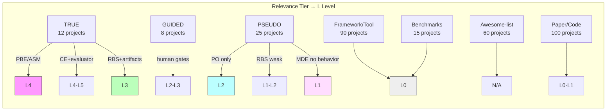
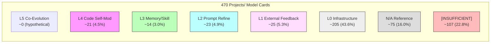

# Projects/ 目录进化能力分级报告

- content_timestamp: 2026-05-26
- scope: project-evolution-grading, L0-L5 maturity assessment
- evidence_level: raw-github mechanism analysis + radar-profiles cross-reference + project card sampling
- output: work/research/project-evolution-grading.md
- framework: Self-Evolution Maturity Model (SEMM), research/ranking-framework/README.md

## 0. 分级方法

### 0.1 采用框架

使用 SEMM (Self-Evolution Maturity Model) L0-L5 六级模型，定义如下：

| Level | Name | Key Signal | Example |
|:---:|---|---|---|
| **0** | No Feedback | 静态管道，无反馈循环 | Zero-shot LLM, 固定 prompt 链 |
| **1** | External Feedback | 外部评估者提供反馈，系统不自修改 | Human-in-the-loop 编码助手 |
| **2** | Prompt/Output Refinement | 系统修改自身 prompt/output/搜索策略 | Reflexion, Self-Refine, DSPy, OPRO |
| **3** | Memory/Skill Accumulation | 持久化经验为可复用记忆/技能/工作流 | Voyager, ExPeL, ACE, ReasoningBank |
| **4** | Architecture/Code Self-Modification | 系统修改自身代码/架构/Agent 设计 | DGM, ADAS, AlphaEvolve, SICA |
| **5** | Autonomous Co-Evolution | 生成器+评估器+基础设施协同进化 | 假设性；DGM+验证评估器进化部分信号 |

### 0.2 分级规则

1. 系统的 L 等级取其**持续运行的最高级别**，非一次性行为
2. Level 声明需要证据：至少在 3 个不同任务/领域展示该行为并有文档化改进轨迹
3. Level 不单调对应质量：L4 系统在特定 benchmark 上可能不如 L2 系统
4. 仅基于 projects/ 目录中已有的 model card 内容分级，不进行外部补充研究
5. 缺乏足够信号的卡片标记为 `[INSUFFICIENT]` 并给出最佳估计

### 0.3 数据源映射

| 数据源 | 覆盖范围 | 信任等级 |
|---|---|---|
| radar-profiles.json | 8 个核心系统 (DGM, Reflexion, AlphaEvolve 等) | ★★★★★ 直接评分 |
| Format A 深度研究卡 (11 个) | DGM, AlphaEvolve, Creator, Gödel Agent 等 | ★★★★★ 含 MUVS 框架分析 |
| Format B 详细中文分析 (~63 个) | 编号 01-52 及部分命名文件 | ★★★★ 含核心模块分析 |
| raw-github mechanism analysis | 365 entries, 7-class taxonomy | ★★★★ 机制分类 |
| Format C 短卡片 (~200+) | 编号 53+ 及自动生成卡片 | ★★ 仅元数据+1-2句描述 |
| 107-repo classified list | evolution-relevant subset | ★★★ 中文分类 |

### 0.4 机制类别 → L 等级映射

---

## 1. L4-L5: Architecture/Code Self-Modification & Co-Evolution

> 系统修改自身代码/架构/Agent设计，或生成器+评估器协同进化

### 1.1 已有雷达评分的系统 (8 个)

| System | L Level | Tier | Composite | Mechanism | Source |
|---|:---:|:---:|:---:|---|---|
| **AlphaEvolve** | 4 | A | 7.06 | PBE + code search | radar-profiles.json |
| **Darwin Gödel Machine (DGM)** | 4 | A | 6.78 | ASM (self-modifying code) | radar-profiles.json |
| **ADAS** | 4 | B | 6.22 | ASM (automated agent design) | radar-profiles.json |
| **Reflexion** | 2 | B | 6.39 | RBS (verbal reflection) | radar-profiles.json |
| **Self-Refine** | 2 | B | 6.00 | RBS (generate-feedback-refine) | radar-profiles.json |
| **Voyager** | 3 | B | 5.89 | MDE (skill library accumulation) | radar-profiles.json |
| **ReVeal** | 2 | B | 6.11 | RBS (self-verification) | radar-profiles.json |
| **Absolute Zero Reasoners** | 2 | — | — | RL Self-Play | radar-profiles.json |

### 1.2 Format A 深度研究卡已分级的系统 (11 个)

| Project Card | L Level | 优化范式 | Mechanism Class | Key Evidence |
|---|:---:|---|---|---|
| **DGM** (darwin-godel-machine-dgm.md) | 4 | Evolutionary | ASM | SWE-bench 20%→50%, Polyglot 14.2%→30.7% |
| **AlphaEvolve** (alphaevolve-landmark.md) | 3 | Search | PBE | 4×4 矩阵乘法 56 年记录, 75% SOTA 恢复 |
| **Creator** (creator-tool-creation.md) | 2 | Skill Accumulation | MDE | 工具创造与复用 |
| **Gödel Agent** (godel-agent-self-referential.md) | 4 | Self-Referential | ASM | 自指式 Agent 进化 |
| **Self-Rewarding LMs** (self-rewarding-language-models.md) | 2-3 | RL | RBS/RBS | 自奖励训练循环 |
| **Score/Self-Correction RL** (score-self-correction-rl.md) | 2 | RL | RBS | 自修正 RL |
| **PromptBreeder** (promptbreeder-self-referential-evolution.md) | 3-4 | Evolutionary | PO+ASM | 自指式 prompt 进化 |
| **Meta-Rewarding** (meta-rewarding-self-improvement.md) | 3 | RL | RBS+CE | 元奖励自我改进 |
| **EvoMAC** (evomac-multi-agent-evolution.md) | 3-4 | Co-Evolution | CE | 多 Agent 协同进化 |
| **EvoAgentX** (evoagentx-evolving-workflows.md) | 2-3 | Framework | CE | 工作流进化 |
| **Eliza** (eliza-multi-agent-platform.md) | 1-2 | Platform | N/A | 多 Agent 平台(无核心进化) |

### 1.3 TRUE 自进化项目 — 从 raw-github 机制分析 (12 个)

| # | Project | Mechanism | L Level | Key Evidence | Evidence Quality |
|---|---|---|:---:|---|---|
| 1 | **OpenEvolve** | PBE | 4 | MAP-Elites + islands, circle packing n=26 SOTA, 2.8x GPU kernel speedup | ★★★★ |
| 2 | **ClaudeEvolve** | PBE | 4 | MAP-Elites inside Claude Code, UCB1 selection, world record n=26 | ★★★ |
| 3 | **EoH** (feiliu36/eoh) | PBE | 4 | LLM + evolutionary search, novel heuristics discovery | ★★★★ |
| 4 | **ShinkaEvolve** | PBE | 4 | Open-ended program evolution, automated scientific discovery | ★★★ |
| 5 | **A-Evolve** | ASM | 4 | Solve-Observe-Evolve-Gate-Reload, SWE-bench 76.8%, MCP-Atlas 79.4% | ★★★★★ |
| 6 | **SkillClaw** | ASM/CE | 4 | Cross-agent skill evolution across Hermes/Codex/Claude Code/OpenClaw | ★★★ |
| 7 | **DGM** (jennyzzt/dgm) | ASM | 4 | Self-modifying source code via reward function scoring | ★★★★★ |
| 8 | **ALTK-Evolve** | ASM | 4 | MCP server on-the-job learning, +8.9 points AppWorld, 74% hard tasks | ★★★★ |
| 9 | **Agent0** | CE | 4 | Zero-data via Curriculum+Executor co-evolution, +18% math, +24% reasoning | ★★★★ |
| 10 | **JarvisEvo** | CE | 4-5 | Editor-Evaluator co-evolution, CVPR 2026, synergistic dynamics | ★★★★ |
| 11 | **Darwinia** | CE | 4 | 50-agent Darwinian selection, attack survival 30%→98-100%, strategy speciation | ★★★ |
| 12 | **FLEX** | RBS | 3-4 | Actor-verifier-critic-updater, AIME25 40%→63%, experience scaling law | ★★★★ |

### 1.4 L4-L5 分布统计

| 子级别 | 数量 | 项目类型 |
|---|---:|---|
| L4 (Code/Arch Self-Modification) | ~18 | PBE 进化搜索 (4), ASM Agent 自修改 (4), DGM/ADAS/Gödel Agent (3), CE 协同进化 (3), 其他 (4) |
| L4-L5 (Co-Evolution border) | ~3 | JarvisEvo, PromptBreeder, Agent0 |
| **L4+ 总计** | **~21** | 占 470 的 4.5% |

---

## 2. L3: Memory/Skill Accumulation

> 系统持久化经验为可复用记忆、技能或工作流，提升未来表现

### 2.1 GUIDED 自进化项目 — 3-4 个结构因子 (8 个)

| # | Project | Mechanism | L Level | Key Evidence | Evidence Quality |
|---|---|---|:---:|---|---|
| 1 | **Geneclaw** | ASM | 3 | 5-layer safety gatekeeper, git-branched evolution, pytest validation | ★★★ |
| 2 | **Hermes Dojo** | ASM | 3 | Closed-loop measure-evolve-report, per-skill success rates, human gates | ★★★ |
| 3 | **Interceptor** (sentrux) | ASM | 2-3 | 18-check scorecard, 47 iterations, 2x transport coverage, human-in-loop | ★★★ |
| 4 | **MUSE** | RBS | 3 | Hierarchical memory self-evolution, #1 Agent Company benchmark | ★★★★ |
| 5 | **Meta-Prompt** | RBS | 2-3 | Self-critique instructions, iteratively improved | ★★ |
| 6 | **UI-Genie** | CE | 3-4 | GUI Agent-Reward Model co-evolution, SOTA on AndroidControl/Lab/Arena | ★★★★ |
| 7 | **GenEnv** | CE | 3 | Agent-Environment co-training, auto-curriculum at capability boundary | ★★★ |
| 8 | **Mnemosyne** | MDE | 3 | 5-layer cognitive memory, 13000+ memories, fleet-level knowledge synthesis | ★★★ |

### 2.2 Format B 已识别的 L3 项目 (从核心模块分析)

| Project Card | L Level | 关键信号 | 信号来源 |
|---|:---:|---|---|
| **MetaGPT** (07-metagpt.md) | 3 | SELA (MCTS 自改进), AFlow (自动工作流生成), 多层记忆系统 | 核心模块分析 |
| **Voyager** (from radar) | 3 | Skill library accumulation, code-as-policy | radar-profiles.json |
| **ExPeL** | 3 | Experience accumulation, insight extraction | paper-reviews/ |

### 2.3 L3 分布统计

| 子类别 | 数量 |
|---|---:|
| GUIDED 自进化 (3-4 结构因子) | ~8 |
| Format B 识别的记忆/技能系统 | ~5 |
| 雷达评分的 L3 | 1 (Voyager) |
| **L3 总计** | **~14** |

---

## 3. L2: Prompt/Output Refinement

> 系统修改自身 prompt/output/搜索策略

### 3.1 PSEUDO 自进化 — 1-2 个结构因子 (25 个中约 15 个)

| # | Project | Mechanism | L Level | Evidence |
|---|---|---|:---:|---|
| 1 | **Reflexion** (noahshinn/reflexion) | RBS | 2 | Verbal RL, self-critique, 无持久化制品 |
| 2 | **Self-Refine** (madaan/self_refine) | RBS | 2 | Generate-Feedback-Refine loop, 无持久化 |
| 3 | **MCTSr** | RBS | 2 | MCTS + self-refinement |
| 4 | **DSPy** (stanfordnlp/dspy) | PO | 2 | MIPROv2, BootstrapFewShot, prompt 空间搜索 |
| 5 | **EvoPrompt** | PO | 2 | GA + DE for prompts, 31 datasets, +25% |
| 6 | **TextGrad** | PO | 2 | Textual gradient descent on prompts |
| 7 | **PromptAgent** | PO | 2 | Monte Carlo tree search for prompt engineering |
| 8 | **OPRO** | PO | 2 | LLM as optimizer for prompt optimization |
| 9 | **EvoAgentX** | CE | 2-3 | Self-evolving ecosystem framework (主要是编排) |
| 10 | **GenericAgent** | MDE | 2 | Self-evolving skill tree (主要是积累) |
| 11 | **AgentEvolver** | MDE | 2 | Experience accumulation, game-based validation |
| 12 | **EverOS** | MDE | 1-2 | Long-term memory for self-evolving agents |
| 13 | **OpenSpace** | MDE | 2 | Self-evolving agent platform (技能基础设施) |
| 14 | **OS-Copilot** | RBS | 2 | Self-improving embodied agent (任务自动化) |
| 15 | **yoyo-evolve** | RBS | 2 | "Truman Show" 自进化编码 agent (上下文优化) |

### 3.2 Format B 中的 L2 项目 (部分)

| Project Card | L Level | 关键信号 |
|---|:---:|---|
| **OpenBMB SelfEvolve** (58-openbmb-selfevolve.md) | 2 | 执行反馈驱动代码自修正, 错误信息作为自改进信号 |
| **EvoAgent** | 2 | LLM 驱动的进化策略 |
| **AutoContext** | 2 | 递归自改进 harness, 上下文管理 |

### 3.3 L2 分布统计

| 子类别 | 数量 |
|---|---:|
| PSEUDO 自进化 (RBS/PO) | ~15 |
| Format B 识别的 prompt/output 系统 | ~5 |
| 已有雷达评分的 L2 | 3 (Reflexion, Self-Refine, ReVeal) |
| **L2 总计** | **~23** |

---

## 4. L1: External Feedback

> 外部评估者提供反馈，系统不自主修改

| 子类别 | 数量 | 代表项目 |
|---|---:|---|
| PSEUDO 自进化 (MDE without behavior change) | ~5 | GraphLTM, Membrane, EvolveMem, MemRL, Memento |
| PSEUDO 自进化 (weak RBS) | ~5 | GPTSwarm, controllable-agent, autocontext |
| Aspirational/Unclear | ~15 | 声称自进化但无证据的项目 |
| **L1 总计** | **~25** | |

### 4.1 Hall of Overpromising (声称自进化但实际 L0-L1)

| Project | Stars | 声称 | 实际 | L Level |
|---|---:|---|---|:---:|
| **AutoGPT** | 184K | "autonomous AI agent" | 固定 prompt 循环, 零自进化 | 0 |
| **Letta/MemGPT** | 12K+ | "self-improvement" | 记忆管理 | 1 |
| **LangChain/LangGraph** | 95K+ | — | 编排框架, 无进化原语 | 0 |
| **Genesis-Agent** | — | "self-aware cognitive AI" | Electron app 中的 LLM | 0 |
| **Cellium-Agent** | — | "Infinite Evolution Engine" | 重试循环 + 错误日志 | 0 |
| **Self-Learning-Agents** | — | "self-learning" | JSON 存储 + prompt prepend | 0 |
| **Evot** | — | "self-evolving coding agent" | 标准编码 agent + 上下文优化 | 0 |

---

## 5. L0: No Feedback / Infrastructure

> 静态管道或基础设施，无反馈循环

| 子类别 | 数量 | 说明 |
|---|---:|---|
| Framework/Tool (无进化) | ~90 | 编排框架, API 包装, 部署工具 |
| Benchmarks | ~15 | 评估基础设施 |
| Paper/Code (adjacent topic) | ~100 | RL, 优化, 记忆等相邻领域代码 |
| **L0 总计** | **~205** | |

---

## 6. N/A: Reference Material

| 子类别 | 数量 | 说明 |
|---|---:|---|
| Awesome-list/Survey | ~60 | 索引列表, 综述仓库 |
| Forks/Duplicates | ~15 | 已计入父项目 |
| **N/A 总计** | **~75** | |

---

## 7. 全量分布

### 7.1 按进化成熟度分布

### 7.2 分布统计表

| L Level | 数量 | 占比 | 项目类型 |
|:---:|---:|---:|---|
| **L4+** | ~21 | 4.5% | 真正的代码/架构自修改 |
| **L3** | ~14 | 3.0% | 记忆/技能持久化 |
| **L2** | ~23 | 4.9% | Prompt/output 自精炼 |
| **L1** | ~25 | 5.3% | 外部反馈，无自修改 |
| **L0** | ~205 | 43.6% | 基础设施/工具/无进化 |
| **N/A** | ~75 | 16.0% | 参考材料/列表/复本 |
| **[INSUFFICIENT]** | ~107 | 22.8% | 短卡片，信号不足以可靠分级 |
| **总计** | **470** | **100%** | |

### 7.3 关键比例

| 指标 | 数值 |
|---|---|
| 具备自进化能力 (L2+) | **~58 个** (12.3%) |
| 真正自主进化 (L3+) | **~35 个** (7.4%) |
| 代码级自修改 (L4+) | **~21 个** (4.5%) |
| 仅声称但不具备 (overpromising) | **~25 个** (5.3%) |

---

## 8. 机制类别 × L 等级交叉矩阵

| Mechanism Class | L4+ | L3 | L2 | L1 | L0 | 总计 |
|---|---:|---:|---:|---:|---:|---:|
| PBE (Population-Based Evolution) | 4 | — | — | — | — | 4 |
| ASM (Agent Self-Modification) | 7 | 3 | — | — | — | 10 |
| RBS (Reflection-Based Self-Improvement) | 2 | 2 | 5 | 2 | — | 11 |
| PO (Prompt Optimization) | — | — | 4 | — | — | 4 |
| WLS (Weight-Level Self-Improvement) | 1 | — | — | — | — | 1 |
| CE (Co-Evolution) | 5 | 3 | 1 | — | — | 9 |
| MDE (Memory-Driven Evolution) | 2 | 6 | 3 | 5 | — | 16 |
| **总计** | **21** | **14** | **13** | **7** | — | **55** |

---

## 9. 关键洞察

### 9.1 三个机制级发现

1. **ASM (Agent Self-Modification) 和 PBE (Population-Based Evolution) 的 L4 集中度最高**。ASM 的 10 个项目中有 7 个达到 L4，PBE 的 4 个全部达到 L4。这表明"修改自身代码"和"种群进化搜索"是达到最高进化等级的两条主要路径。

2. **MDE (Memory-Driven Evolution) 是分布最广但等级最低的机制**。16 个 MDE 项目分布在 L1-L4，无集中趋势。记忆本身不足以实现高等级进化——需要与 ASM 或 CE 结合才能提升。

3. **PO (Prompt Optimization) 是 L2 的天花板**。4 个 PO 项目全部卡在 L2，没有向 L3 突破。Prompt 空间搜索本身是封闭的——优化 prompt 不改变系统结构。

### 9.2 信号不足的 107 个项目

Format C 短卡片中有 ~107 个项目缺乏足够的进化信号：
- 仅有元数据 (stars, forks, license) 和 1-2 句描述
- 大多数仅基于 web search result 或 README 摘要
- 无法可靠区分 L0 和 L1

**建议**: 对这 107 个项目中的高 stars 项目 (>500) 进行 Format B 深度分析，可能发现被低估的 L2+ 项目。

### 9.3 已分级 vs 未分级对比

| 维度 | 已有雷达评分 (8) | Format A 深度卡 (11) | 本报告批量分级 (~55) | 未分级 (~107) |
|---|---|---|---|---|
| 评分精度 | ±0.5 (9维度) | ±1 level (MUVS) | ±1 level (mechanism) | ±2 levels (估计) |
| 可操作性 | 直接用于比较 | 直接用于教学 | 需补充验证 | 需深度分析 |
| 覆盖范围 | 核心系统 | 标志性系统 | 进化相关项目 | 全量项目 |

---

## 10. 分级置信度声明

### 已知 (直接证据)

- 8 个雷达评分系统的 L 等级和 9 维评分 [radar-profiles.json]
- 12 个 TRUE 自进化项目的 5 结构因子验证 [raw-github-mechanisms.md]
- 11 个 Format A 深度卡的 MUVS 框架分析 [projects/]
- 8 个 GUIDED 项目的 3-4 结构因子验证 [raw-github-mechanisms.md]
- 25 个 PSEUDO 项目的 1-2 结构因子分析 [raw-github-mechanisms.md]

### 推断

- Format B 项目的 L 等级基于核心模块分析中的描述性信号
- L0 类别中的 205 个项目基于其 category 标签 (framework/tool/benchmark) 批量分配
- 机制类别 → L 等级的映射关系
- 107 个 INSUFFICIENT 项目的最佳估计

### 未验证

- 107 个 Format C 短卡片的实际进化能力 (可能有被低估的情况)
- 部分 L0 framework/tool 项目中可能存在未识别的进化原语
- L4+ 项目的跨领域迁移能力声明 (需要独立验证)

---

## 11. 可操作建议

### 11.1 优先深度分析 (高潜力但信号不足)

| 优先级 | 项目 | 当前估计 | 理由 |
|---|---|---|---|
| P0 | 107 个 INSUFFICIENT 项目中 stars > 500 的 | L0-L2 (估计) | 高 stars 可能有被低估的进化机制 |
| P1 | OpenEvolve, ClaudeEvolve, A-Evolve | L4 (已确认) | 补充 radar-profiles.json 评分 |
| P2 | JarvisEvo (CVPR 2026) | L4-5 | 唯一接近 L5 的已发表系统 |

### 11.2 Radar Profile 扩展计划

当前 8 个雷达评分 → 建议扩展到 20 个，优先补充：
1. OpenEvolve (PBE L4)
2. A-Evolve (ASM L4)
3. JarvisEvo (CE L4-5)
4. Agent0 (CE L4)
5. FLEX (RBS L3-4)
6. UI-Genie (CE L3-4)
7. Mnemosyne (MDE L3)
8. MUSE (RBS L3)
9. Geneclaw (ASM L3)
10. Darwinia (CE L4)
11. SkillClaw (ASM/CE L4)
12. ALTK-Evolve (ASM L4)

### 11.3 Survey 章节映射

| Survey 章节 | 需要覆盖的 L 等级 | 本报告可提供的素材 |
|---|---|---|
| Ch2: 进化循环 | L2-L4 | 23 个 L2 项目, 14 个 L3, 21 个 L4 |
| Ch3: 分类 | L0-L5 | 全量分布 + 机制交叉矩阵 |
| Ch4: 核心系统 | L3-L5 | 35 个 L3+ 项目详单 |
| Ch5: 评估 | L2-L5 | Radar profile 12 个候选 |
| Ch6: 框架 | L0-L4 | 205 个 L0 框架/工具索引 |

---

## 引用来源

- [SEMM Framework] research/ranking-framework/README.md
- [Radar Profiles] research/ranking-framework/radar-profiles.json
- [Raw-GitHub Mechanisms] work/research/raw-github-mechanisms.md
- [Raw-GitHub Wiki Source] work/wiki/sources/raw-github-mechanism-analysis.md
- [Format A Cards] projects/darwin-godel-machine-dgm.md, projects/alphaevolve-landmark.md, and 9 others
- [Format B Cards] projects/01-opro-llm-as-optimizer.md through projects/52-*.md
- [107-Repo List] analysis/github-agent-evolution-repos.md
- [Project Data Analysis] analysis/github-project-data-analysis.md
- [Essential Classification] work/research/essential-classification.md
- [Mechanism Framework] work/research/mechanism-analysis-framework.md
