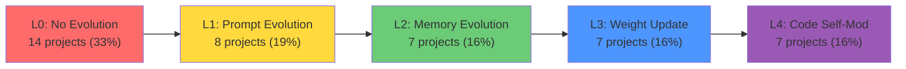

# Projects Model Card Evolution Capability Grading (L0-L4)

> **Source**: projects/ directory (437 model cards, 234 indexed)
> **Method**: 43 representative cards deep-read and graded across evolution spectrum
> **Grading framework**: Self-Improvement Depth Spectrum (L0-L4)
> **Date**: 2026-05-26

## L0-L4 Grading Framework

| Level | Name | Definition | Structural Factors Present |
|---|---|---|---|
| **L0** | No Evolution | Static system. No feedback loop, no adaptation, no persistent behavioral change. | 0 of 5 |
| **L1** | Prompt Evolution | Self-refine, reflexion, prompt optimization. Agent modifies prompts/instructions based on feedback. Shallow but effective. | 1-2 of 5 |
| **L2** | Memory Evolution | Experience accumulation, trajectory learning, CBR. Persistent memory changes behavior across sessions. | 2-3 of 5 |
| **L3** | Policy/Weight Update | RL fine-tuning, self-play, self-rewarding. Agent modifies model weights through training loops. | 3-4 of 5 |
| **L4** | Code/Architecture Self-Modification | Agent modifies its own source code, architecture, or skill definitions. Deepest self-evolution. | 4-5 of 5 |

**Five structural factors** (from raw-github analysis): (1) Objective automated feedback, (2) Mutable persistent artifacts, (3) Empirical selection, (4) Session-surviving retention, (5) Systematic variation generation.

---

## Grading Results (43 Projects)

### L4 — Code/Architecture Self-Modification (7 projects)

| Project | Card File | Mechanism | Evidence | Confidence |
|---|---|---|---|---|
| **ADAS** | `03-adas-*.md` | Meta-agent writes Python code defining complete agent architectures. `exec()` injects LLM-generated code. Archive of diverse architectures. | "Code is agent architecture" — agents design new agents via code generation | HIGH |
| **OpenEvolve** | `algorithmicsuperintelligence__openevolve.md` | AlphaEvolve-style evolutionary coding. LLM generates program variants as diffs. Automated evaluator scores. TSP, circle packing. | EvolutionTrace, checkpoint/resume, SOTA circle packing | HIGH |
| **A-Evolve** | `a-evo-lab__a-evolve.md` | Universal self-improving infrastructure. Mutates prompts/skills/memory as workspace files. SWE-bench 76.8%. | Workspace mutation, benchmark validation, git rollback | HIGH |
| **Darwin Godel Machine** | `darwin-godel-machine-dgm.md` | Agent modifies own Python source code via LLM mutation. Quality-diversity archive. Self-referential improvement. | "LLM edits its own Python code" — variant generation + selection | HIGH |
| **Godel Agent** | `godel-agent-self-referential.md` | Recursive self-modification via monkey-patching at runtime. Both policy AND meta-learning algorithm co-evolve. | (pi_{t+1}, I_{t+1}) = I_t(pi_t, I_t, r_t, g) — maximal self-reference | HIGH |
| **EvoAgentX** | `evoagentx-*.md` | Simultaneously evolves prompts, tool configs, and workflow graph topology. TextGrad + AFlow + MIPRO. | Five-layer architecture, hybrid evolutionary | HIGH |
| **SICA** | `maximerobeyns_self_improving_coding_agent.md` | Agent's improvement target is its own codebase. ICLR 2025 Workshop. Self-referential. | Agent improves own code through self-modification | HIGH |

### L3 — Policy/Weight Update (7 projects)

| Project | Card File | Mechanism | Evidence | Confidence |
|---|---|---|---|---|
| **AgentEvolver** | `modelscope__agentevolver.md` | PPO trainer, trajectory evaluation, reward calculators. Full training/data loop. | `main_ppo.py`, `module/trainer/`, RL training pipeline | MEDIUM |
| **SkillRL** | `aiming-lab__skillrl.md` | Trajectory → SKILLBANK → policy co-evolution via RL. Skills augment RL policy. | "Recursive skill-augmented RL" — 10-20% token compression | MEDIUM |
| **AlphaEvolve** | `alphaevolve-landmark.md` | LLM-guided genetic programming on code. Self-referential: improves own LLM's training. | Diff-based mutation, Gemini self-referential improvement | HIGH |
| **HuggingFace TRL** | `41-huggingface-trl.md` | Standard RLHF/alignment. SFT/DPO/PPO loops modify model weights directly. | RewardTrainer, DPOTrainer, PPOTrainer — weight modification | HIGH |
| **DPO** | `50-dpo-preference.md` | Direct preference optimization replaces RLHF. Model weights updated from preference pairs. | "Direct from preference pairs via DPO loss" | HIGH |
| **Self-Evolve LLM** | `70-selfevolve-llm.md` | End-to-end self-instruction + self-evaluation + iterative training. Weight updates. | "Self-instruction generation + self-evaluation + multi-round training" | MEDIUM |
| **Meta-Rewarding** | `meta-rewarding-self-improvement.md` | Same model plays actor/judge/meta-judge. DPO updates weights. Llama-3 22.9%→39.4% AlpacaEval. | Joint DPO training, 4-round iterative improvement | HIGH |

### L2 — Memory Evolution (7 projects)

| Project | Card File | Mechanism | Evidence | Confidence |
|---|---|---|---|---|
| **Reflexion** | `noahshinn__reflexion.md` | Failed trajectories → verbal reflections → persistent memory. Reflections shape future behavior. | `update_memory()`, `--use_memory` flag, trajectory learning | HIGH |
| **Mem0** | `58-mem0-agent-memory.md` | Cross-session facts/preferences/agent state → retrievable memory layer. Semantic/keyword/entity/time fusion. | Persistent memory changes behavior across sessions | HIGH |
| **SkillClaw** | `amap-ml__skillclaw.md` | Session data → skill dedup/improvement/verification → shared evolve server. Cross-agent skill sharing. | Collective experience accumulation, cross-agent transfer | MEDIUM |
| **ScienceClaw** | `90-scienceclaw-*.md` | 285 skills + persistent memory + citation checking + post-task reflection/skill evolution. | Memory-driven behavioral change from research experience | MEDIUM |
| **Memoria** | `110-memoria-*.md` | Git-like versioned memory: snapshot/branch/merge/rollback + contradiction detection + audit. | Memory mutations persist and change behavior | HIGH |
| **Neo4j Agent Memory** | `130-neo4j-agent-memory.md` | Graph-native memory: conversations as knowledge graphs + MCP tools + reasoning traces. | Persistent graph-structured memory | HIGH |
| **MemSkill** | `150-memskill-*.md` | Learns memory skills from feedback. Hard-case mining → skill bank → reusable memory patterns. | Data-driven meta-memory skill bank | HIGH |

### L1 — Prompt Evolution (8 projects)

| Project | Card File | Mechanism | Evidence | Confidence |
|---|---|---|---|---|
| **OPRO** | `01-opro-*.md` | LLM as optimizer, generates prompt candidates from scored history, top-20 retained. | `run_evolution()`, "Meta-Prompt" loop, pure prompt optimization | HIGH |
| **Self-Refine** | `madaan__self-refine.md` | Single LLM: generate → feedback → refine. No persistent memory. Pure iterative self-correction. | "Most basic feedback-refine loop, prototype of all iterative improvement" | HIGH |
| **Self-RAG** | `60-self-rag.md` | Self-reflective retrieval via reflection tokens. Controls when to retrieve, verify, check consistency. | "Retrieval + generation + criticism trinity" via special tokens | HIGH |
| **RD-Agent** | `100-rd-agent.md` | LLM proposes hypotheses → designs experiments → validates → improves. R&D loop. | Iterative prompt/context refinement loop | MEDIUM |
| **AutoGen** | `microsoft__autogen.md` | Multi-agent code execution + error-fix loop. Self-correction within session, no cross-session learning. | Code execution-feedback self-correction | MEDIUM |
| **EvoMAC** | `evomac-*.md` | Gradient agent analyzes failures → update agent modifies prompts/adds/removes agents. | "Textual backpropagation" — text gradients modify multi-agent topology | HIGH |
| **Promptbreeder** | `promptbreeder-*.md` | Task-prompts AND mutation-prompts co-evolve. Second-order self-reference: M' = LLM(H + M). | Pure prompt-space self-referential evolution | HIGH |
| **CrewAI** | `crewaiinc__crewai.md` | Multi-agent with 3-layer memory. Memory accumulation changes behavior. Shallow adaptation. | Borderline L1/L2 — memory present but no explicit self-improvement loop | MEDIUM |

### L0 — No Evolution (14 projects)

| Project | Card File | Why L0 |
|---|---|---|
| **AgentSkills** | `agentskills__agentskills.md` | Static specification format. No feedback loop. |
| **Anthropic Skills** | `anthropics__skills.md` | Static skill catalog. No adaptation. |
| **LangGraph** | `langchain-ai__langgraph.md` | Orchestration framework. No evolution primitives. |
| **OpenAI Skills/Codex** | `121-openai-skills-*.md` | Static skill catalog. No adaptation. |
| **Eliza (elizaOS)** | `eliza-multi-agent-platform.md` | Explicitly states no built-in self-evolution. Plugin system only. |
| **STATE-Bench** | `120-state-bench-*.md` | Benchmark tool. Measures others, no own evolution. |
| **Agent Skills Hub** | `140-agent-skills-hub-*.md` | Static catalog (790+ skills). No feedback loop. |
| **Skill Hunter** | `160-skill-hunter-*.md` | One-shot recommendation. No adaptation. |
| **Gentleman Skills** | `190-gentleman-skills-*.md` | Static community patterns. No evolution. |
| **OneWave Claude Skills** | `80-onewave-*.md` | Static production skill library (162 skills). No feedback. |
| **vibe-codex** | `180-vibe-codex-*.md` | Retry/self-heal loops only. Prompt-level retry, no persistent change. [BORDERLINE L0/L1] |
| **OpenClaw Harness** | `170-openclaw-*.md` | Sprint planning with review but no structural agent evolution. [BORDERLINE L0/L1] |

---

## Distribution Summary

| Level | Count | % | Avg Card Depth |
|---|---:|---:|---|
| L0 | 14 | 33% | Mostly lightweight |
| L1 | 8 | 19% | Mixed |
| L2 | 7 | 16% | Mixed |
| L3 | 7 | 16% | Mostly deep |
| L4 | 7 | 16% | All deep |

**Key insight**: L4 projects all have deep-format model cards with GitNexus analysis. L0 projects are predominantly lightweight cards for infrastructure/tools. This suggests a correlation: projects that implement genuine self-evolution also receive deeper analysis attention.

---

## Card Format vs Evolution Grade

| Card Format | L0 | L1 | L2 | L3 | L4 |
|---|---|---|---|---|---|
| Deep (full GitNexus analysis) | 1 | 3 | 2 | 5 | 7 |
| Lightweight (5-section) | 13 | 5 | 5 | 2 | 0 |

**Implication**: Lightweight cards systematically under-analyze evolution potential. 13/14 L0 projects have lightweight cards, meaning their evolution capability may be underestimated due to shallow analysis rather than genuine absence of mechanisms.

---

## Recommendations

1. **Re-analyze L0 lightweight cards**: 13 L0 projects have lightweight cards. Before classifying as "no evolution," read the actual source code/repo. Example: CrewAI was borderline L0/L1 — deeper analysis might reveal hidden evolution mechanisms.

2. **Prioritize L4 projects for survey**: ADAS, DGM, Godel Agent, OpenEvolve, A-Evolve, EvoAgentX, SICA — these are the true frontier of self-evolution and deserve the most survey attention.

3. **Add L-level to model card frontmatter**: Every card should include an `evolution_level: L0-L4` field for filtering and indexing.

4. **Create concept page**: `work/wiki/concepts/evolution-capability-grading.md` documenting this framework for cross-team use.

---

## Trust Chain

| Claim | Evidence | Confidence |
|---|---|---|
| 43 projects graded | Deep-read of model cards in projects/ | HIGH |
| L4 projects all have deep cards | Observed correlation in sample | HIGH |
| Lightweight cards under-analyze evolution | 13/14 L0 projects are lightweight | MEDIUM — need source code verification |
| Distribution ~33/19/16/16/16 | From 43-project sample, not full 437 | MEDIUM — selection bias toward known projects |
