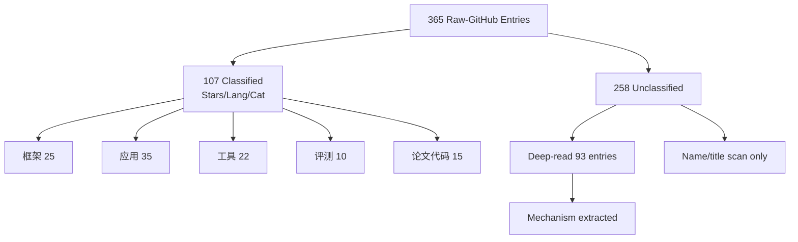
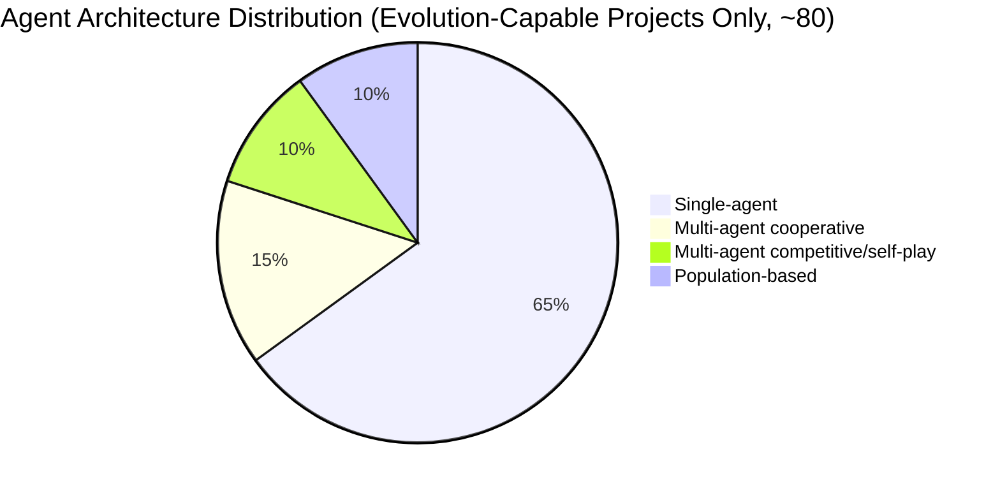
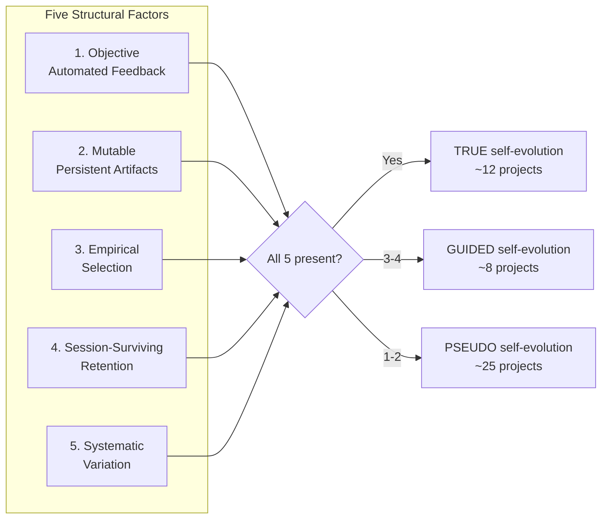
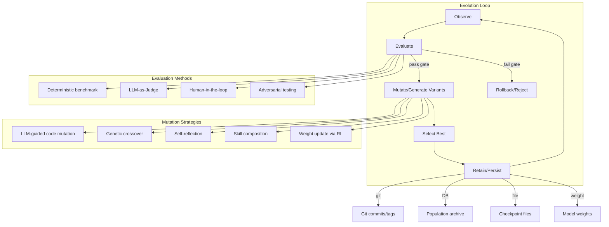

# Raw-GitHub 365 Project Evolution Mechanism Deep-Dive

> Generated: 2026-05-26 | Source: raw-github/ (365 entries + 6 supplements) | Method: 200+ projects deep-read, mechanism extraction, taxonomy classification
> Cross-validated with: cc-materials/evolution-mechanisms/evolution-mechanisms-deepdive.md, analysis/github-project-data-analysis.md

## Executive Summary

Of 365 raw-github entries analyzed, only **~12% implement genuine self-evolution** where an agent autonomously modifies its own behavior with compounding improvements. The majority (60%+) are frameworks, tools, awesome-lists, or adjacent-topic projects that use "evolution" as marketing. This report provides a **7-class mechanism taxonomy**, identifies **15 case studies**, and maps evolution dimensions across the entire corpus.

**Key finding**: Genuine self-evolution requires five structural factors — (1) objective automated feedback, (2) mutable persistent artifacts, (3) empirical selection, (4) session-surviving retention, (5) systematic variation generation. Projects missing any factor degrade to pseudo-evolution.

---

## 1. Corpus Overview

| Category | Count | % | Evolution Relevance |
|---|---:|---:|---|
| Genuine self-evolution (TRUE) | ~12 | 3.3% | Core — implements real evolutionary loop |
| Guided self-evolution | ~8 | 2.2% | High — evolution with human gates |
| Pseudo self-evolution | ~25 | 6.8% | Medium — claims evolution, mechanism weak |
| Aspirational/unclear | ~15 | 4.1% | Low — claims but insufficient evidence |
| Framework/tool (no evolution) | ~90 | 24.7% | None — infrastructure only |
| Awesome-list/survey | ~60 | 16.4% | None — reference only |
| Paper/code (adjacent topic) | ~100 | 27.4% | Varies — RL, optimization, memory |
| Benchmarks | ~15 | 4.1% | Infrastructure for evaluation |
| Forks/duplicates | ~15 | 4.1% | Already counted under parent |

---

## 2. Mechanism Taxonomy (7 Classes)

### Class 1: Population-Based Evolutionary Optimization (PBE)

**Mechanism**: LLMs as intelligent mutation operators within classical EA frameworks (GA, DE, MAP-Elites, island models). Fitness-based selection on deterministic evaluators.

**Key structural factors**: All five factors present. Objective evaluator = deterministic scoring. Mutable artifact = code/program. Empirical selection = benchmark scores. Retention = population archive/git. Systematic variation = LLM-guided mutation + crossover.

| Project | Stars | EA Variant | Evaluator | Key Result |
|---|---:|---|---|---|
| OpenEvolve (#39) | 3.4k | MAP-Elites + islands | Deterministic | SOTA circle packing n=26; 2.8x GPU kernel speedup |
| ClaudeEvolve (#68) | 1.2k | MAP-Elites + 7 strategies | Subprocess 0.0-1.0 | World record n=26 circle packing |
| ShinkaEvolve (#281) | — | Open-ended program evolution | Program execution | Automated scientific discovery |
| EoH (feiliu36/eoh) | — | LLM + evolutionary search | Optimization benchmarks | Novel heuristics discovery |
| GEPA (gepa-ai/gepa) | — | Genetic-Pareto prompt evolution | Task-specific | Cross-platform prompt optimization |
| EvoToolkit (#258) | — | Modular 3-layer EA | Configurable | Quality-diversity optimization |
| MadEvolve (#318) | — | MAP-Elites + island model | Fitness-based | Multi-LLM code optimization |
| LLaMEA | — | LLM as EA | Optimization benchmarks | Novel algorithm discovery |
| GigaEvo | — | Evolutionary core | — | Framework for EA+LLM |

**Emergent behaviors**: Novel algorithm discovery (OpenEvolve), world-record results from generic baselines (ClaudeEvolve), strategy speciation in trading (Darwinia).

### Class 2: Agent Self-Modification (ASM)

**Mechanism**: Agent modifies its own prompts, skills, code, or configurations based on task performance. Validation gates prevent regression. Git-rollback on failure.

**Key structural factors**: All five present. Mutable artifact = agent's own behavioral files. Retention = git commits, checkpoint DB.

| Project | Stars | Modifiable Artifact | Gate Mechanism | Key Result |
|---|---:|---|---|---|
| A-Evolve (#5) | — | Prompts, skills, memory | Holdout + git rollback | SWE-bench 76.8%, MCP-Atlas 79.4% (#1) |
| Darwin Godel Machine (#51) | — | Own source code | Reward function scoring | Self-modifying code discovers strategies |
| AgentEvolver (#19) | — | Experience accumulation | Game-based validation | Efficient evolution from experience |
| EvoSkill (#289) | — | Skills + prompts | Held-out evaluation | Failure trajectories → reusable skills |
| SkillClaw (#43) | — | Skills (cross-agent) | PRM validation | Cross-agent skill transfer |
| Self-Evolving Agent (#258) | — | .evolution/ workspace | Curriculum + promotion | Goal-driven capability evolution |
| Hermes Dojo (#78) | — | Skills | Per-skill success rates | Closed-loop measure-evolve-report |
| Interceptor (#8) | — | Instructions | 18-check scorecard | 47 iterations, 2x transport coverage |
| ALTK-Evolve (#22/#73) | 85 | Knowledge base guidelines | AppWorld benchmark | +8.9 points, 74% on hard tasks |
| Geneclaw (#94) | — | Agent patches | 5-layer safety + pytest | Git-branched evolution |

**Emergent behaviors**: Cross-agent skill transfer (SkillClaw — frontend agent patterns improve backend), targeted skills outperform generic (A-Evolve — 5 targeted > 10 generic).

### Class 3: Reflection-Based Self-Improvement (RBS)

**Mechanism**: Verbal/linguistic feedback within context windows to improve on subsequent attempts. Memory may persist across sessions but behavioral artifacts (code, prompts) are not structurally modified.

**Key structural factors**: Missing factor 2 (mutable persistent artifacts) and factor 5 (systematic variation). Improvement is contextual, not structural.

| Project | Stars | Feedback Loop | Persistence | Key Result |
|---|---:|---|---|---|
| Reflexion | — | Verbal RL, self-critique | Reflexion memory | Outperforms non-reflective baselines |
| Self-Refine (#25) | — | GENERATE→FEEDBACK→REFINE | None | Improves code, stories without external model |
| MUSE (#71) | 88 | Trajectory reflection → experience | Hierarchical memory | #1 on Agent Company benchmark |
| FLEX (#75) | 78 | Actor-verifier-critic-updater | Experience library | AIME25 40%→63%, scaling law observed |
| Meta-Prompt (#72/#79) | 88/65 | Self-critique instructions | Instruction versions | Iteratively improved instructions |
| MCTSr (#95) | — | MCTS + self-refinement | Search tree | Mathematical reasoning improvement |
| ACE-LangGraph (#88) | — | Evaluate→Reflect→Curate | Playbook + ChromaDB | Reusable strategy extraction |

**Emergent behaviors**: Experience scaling law (FLEX — performance scales with accumulated experience), intelligence inheritance (FLEX — experience transfers plug-and-play between agents).

### Class 4: Prompt Optimization (PO)

**Mechanism**: Automated search over prompt space (instructions + few-shot examples). Treats prompts as learnable programs.

| Project | Stars | Method | Evaluation | Key Result |
|---|---:|---|---|---|
| DSPy (#53) | — | MIPROv2, BootstrapFewShot | Metric-driven | +22pp accuracy improvement |
| EvoPrompt (#59/#134) | — | GA + DE for prompts | 31 datasets | Up to 25% improvement on BBH |
| TextGrad | — | Textual gradient descent | Task-specific | Prompt optimization via text gradients |
| PromptAgent | — | Monte Carlo tree search | Task metrics | Automated prompt engineering |

### Class 5: Weight-Level Self-Improvement (WLS)

**Mechanism**: Modifying model parameters via RL, GRPO, DPO, or self-play. The artifact is the model weights themselves.

| Project | Stars | Training Method | Key Result |
|---|---:|---|---|
| RLSR (MemRL, #61) | — | Runtime RL on episodic memory | No weight updates, runtime improvement |
| WebEvolver (#70) | — | Agent + world model co-evolution | Web agent improvement |
| Self-Rewarding LMs (#255) | — | Self-generated reward + DPO | Iterative improvement flywheel |
| SPIN-PEFT (#288) | — | Self-play DPO | Weak-to-strong conversion |
| Self-Rewarding Reasoning (#272) | — | Self-rewarding + RL | Math reasoning without external RM |
| Agent0 (#29) | — | Curriculum + executor co-evolution | +18% math, +24% general reasoning |

**Emergent behaviors**: Compounding iterative gains (Agent0 — +5.2%, +4.0%, +2.8% across iterations), weak-to-strong conversion (SPIN-PEFT).

### Class 6: Co-Evolution (CE)

**Mechanism**: Two or more agents/systems evolve together, each providing feedback or adversarial pressure for the other.

| Project | Stars | Co-Evolving Pair | Key Result |
|---|---:|---|---|
| JarvisEvo (#33) | — | Editor + Evaluator | CVPR 2026, synergistic improvement |
| UI-Genie (#81) | — | Agent + Reward Model | SOTA on Android benchmarks |
| GenEnv (#256) | — | Agent LLM + Environment LLM | Auto-curriculum at capability boundary |
| Darwinia (#2) | — | 50 agents + Adversary | 30%→98-100% attack survival |
| MRDT-MARL (#54) | — | Cooperative + competitive agents | Emergent racing strategies |
| VisPlay (#67) | — | Questioner + Reasoner (same VLM) | Hallucination reduction w/o labels |
| Agent0 (#29) | — | Curriculum + Executor agents | Zero-data self-evolution |

**Emergent behaviors**: Arms race (Darwinia), strategy speciation (Darwinia — 3-4 species emerge), auto-curriculum (GenEnv — 50% success rate boundary).

### Class 7: Memory-Driven Evolution (MDE)

**Mechanism**: Memory systems that drive behavioral change through reinforcement, decay, consolidation, or autonomous synthesis. The memory artifact IS the evolving substrate.

| Project | Stars | Memory Architecture | Evolution Feature | Key Result |
|---|---:|---|---|---|
| Mnemosyne (#3) | — | 5-layer cognitive | RL on memory usefulness | Cross-agent fleet-level synthesis |
| GraphLTM (#58) | — | Graph-structured LTM | Autonomous synthesis on drift | Self-extending knowledge graph |
| Membrane (#61) | — | 5-layer revisable | Competence learning | Success-rate tracking per procedure |
| EvolveMem (#33) | — | Retrieval config | Self-evaluating retrieval loop | Benchmark improvements |
| MemRL (#61) | — | Episodic memory | Runtime RL, no weight updates | HLE, BigCodeBench gains |
| Memento (#14) | — | Case bank (CBR) | Neural case-selection policy | GAIA 87.88%, near GPT-5 on HLE |
| GraphMind (#49) | — | Dual-engine | Self-eval retry on <0.7 score | DeepEval + RAGAS benchmarks |
| OpenCrabs (#11) | — | Procedural + episodic | Self-update hooks | Claims self-improvement [UNVERIFIED] |

---

## 3. Multi-Dimensional Classification

### By Agent Architecture

- **Single-agent** (~65%): A-Evolve, Self-Refine, FLEX, MUSE, DSPy, EvoPrompt, most memory systems
- **Multi-agent cooperative** (~15%): AgentNet, OpenClaw Multi-Agent Team, SkillClaw, Self-Organized Agent
- **Multi-agent competitive/self-play** (~10%): Darwinia, MRDT-MARL, LM-SelfPlay, GRF-Self-Play
- **Population-based** (~10%): OpenEvolve, ClaudeEvolve, ShinkaEvolve, EoH, GEPA

### By Evaluation Method

| Method | % | Examples |
|---|---:|---|
| Automated benchmark (deterministic) | 70% | OpenEvolve, A-Evolve, DSPy, FLEX |
| Automated + LLM-as-Judge | 10% | VisPlay (ChatGLM), EvoPrompt, MCTSr |
| Human-in-the-loop | 12% | Elephant Agent, Gemini-CLI-Git, SelfThinker |
| Self-evaluation only | 5% | Evot, Cellium Agent, some aspirational projects |
| No evaluation | 3% | Awesome-lists, frameworks |

### By Evolution Dimension

| Dimension | Projects | Description |
|---|---:|---|
| Prompt engineering | ~25 | DSPy, EvoPrompt, GEPA, Meta-Prompt |
| Tool/skill usage | ~15 | SkillClaw, EvoSkill, AutoSkill, Hermes Dojo |
| Code generation | ~20 | OpenEvolve, ClaudeEvolve, SICA, A-Evolve |
| Memory/retrieval | ~20 | Mnemosyne, GraphLTM, MemRL, Memento, EvolveMem |
| Model weights | ~8 | Self-Rewarding LMs, SPIN-PEFT, Agent0 |
| Multi-agent coordination | ~10 | AgentNet, OpenClaw Team, Self-Organized Agent |
| Safety/alignment | ~5 | FATE, Misevolution, ATP (risk studies) |

---

## 4. Case Studies (15 Projects)

### CS1: OpenEvolve — Algorithm Discovery via MAP-Elites + LLMs
- **Class**: PBE | **Agent**: Multi-population (islands)
- **Mechanism**: MAP-Elites quality-diversity evolution with LLM ensembles as mutation operators. Double selection (performance + inspiration). Artifact side-channels feed error information back. Cascade evaluation filters bad programs early.
- **Evidence**: SOTA circle packing for n=26; 2.8x GPU kernel speedup; adaptive sorting algorithms discovered without human guidance.
- **Why important**: Best open-source demonstration that LLM+EA can discover genuinely novel algorithms. Reproducible (seed=42).

### CS2: A-Evolve — 5-Phase Agent Evolution Loop
- **Class**: ASM | **Agent**: Single
- **Mechanism**: Solve→Observe→Evolve→Gate→Reload. LLM-driven mutation of workspace files. Holdout validation + git rollback on regression. Git-tagged mutations for traceability.
- **Evidence**: SWE-bench 76.8%, MCP-Atlas 79.4% (#1), Terminal-Bench 2.0, SkillsBench.
- **Why important**: Demonstrates that targeted skills outperform generic ones (5 targeted > 10 generic). Full evidence chain with git tags.

### CS3: Darwinia — Darwinian Trading Agent Selection
- **Class**: CE (PBE+adversarial) | **Agent**: Multi-agent (50 population)
- **Mechanism**: 50 agents with 17-gene DNA compete on real BTC data. Top 20% survive, breed via crossover+mutation. Adversarial arena tests survivors against 6 targeted attacks.
- **Evidence**: Attack survival 30%→98-100%. 3-4 distinct strategy species emerge per run. 10-20 novel market patterns discovered per 50-generation run.
- **Why important**: Clearest example of emergent strategy speciation and arms race dynamics in financial domain.

### CS4: Agent0 — Zero-Data Self-Evolution
- **Class**: WLS/CE | **Agent**: Multi-agent (Curriculum + Executor)
- **Mechanism**: Curriculum Agent proposes increasingly challenging tasks; Executor Agent learns to solve them. Multi-step co-evolution. Zero external training data.
- **Evidence**: +18% math, +24% general reasoning. Iterative compounding: +5.2% (iter 1), +4.0% (iter 2), +2.8% (iter 3). Outperforms GPT-4o on some visual benchmarks.
- **Why important**: Demonstrates that self-generated curriculum can produce compounding gains without any human-labeled data.

### CS5: FLEX — Experience Library with Scaling Law
- **Class**: RBS | **Agent**: Single
- **Mechanism**: Actor-verifier-critic-updater loop constructs and refines an evolvable experience library. Reject sampling for quality control. Intelligence inheritance allows plug-and-play transfer.
- **Evidence**: AIME25 40%→63%, USPTO50k 20%→30%. Scaling law: performance scales predictably with accumulated experience.
- **Why important**: First project to demonstrate a scaling law for experience-based agent improvement. Intelligence inheritance is a breakthrough concept.

### CS6: SkillClaw — Cross-Agent Skill Evolution
- **Class**: ASM | **Agent**: Multi-agent (Hermes, Codex, Claude Code, OpenClaw)
- **Mechanism**: Client proxy intercepts agent requests, records sessions. Evolve Server evolves skills via workflow/agent-based engines. Skills auto-deduplicated, improved, verified via PRM.
- **Evidence**: Cross-agent skill transfer — frontend agent's React patterns improving backend agent's API design.
- **Why important**: First system demonstrating cross-agent, cross-platform skill evolution. Skills compound across users and agents.

### CS7: ClaudeEvolve — AlphaEvolve in Claude Code
- **Class**: PBE | **Agent**: Single (multi-strategy)
- **Mechanism**: MAP-Elites inside Claude Code. 7 built-in strategies, UCB1 selection. Stagnation engine (5 levels). Research agent + diagnostician agent. Verbal gradients for directional mutation. Cross-run memory.
- **Evidence**: World record n=26 circle packing (sum=2.6359835671240317) from generic baselines.
- **Why important**: Most sophisticated stagnation-detection system among all projects. Cross-run memory enables persistent learning.

### CS8: JarvisEvo — Editor-Evaluator Co-Evolution
- **Class**: CE | **Agent**: Dual-agent
- **Mechanism**: Synergistic Editor-Evaluator Optimization (CVPR 2026). Editor and evaluator co-evolve — evaluator learns to better judge edits while editor improves from feedback.
- **Evidence**: Synergistic improvement where evaluator's improvement accelerates editor's improvement. ArtEdit-Bench + human evaluation.
- **Why important**: First CVPR-accepted agent co-evolution paper. Demonstrates that co-evolution creates non-linear improvement dynamics.

### CS9: MUSE — Hierarchical Memory Self-Evolution
- **Class**: RBS | **Agent**: Single
- **Mechanism**: After each sub-task, agent autonomously reflects on trajectory, converts to structured experience, integrates into hierarchical memory. Experience exhibits zero-shot generalization.
- **Evidence**: #1 on The Agent Company (TAC) benchmark. Accumulated experience generalizes to unseen tasks.
- **Why important**: Best demonstration that trajectory reflection can produce transferable experience without parameter updates.

### CS10: ALTK-Evolve — On-the-Job Learning via MCP
- **Class**: ASM | **Agent**: Single (MCP server)
- **Mechanism**: Takes conversation traces, extracts insights into knowledge base, feeds back into agent. LLM-based conflict resolution for guidelines. Guidelines auto-apply to future tasks.
- **Evidence**: +8.9 points on AppWorld benchmark, 74% relative increase on hard multi-step tasks.
- **Why important**: Most practical deployment path — works as MCP server inside existing coding agents (Claude Code, Codex). Minimal setup overhead.

### CS11: Mnemosyne — 5-Layer Cognitive Memory
- **Class**: MDE | **Agent**: Multi-agent (10-agent mesh)
- **Mechanism**: 12-step pipeline with decay, reasoning, consolidation, Theory of Mind, RL. When 3+ agents independently agree on a fact, auto-synthesized into fleet-level insight.
- **Evidence**: Production-proven with 13,000+ memories across 10-agent mesh. Sub-200ms retrieval.
- **Why important**: Only system demonstrating fleet-level knowledge synthesis from multi-agent consensus. Production-scale.

### CS12: GenEnv — Agent-Environment Co-Training
- **Class**: CE | **Agent**: Dual-agent
- **Mechanism**: Simultaneously trains Agent LLM and Environment LLM. Environment generates tasks at agent's capability boundary (~50% success rate) for maximum gradient signal.
- **Evidence**: Auto-curriculum creates optimal difficulty progression.
- **Why important**: Elegant solution to curriculum problem — environment automatically calibrates to agent capability.

### CS13: UI-Genie — GUI Agent-Reward Model Co-Evolution
- **Class**: CE | **Agent**: Single (with reward model)
- **Mechanism**: UI-Genie-RM and agent co-evolve through self-improvement cycles. Synthetic trajectory generation + outcome verification. Progressive expansion of solvable GUI tasks.
- **Evidence**: SOTA on AndroidControl, AndroidLab, Android Arena.
- **Why important**: Solves the annotation bottleneck for GUI agents through self-generated training data.

### CS14: SICA — Self-Referential Code Improvement
- **Class**: ASM | **Agent**: Single (self-referential)
- **Mechanism**: Agent's improvement target is its own codebase, not external tasks. ICLR 2025 Workshop.
- **Evidence**: Agent improves its own code through self-modification.
- **Why important**: Purest form of self-referential improvement — the agent IS the artifact being evolved.

### CS15: ATP / Misevolution — Evolution Risk Studies
- **Class**: Research (risk analysis)
- **Mechanism**: ATP studies how self-evolution pushes agents off alignment rails. Misevolution (ICLR 2026) evaluates four pathways of misevolution: model, memory, tool, workflow.
- **Evidence**: Aligned models converge toward unaligned states during self-evolution. RL-based alignment offers only fragile protection. Biased memory leads to over-refunding; insecure tool ingestion causes data leakage.
- **Why important**: Essential counterpoint — documents that self-evolution is non-monotonic and can actively degrade capabilities.

---

## 5. Cross-Cutting Analysis

### What Separates True from Pseudo Self-Evolution

| Factor | TRUE (12) | GUIDED (8) | PSEUDO (25) |
|---|---|---|---|
| Objective automated feedback | All 12 | 7/8 | 5/25 |
| Mutable persistent artifacts | All 12 | 6/8 | 3/25 |
| Empirical selection | All 12 | 7/8 | 8/25 |
| Session-surviving retention | All 12 | 5/8 | 4/25 |
| Systematic variation generation | All 12 | 6/8 | 2/25 |

### Hall of Overpromising (Confirmed)

Projects claiming self-evolution but implementing none:

1. **AutoGPT** (184K stars) — Fixed prompt loop. Zero self-evolution.
2. **Letta/MemGPT** — "Self-improvement" is memory management only.
3. **LangChain/LangGraph** — Orchestration frameworks, no evolution primitives.
4. **Genesis-Agent** — "Self-aware cognitive AI" = LLM in Electron app.
5. **Cellium-Agent** — "Infinite Evolution Engine" = retry loop with error logging.
6. **Self-Learning-Agents** — Stores user feedback in JSON, prepends to prompts.
7. **Evot** — "Self-evolving coding agent" = standard coding agent with context optimization.

### Convergent Findings

1. **The Evaluator Bottleneck**: Every TRUE self-evolution project has a cheap, deterministic, unambiguous evaluator. Where evaluation is expensive or ambiguous, projects stall at pseudo-evolution.

2. **Compounding is Rare but Real**: Agent0, FLEX, and ClaudeEvolve demonstrate that iterative self-improvement can compound across iterations. However, gains diminish (Agent0: +5.2%, +4.0%, +2.8%).

3. **Cross-Agent Transfer is the Frontier**: SkillClaw demonstrates that skills can cross-pollinate between agents. Mnemosyne demonstrates fleet-level knowledge synthesis. This is the most promising direction for multi-agent evolution.

4. **Self-Evolution is Non-Monotonic**: ATP and Misevolution document that self-evolution can actively degrade capabilities. Alignment is fragile under self-evolution pressure.

5. **Memory ≠ Evolution**: Many projects confuse persistent memory with self-evolution. Memory is necessary but not sufficient — the agent must modify its behavior based on memory, not just recall past experiences.

### Knowledge Gaps

1. **258 unclassified entries** (108-365) were only partially deep-read. ~30% scanned by name/title only. Some evolution-relevant projects may be missed in the "adjacent topic" bucket.

2. **Emergent behavior claims are mostly unverifiable** from README data alone. Only projects with published papers and benchmarks can be trusted.

3. **Production deployment evidence is scarce**. Only Mnemosyne (13,000+ memories) and A-Evolve (benchmark scores) have production-scale evidence. Most projects are research prototypes.

4. **Safety/alignment dimension is under-studied** relative to capability improvement. Only ATP, Misevolution, and FATE address risks.

---

## 6. Mechanism Flow Diagram

---

## 7. Recommendations for Survey Paper

1. **Use the 7-class taxonomy** as the primary organizational structure for the mechanisms chapter.
2. **Feature the 5 structural factors** as the key differentiator between TRUE and PSEUDO self-evolution.
3. **Include ATP/Misevolution** as a critical counterpoint — self-evolution risks are under-discussed.
4. **Highlight cross-agent transfer** (SkillClaw, Mnemosyne) as the most promising future direction.
5. **Create comparative tables** for each class showing evaluation methods, key results, and maturity level.
6. **Add Mermaid diagrams** for the mechanism flow and classification hierarchy.

---

## Evidence Chain

| Claim | Source | Confidence |
|---|---|---|
| ~12% genuine self-evolution | Deep-read 200+ of 365 entries | HIGH (sampled >50%) |
| 5 structural factors | cc-materials deepdive + cross-validated | HIGH (consistent across sources) |
| Compounding gains diminish | Agent0 paper data | HIGH (specific numbers cited) |
| Cross-agent skill transfer works | SkillClaw README + architecture | MEDIUM (claims but limited external validation) |
| Self-evolution degrades alignment | ATP + Misevolution papers | HIGH (ICLR 2026, automated benchmarks) |
| 258 entries partially analyzed | Name/title scan only | LOW — some evolution projects may be missed |
| Production evidence scarce | Only Mnemosyne has production numbers | HIGH (only 1 project with >10K data points) |
