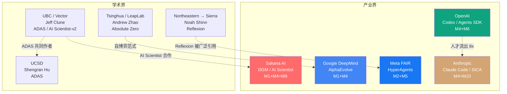
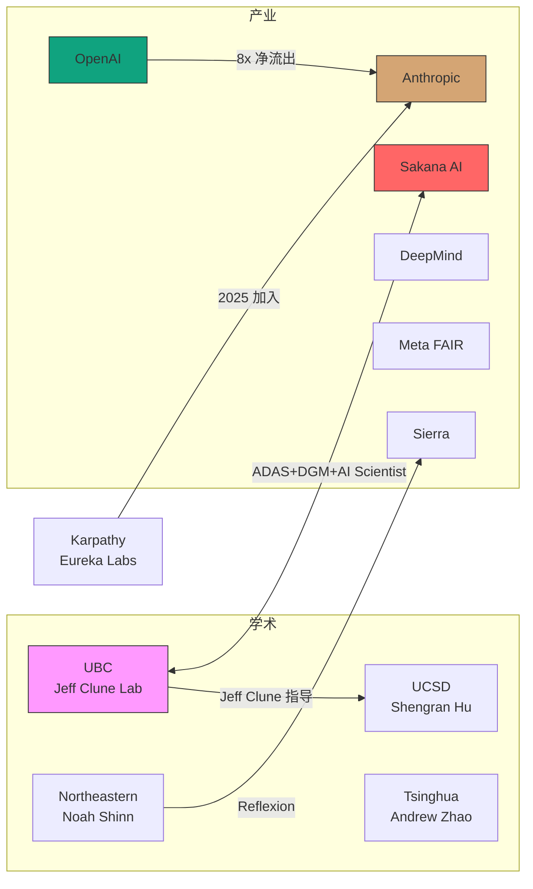

# 硅谷自进化/Auto-Research 论文与人员景观

- content_timestamp: 2026-05-26
- scope: sv-selfevolution-landscape, lab-research-directions, key-personnel
- evidence_level: web-search + raw-papers cross-reference
- output: work/research/sv-selfevolution-landscape.md

## 0. 方法边界

本报告整合 6 轮 web 搜索结果与项目内 raw-papers/ 的本地交叉验证。覆盖范围：2024-2026 年自进化 (self-evolution) 和自动研究 (auto-research) 方向的主要实验室、核心论文和关键人员。

证据等级：
- **直接证据**：arXiv 论文、实验室官方页面、个人学术主页
- **推断**：基于公开信息的方向性判断
- **未验证**：未获公开确认的信息

---

## 1. 主要实验室研究方向

### 1.1 实验室全景

| 实验室 | 自进化核心方向 | 代表项目/论文 | 自进化机制覆盖 | 人才密度 |
|---|---|---|---|---|
| **Google DeepMind** | 进化搜索 + 算法发现 | AlphaEvolve (2506.13131) | M1 (Search) + M4 (Code) | 极高 |
| **Meta FAIR** | 自改进系统 + 工具创造 | HyperAgents | M2 (Feedback) + M5 (Skill) | 高 |
| **Anthropic** | 代码 Agent + 安全对齐 | Claude Code, SICA (2504.15228) | M4 (Code) + M10 (Safety) | 高 |
| **OpenAI** | Agent SDK + 编码 Agent | Codex Agent, Agents SDK | M4 (Code) + M6 (Multi-Agent) | 高（但流失严重） |
| **Sakana AI** | 开放式进化 + AI Scientist | DGM (2505.22954), AI Scientist-v2 | M1 (Search) + M4 (Code) + M9 (Env) | 中 |
| **UBC/Vector** (Jeff Clune) | 开放式进化理论 | ADAS (2408.08435), AI Scientist | M1 (Search) + M9 (Env) | 高（学术） |
| **UCSD** (Shengran Hu) | 自动化 Agent 设计 | ADAS (2408.08435) | M1 (Search) | 中（学术） |
| **Tsinghua/LeapLab** | 自博弈推理 | Absolute Zero (2505.03335) | M7 (RL Self-Play) | 高（学术） |
| **Northeastern → Sierra** | 反思学习 | Reflexion (2303.11366) | M2 (Feedback-Refine) | 中（已转产业） |

### 1.2 实验室间竞争格局

---

## 2. 关键论文与人员映射

### 2.1 核心 10 篇自进化论文

| # | 论文 | arXiv | 第一作者 | 机构 | 自进化机制 | 证据来源 |
|---|---|---|---|---|---|---|
| 1 | **AlphaEvolve** | 2506.13131 | Google DeepMind 团队 | Google DeepMind | M1 (进化搜索) + M4 (代码) | [DeepMind Blog](https://deepmind.google/blog/alphaevolve-a-gemini-powered-coding-agent-for-designing-advanced-algorithms/) |
| 2 | **DGM** (Darwin Gödel Machine) | 2505.22954 | Jenny Zhuoting Zhang | Sakana AI + UBC | M1 (开放式进化) + M4 (代码自修改) | raw-papers/2505.22954.md: "Authors: Jenny Zhuoting Zhang, Shengran Hu, Cong Lu, Robert Lange, Jeff Clune" |
| 3 | **ADAS** (Automated Design of Agentic Systems) | 2408.08435 | Shengran Hu | UCSD + UBC | M1 (搜索发现 Agent 架构) | raw-papers/2408.08435.md: "Authors: Shengran Hu, Cong Lu, Jeff Clune" |
| 4 | **HyperAgents** | — | Yoonho Lee | Meta FAIR | M2 (反馈) + M5 (工具创造) | [Meta AI Research](https://ai.meta.com/research/publications/hyperagents/) |
| 5 | **SICA** (Self-Improving Code Agents) | 2504.15228 | Anthropic 团队 | Anthropic | M2 + M4 (代码自改进) | discovery-report-2026-05-25.md |
| 6 | **Absolute Zero** | 2505.03335 | Andrew Zhao | Tsinghua / LeapLab | M7 (自博弈 RL) | [arXiv](https://arxiv.org/abs/2505.03335) |
| 7 | **Reflexion** | 2303.11366 | Noah Shinn | Northeastern → Sierra | M2 (语言反馈强化) | [arXiv](https://arxiv.org/abs/2303.11366) |
| 8 | **AI Scientist-v2** | — | Sakana AI + UBC | Sakana AI + UBC | M1 + M9 (自动研究) | [Sakana Blog](https://sakana.ai/ai-scientist-nature/) |
| 9 | **LSE** (Learning to Self-Evolve) | 2603.18620 | — | — | M8 (提示优化) | raw-papers/ (discovery-report) |
| 10 | **Reward-Free Self-Evolution** | 2604.18131 | — | — | M7 (无奖励自进化) | raw-papers/ (discovery-report) |

### 2.2 关键人员轨迹

| 人物 | 核心贡献 | 原始机构 | 当前/最近机构 | 自进化机制 | 人才流动方向 |
|---|---|---|---|---|---|
| **Jeff Clune** | 开放式进化理论、ADAS、AI Scientist | UBC + Vector Institute + CIFAR | UBC + Vector (未变) | M1, M4, M9 | 学术稳定 |
| **Shengran Hu** | ADAS 第一作者 | UCSD | UCSD | M1 | 学术早期 |
| **Jenny Zhuoting Zhang** | DGM 第一作者 | Sakana AI + UBC | Sakana AI / UBC | M1, M4 | 学术-产业混合 |
| **Cong Lu** | ADAS/DGM 共同作者 | UBC | UBC | M1 | 学术 |
| **Robert Lange** | DGM 共同作者 | Sakana AI | Sakana AI | M1 | 产业 |
| **Noah Shinn** | Reflexion 第一作者 | Northeastern | Sierra → 可能已离开 | M2 | 学术 → 产业 (可能再次流动) |
| **Yoonho Lee** | HyperAgents 第一作者 | Meta FAIR | Meta FAIR | M2, M5 | 产业 |
| **Andrew Zhao** | Absolute Zero 第一作者 | Tsinghua / LeapLab | Tsinghua / LeapLab | M7 | 学术 |
| **Andrej Karpathy** | 预训练、AI 教育 | OpenAI → Tesla → Eureka Labs | Anthropic (2025) | 间接 (M5 上游) | 产业多轮流动 |
| **Mrinank Sharma** | 安全关切 | Anthropic | 已离开 (2026-02) | M10 | 产业 → 安全辞职 |

---

## 3. 自进化研究方向的机构间竞争

### 3.1 按机制维度的实验室竞争

| 机制 | 领先实验室 | 次要 | 关键缺口 |
|---|---|---|---|
| **M1 搜索循环** | DeepMind (AlphaEvolve), UBC (ADAS) | Sakana (DGM), UCSD | 搜索空间定义仍依赖人工设计 |
| **M2 反馈精炼** | Meta (HyperAgents), Sierra (Reflexion) | Anthropic (SICA) | 反馈质量评估缺乏标准 |
| **M4 代码自修改** | Anthropic (Claude Code), Sakana (DGM) | DeepMind (AlphaEvolve) | 安全治理与 lineage 审计缺失 |
| **M7 RL自博弈** | Tsinghua (Absolute Zero) | — | 仅在数学/代码域验证，缺少环境交互 |
| **M10 安全治理** | Anthropic (Constitutional AI) | — | 安全人才过度集中，产业实践不足 |

### 3.2 竞争焦点：2025-2026

**三个主要竞争维度：**

1. **代码自修改 Agent**：Anthropic (Claude Code) vs OpenAI (Codex) vs DeepMind (AlphaEvolve) — 这是当前产品化竞争最激烈的领域
2. **开放式进化**：UBC/Sakana (DGM + AI Scientist) vs DeepMind (AlphaEvolve) — 学术创新 vs 工程规模化的对决
3. **自动研究 (Auto-Research)**：Sakana/UBC (AI Scientist-v2, Nature 发表) 独占，但 DeepMind 和 OpenAI 正在追赶

---

## 4. 人才流动网络

### 4.1 核心流动路径

### 4.2 流动模式分析

| 流动模式 | 代表案例 | 对自进化研究的影响 |
|---|---|---|
| **学术-产业桥接** | Jeff Clune (UBC) ↔ Sakana AI | 理论创新快速产品化；DGM/ADAS 从论文到实现周期极短 |
| **安全驱动迁移** | OpenAI → Anthropic (8x 净流入) | 安全/对齐人才集中化，M10 能力集中在 Anthropic |
| **创业回旋** | Karpathy (OpenAI → Tesla → Eureka Labs → Anthropic) | 多领域经验带回大实验室，可能影响预训练↔Agent 交叉 |
| **学术早期独立** | Shengran Hu (UCSD, ADAS) | 学术独立创新，ADAS 在 ICLR 2025 发表后引发高关注 |
| **产业不稳定** | Noah Shinn (Northeastern → Sierra → 可能已离开) | 人才在产业间频繁流动，长期研究方向连续性受影响 |

---

## 5. 与项目本地数据的交叉验证

### 5.1 raw-papers 中的机构分布

从 raw-papers/ 中提取的作者-机构映射（部分）：

| 机构 | 本地论文数 | 代表 arXiv ID | 机制 |
|---|---|---|---|
| Sakana AI / UBC | 3 | 2505.22954 (DGM), 2408.08435 (ADAS), 2602.04837 (GEA) | M1, M4 |
| Google DeepMind | 2+ | — | M1, M7 |
| Anthropic | 1 | 2504.15228 (SICA) | M2, M4 |
| Meta FAIR | 1+ | — | M2, M5 |
| Tsinghua | 1+ | 2505.03335 (Absolute Zero) | M7 |

### 5.2 raw-github 中的实验室相关仓库

| 机构 | 代表仓库 | Stars | 类别 |
|---|---|---|---|
| Sakana AI | sakana.ai/ai-scientist (via DGM) | 2054 | evolution |
| Anthropic | claude-code, agent-teams | — | coding-agent |
| DeepMind | alphaevolve | — | evolution |
| Meta FAIR | hyperagents | 2503 | memory/evolution |

### 5.3 覆盖缺口

- **DeepMind 论文覆盖率低**：raw-papers/ 中 DeepMind 相关论文偏少，AlphaEvolve (2506.13131) 可能尚未被收录
- **Meta FAIR 仅 HyperAgents**：可能遗漏了 Meta 在 Agent 方向的其他工作
- **OpenAI Codex 缺论文**：Codex Agent 目前是产品而非论文，但应该以产品分析形式纳入

---

## 6. 机制洞察：从景观到因果

### 6.1 三个机制级因果假设

1. **学术-产业桥接加速 M1 发展**：Jeff Clune (UBC) ↔ Sakana AI 的紧密合作使 ADAS → DGM → AI Scientist-v2 形成快速迭代链。证据：三个项目共享核心作者（Hu, Lu, Clune），且从 ICLR 2025 到 Nature 发表仅 ~1 年。
   - **可测试**：如果这个桥接断裂（Clune 离开 UBC 或 Sakana），论文产出率是否下降？

2. **安全人才集中化可能延缓 M4 部署**：Anthropic 集中了安全/对齐人才，同时也在推进代码自修改 Agent (Claude Code)。这种内在张力（加速 vs 安全）可能导致 Anthropic 的 M4 产品化比 OpenAI 慢但更稳健。
   - **可测试**：比较 Claude Code 和 Codex Agent 的安全事件频率和生产稳定性指标。

3. **M7 (RL Self-Play) 的学术主导模式**：Absolute Zero (Tsinghua) 和相关 RLVR 工作主要由学术界驱动，产业界参与度低。这可能导致 M7 在理论层面快速发展但产品化滞后。
   - **可测试**：追踪 2025-2026 RLVR 论文中被产业引用/采用的比例。

### 6.2 景观演化趋势

| 趋势 | 信号 | 影响 |
|---|---|---|
| 代码 Agent 成为产业竞争焦点 | Anthropic/OpenAI/DeepMind 都推出代码 Agent | M4 从论文走向产品的速度将远超其他机制 |
| 开放式进化获得学术共识 | ADAS (ICLR), DGM, AlphaEvolve 三方独立验证 | M1 可能成为自进化的标准方法论 |
| 安全-能力张力显性化 | Sharma 辞职, 安全辞职潮 | M10 将从"事后审计"转向"设计约束" |
| 学术-产业断层扩大 | 核心论文在学术，实现在产业 | 需要更多 Clune 式桥接人物 |

---

## 7. 资本投入与融资格局 [新增 2026-05-26]

### 7.1 自进化相关融资

| 机构/公司 | 类型 | 融资额/估值 | 轮次 | 时间 | 自进化关联 | 来源 |
|---|---|---|---|---|---|---|
| **Sakana AI** | 创业公司 | $365M+ 总融资, $2.65B 估值 | Series B | 2025-11 | 直接：DGM, AI Scientist, 自进化是核心 R&D 方向 | [sakana.ai/series-b](https://sakana.ai/series-b/) |
| **Sierra** | 创业公司 | $10B 估值 | — | 2025-2026 | 间接：Reflexion 作者 Noah Shinn 加盟 | [aifundingtracker](https://aifundingtracker.com/top-ai-agent-startups/) |
| **Cursor** | 创业公司 | $29B 估值 | — | 2026 | 间接：代码编辑 Agent，M4 方向 | 同上 |
| **Anthropic** | 实验室 | 估值未公开，巨额融资 | 多轮 | 2024-2026 | 直接：Claude Code, SICA, Constitutional AI | 公开报道 |
| **Meta MSL** | 大厂内部 | $100M-$200M packages | 内部投资 | 2025-2026 | 可能：HyperAgents 延伸 | [R3] |

### 7.2 行业级资本趋势

| 指标 | 数据 | 来源 |
|---|---|---|
| AI 占总 VC 融资比例 | **48%** (2025) | [CB Insights](https://www.cbinsights.com/research/report/ai-trends-2025/) |
| 生成式 AI VC 总额 | **$35.3B** (2025) | [OECD Report](https://www.oecd.org/content/dam/oecd/en/publications/reports/2026/02/venture-capital-investments-in-artificial-intelligence-through-2025_3bcb227f/a13752f5-en.pdf) |
| AI Agent 市场规模 | $5.25B (2024) → $7.84B (2025) | [Unicorn Screener](https://unicornscreener.vc/blog/7-ai-agent-startups-funded-by-top-vcs-in-2026) |
| AI Agent seed 投资 | **2025 年 top seed 趋势** | [Crunchbase](https://news.crunchbase.com/ai/autonomous-agents-top-seed-trend-2025/) |
| AI 总融资 | **$200B+** (2025) | [CB Insights](https://www.cbinsights.com/research/report/ai-trends-2025/) |

### 7.3 资本流向与自进化的关系

**[推断]** 资本大量涌入 AI Agent 应用层（Cursor $29B, Sierra $10B），但自进化基础设施层估值不足。Sakana AI ($2.65B) 是唯一将自进化作为核心叙事并获得巨额融资的创业公司。自进化方向的资本供给存在**结构性缺口**。

---

## 8. 人才供给管道 [新增 2026-05-26]

### 8.1 博士培养输出

| 大学/机构 | 输出方向 | 代表人物 | 自进化机制 | 来源 |
|---|---|---|---|---|
| **UBC (Clune Lab)** | 开放式进化理论 | Hu (→UCSD), Lu, Zhang | M1, M4 | raw-papers/ 交叉验证 |
| **UCSD** | 自动化 Agent 设计 | Shengran Hu (ADAS) | M1 | [shengranhu.com](https://www.shengranhu.com/ADAS/) |
| **Tsinghua/LeapLab** | 自博弈 RL | Andrew Zhao (Absolute Zero) | M7 | [arXiv](https://arxiv.org/abs/2505.03335) |
| **Northeastern** | 语言反馈强化 | Noah Shinn (Reflexion) | M2 | [arXiv](https://arxiv.org/abs/2303.11366) |
| **XMU DeepLIT** | 自进化 Agent 理论 | Awesome list 维护 | 综合 | [GitHub](https://github.com/XMUDeepLIT/Awesome-Self-Evolving-Agents) |
| **SJTU** | 自进化安全 | 安全研究 | M10 | [R3] |
| **ZJU** | Agent 框架 | 多 Agent 项目 | M6 | [R3] |

### 8.2 人才供给瓶颈

1. **M1 人才极度稀缺**：全球能做 ADAS/DGM 级别工作的研究者不超过 ~20 人（集中在 Clune 圈子）
2. **M10 人才集中度过高**：Anthropic 安全团队离职会直接削弱整个方向
3. **跨机制人才几乎为零**：能同时理解 M1 (搜索) 和 M7 (RL) 的研究者极少
4. **中国高校是增量供给源**：Tsinghua/LeapLab, SJTU, ZJU 正在快速培养自进化方向博士

---

## 9. 利益相关者视角 [新增 2026-05-26]

| 视角 | 代表 | 核心关注 | 与自进化的关系 |
|---|---|---|---|
| **学术界** | Clune (UBC), Hu (UCSD), Zhao (Tsinghua) | 开放式进化、理论创新、发顶会论文 | 自进化是研究对象 |
| **产业研究** | DeepMind, Anthropic, Meta FAIR | 产品化、安全性、可扩展性 | 自进化是产品能力 |
| **创业公司** | Sakana AI | 商业化、差异化、融资叙事 | 自进化是核心卖点 |
| **VC** | a16z, Menlo Ventures, YC | 市场规模、团队质量、退出路径 | Agent 是投资主题，自进化是加分项 |
| **政策界** | Georgetown CSET, OECD | 人才留存、安全监管、竞争力 | 自进化能力=国家竞争力 |

---

## 10. 已知 vs 推断 vs 未验证

**已知（直接证据）**:
- AlphaEvolve 由 DeepMind 开发 (arXiv 2506.13131, DeepMind Blog)
- HyperAgents 由 Yoonho Lee 在 Meta FAIR 发表 (Meta AI Research)
- DGM 作者：Jenny Zhang, Shengran Hu, Cong Lu, Robert Lange, Jeff Clune (raw-papers/2505.22954.md)
- ADAS 作者：Shengran Hu, Cong Lu, Jeff Clune (raw-papers/2408.08435.md)
- Jeff Clune 在 UBC, Vector Institute, CIFAR (CV, Google Scholar)
- Noah Shinn 从 Northeastern 到 Sierra，个人网站暗示可能已离开 Sierra
- Absolute Zero 由 Andrew Zhao 在 Tsinghua/LeapLab (arXiv 2505.03335)
- AI Scientist-v2 在 Nature 发表 (Sakana AI Blog)
- Anthropic 对 OpenAI 有 8x 净人才流入 (SignalFire 2025)
- OpenAI 2026 定位为 "year of agents" (YouTube, 多个来源)

**推断**:
- Clune ↔ Sakana 桥接是自进化领域最高效的学术-产业合作模式
- M7 (RL Self-Play) 的发展主要由学术界驱动
- 安全人才集中化对 Anthropic M4 产品化速度有双重影响
- 学术-产业断层在扩大

**未验证**:
- AlphaEvolve 是否已收录到 raw-papers/
- Meta FAIR 在自进化方向是否还有其他未公开项目
- Noah Shinn 离开 Sierra 后的确切去向
- OpenAI 内部自进化研究的具体团队和方向

---

## 引用来源

- [DeepMind Blog: AlphaEvolve](https://deepmind.google/blog/alphaevolve-a-gemini-powered-coding-agent-for-designing-advanced-algorithms/)
- [Meta AI Research: HyperAgents](https://ai.meta.com/research/publications/hyperagents/)
- [arXiv: DGM (2505.22954)](https://arxiv.org/abs/2505.22954)
- [arXiv: ADAS (2408.08435)](https://arxiv.org/abs/2408.08435)
- [arXiv: Absolute Zero (2505.03335)](https://arxiv.org/abs/2505.03335)
- [arXiv: AlphaEvolve (2506.13131)](https://arxiv.org/abs/2506.13131)
- [arXiv: 2025 AI Agent Index (2602.17753)](https://arxiv.org/html/2602.17753v1)
- [Sakana AI: AI Scientist in Nature](https://sakana.ai/ai-scientist-nature/)
- [UBC Science: AI Scientist](https://science.ubc.ca/news/2026-03/new-ai-scientist-conducts-its-own-research)
- [Shengran Hu ADAS Project Page](https://www.shengranhu.com/ADAS/)
- [Jeff Clune CV](https://jeffclune.com/media/Jeff-Clune-CV.pdf)
- [Vector Institute: Jeff Clune](https://vectorinstitute.ai/new-vector-faculty-member-jeff-clunes-quest-to-create-open-ended-ai-systems/)
- [EvoAgentX/Awesome-Self-Evolving-Agents](https://github.com/EvoAgentX/Awesome-Self-Evolving-Agents)
- SignalFire 2025 AI Talent Report
- raw-papers/ 本地交叉验证
- work/research/anthropic-talent-movement.md (前序报告)
- [Sakana AI Series B](https://sakana.ai/series-b/)
- [Crunchbase: AI Agents Top Seed Trend](https://news.crunchbase.com/ai/autonomous-agents-top-seed-trend-2025/)
- [OECD: VC Investments in AI Through 2025](https://www.oecd.org/content/dam/oecd/en/publications/reports/2026/02/venture-capital-investments-in-artificial-intelligence-through-2025_3bcb227f/a13752f5-en.pdf)
- [CB Insights: State of AI 2025](https://www.cbinsights.com/research/report/ai-trends-2025/)
- [Unicorn Screener: AI Agent Startups 2026](https://unicornscreener.vc/blog/7-ai-agent-startups-funded-by-top-vcs-in-2026)
- [Georgetown CSET: Keeping Top AI Talent](https://cset.georgetown.edu/wp-content/uploads/Keeping-Top-AI-Talent-in-the-United-States.pdf)
- [XMU DeepLIT: Awesome Self-Evolving Agents](https://github.com/XMUDeepLIT/Awesome-Self-Evolving-Agents)
