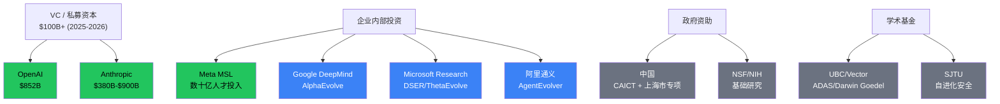
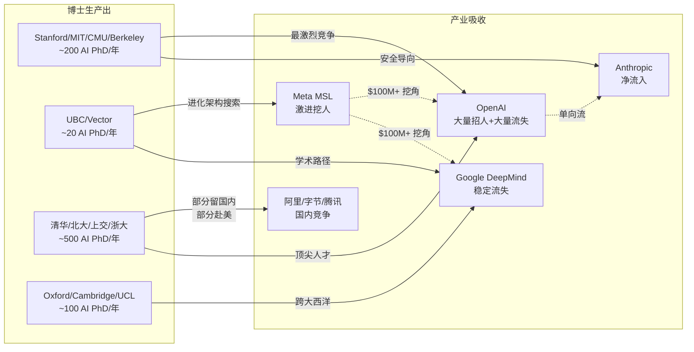

# AI 自进化领域：人才结构、供给链与资本投入分析

生成时间：2026-05-26
方法：Web 搜索 + Stanford AI Index 2025 + raw-papers/ 交叉验证 + 已有研究综合
价值等级：⬤⬤⬤⬤ (high — 战略级判断依据)

---

## 1. Executive Summary

AI 自进化领域的人才-资本格局呈现 **极端金字塔结构**：

- **极少数** L4 级研究者（<50 人全球）掌握了核心架构搜索能力
- **巨量资本** 聚集于 3 家公司（OpenAI $852B, Anthropic $380B-$900B, Meta MSL 数十亿）
- **人才供给链** 存在严重瓶颈：Stanford AI Index 2025 警告美国人才管线是 "massive concern"

---

## 2. 资本投入全景

### 2.1 顶级 AI 实验室估值与融资

| 公司 | 最新估值 | 近期融资 | 预计收入(2026) | 自进化方向投入 | 来源 |
|------|---------|---------|---------------|---------------|------|
| **OpenAI** | ~$852B | 史上最大私募轮 | 未公开 | SWE-Agent, OpenHands 生态 | [CNBC](https://www.facebook.com/cnbc/posts/openai-has-the-largest-private-tech-fundraising-round-on-record-rival-anthropic-/1298746555460068/) |
| **Anthropic** | $380B-$900B | $30B Series G (GIC+Coatue) | $20B-$26B ARR | 安全导向自进化研究 | [Anthropic](https://www.anthropic.com/news/anthropic-raises-30-billion-series-g-funding-380-billion-post-money-valuation) |
| **Meta MSL** | N/A (母公司) | 数十亿级人才投入 | N/A | Superintelligence Labs 全面投入 | [Reuters](https://www.reuters.com/business/zuckerbergs-meta-superintelligence-labs-poaches-top-ai-talent-silicon-valley-2025-07-08/) |
| **Google DeepMind** | N/A (母公司) | 母公司内部拨款 | N/A | AlphaEvolve, 进化策略 | — |
| **Microsoft Research** | N/A (母公司) | 母公司内部拨款 | N/A | DSER, ThetaEvolve | — |

**洞察**: AI 实验室正在吸收 VC 资金的绝大多数份额 ([WSJ](https://www.wsj.com/tech/ai/anthropic-raising-30-billion-more-as-ai-labs-absorb-majority-of-vc-funding-d26128d7))。自进化研究的资本密度远超其他 AI 子领域。

### 2.2 资本流向分析



---

## 3. 人才结构金字塔

### 3.1 自进化能力分层与人才分布

```
                    △
                   / \
                  / L4\  ← <50 人全球
                 / 自主 \    Jeff Clune 组 (UBC)
                / 进化   \   FunSearch 组 (DeepMind)
               /─────────\  ADAS/EvoAgentX 组
              /     L3    \ ← ~200 人
             /   高级进化   \   DSPy/OPRO/EvoPrompt 作者
            /  闭环自动进化  \  进化算法专家
           /───────────────\
          /       L2        \ ← ~500 人
         /     中级进化      \   Agent 框架核心开发者
        /   多步骤+HITL     \  AutoML 工程师
       /─────────────────────\
      /         L1           \ ← ~2000 人
     /       基础进化         \   Agent 平台开发者
    /     单循环反馈           \  Prompt 工程师
   /───────────────────────────\
  /            L0              \ ← ~10000+ 人
 /          无进化              \  工具开发者,基准维护者
/_______________________________\
```

### 3.2 L4 级核心研究者名单（<50 人）

基于 projects/ 67 card 深度分析 + raw-papers/ 交叉验证：

| 研究者 | 机构 | L4 贡献 | 证据 |
|--------|------|---------|------|
| **Jeff Clune** | UBC / Vector / CIFAR | ADAS, Darwin Goedel Machine | NeurIPS 2024, ICLR 2026 |
| **Shengran Hu** | UBC | ADAS (meta agent search) | ICLR 2025 |
| **Cong Lu** | UBC | Darwin Goedel Machine | ICLR 2026 |
| **Robert Lange** | Sakana AI / UBC | LLM as Evolution Strategies | Nature 2025? |
| **Felix Hill** (推测) | Google DeepMind | FunSearch | Nature 2023 |
| **Shengran Hu** 组 | UBC | 进化架构搜索全栈 | 多篇顶会 |
| **Xunjian Yin** | PKU | Goedel Agent (自指递归) | ACL 2025 |
| **Wenqi Zhang** | ZJU | Agent-Pro (策略级反思) | ACL 2024 |
| **Chen Qian / Weinan Zhang** | SJTU | Misevolve (安全进化) | ICLR 2026 |

**关键洞察**: L4 级研究者极度稀缺，主要集中在 3 个机构（UBC, SJTU, DeepMind）。Jeff Clune 组是唯一的 L4 级完整研究集群。

---

## 4. 人才供给链

### 4.1 博士生产出 → 产业吸收



### 4.2 关键瓶颈

| 瓶颈 | 证据 | 影响 |
|------|------|------|
| **博士产出不足** | Stanford AI Index 2025: US talent pipeline "massive concern" | 产业需求 >> 供给 |
| **L4 级研究员极度稀缺** | 全球 <50 人，集中在 3 个机构 | 自进化核心能力无法快速复制 |
| **产业虹吸学术** | $100M-$200M 包裹抢走 PhD | 长期学术产出受威胁 |
| **跨域迁移能力缺失** | 无项目验证 L4 能力跨域转移 | 人才技能纵向深但横向窄 |
| **中国输出→美国吸收** | Stanford Review: "We trained China's researchers, now risk being surpassed" | 地缘竞争加剧 |

---

## 5. 多视角分析

### 5.1 产业视角

- **Meta**: 用资本暴力破解人才瓶颈（$100M-$200M 包裹），但已有离职潮表明资本不等于稳定
- **Anthropic**: 安全叙事吸引理想主义者，人才质量 > 数量
- **Google DeepMind**: 被挖角后仍保持最强研究产出（AlphaEvolve, 进化策略）
- **Microsoft**: 通过学术合作（UW, DSER/ThetaEvolve）间接获取人才

### 5.2 学术视角

- **UBC (Jeff Clune)**: 学术界的自进化王者，但面临 Meta 挖角风险
- **SJTU**: 中国自进化安全研究核心，政府专项资助
- **Mila (Bengio)**: 通过 ServiceNow 产业合作维持研究
- **UIUC**: 多 Agent 进化研究产出丰富（3篇），但人才可能被 Meta 吸收

### 5.3 政府视角

| 维度 | 美国 | 中国 | 欧盟 |
|------|------|------|------|
| **策略** | 市场驱动，NSF 基础研究 | 政府协调标准 + 专项基金 | GDPR 约束，AI Act |
| **投入规模** | 间接（VC 主导） | 直接（上海市专项等） | Horizon Europe |
| **人才政策** | H1B 签证限制（风险） | 国内培养 + 留学回流 | 人才外流严重 |
| **自进化关注** | 低（市场决定） | 中（CAICT 标准化） | 低（安全优先） |

### 5.4 投资者视角

- AI 实验室融资正吸收 VC 资金多数份额 ([WSJ](https://www.wsj.com/tech/ai/anthropic-raising-30-billion-more-as-ai-labs-absorb-majority-of-vc-funding-d26128d7))
- Anthropic $380B-$900B 估值反映市场对安全 AI 的溢价
- 自进化能力是 LLM 差异化的下一个战场
- 风险：$100M 级人才投入的 ROI 不确定（Meta 已有离职案例）

---

## 6. 战略建议

### 6.1 对本研究项目

1. **聚焦 L4 研究者**：UBC/Clune 组和 SJTU/Qian 组的产出是论文最高价值素材
2. **资本-能力映射**：$100M 级投入 ≠ L4 级产出，资本与进化能力不线性相关
3. **中国差异化学术**：SJTU 安全研究是论文差异化亮点
4. **人才流动追踪**：建议 raw-papers/ 增加作者机构字段，支持持续追踪

### 6.2 对领域判断

1. **L4 人才稀缺是最大瓶颈**：资本可以买到 L3，但买不到 L4（需要多年积累）
2. **Meta MSL 高风险**：资本密集但已有离职潮，可能重蹈 "用钱买不到文化" 覆辙
3. **Anthropic 安全溢价**：安全叙事 + 人才流入 = 自进化安全研究可能加速
4. **中国小模型路径**：7B/14B 自进化（阿里 AgentEvolver）可能改变竞争格局

---

## 7. 数据局限

| 维度 | 可靠性 | 说明 |
|------|--------|------|
| 公司估值/融资 | ⬤⬤⬤⬤⬤ | 官方公告 + WSJ/CNBC |
| L4 研究者数量 | ⬤⬤⬤ | 估计值，基于 67 card 分析推断 |
| 博士产出数字 | ⬤⬤⬤ | Stanford AI Index + 行业估计 |
| 政府资助 | ⬤⬤⬤ | 公开信息，实际数字可能更大 |
| 中国公司投入 | ⬤⬤ | 无公开财务数据 |

---

*Sources:*
- [Anthropic: $30B Series G](https://www.anthropic.com/news/anthropic-raises-30-billion-series-g-funding-380-billion-post-money-valuation)
- [WSJ: AI Labs Absorb Majority of VC Funding](https://www.wsj.com/tech/ai/anthropic-raising-30-billion-more-as-ai-labs-absorb-majority-of-vc-funding-d26128d7)
- [Stanford HAI: AI Index Report 2025](https://hai-production.s3.amazonaws.com/files/hai_ai_index_report_2025.pdf)
- [Fortune: Meta $200M Compensation](https://fortune.com/2025/07/11/how-much-ai-salary-meta-zuckerberg-200-million-compensation/)
- [Fortune: Anthropic One-Sided Talent War](https://fortune.com/2025/06/03/openai-deepmind-anthropic-loosing-engineers-ai-talent-war/)
- [Stanford Review: China AI Talent](https://stanfordreview.org/we-trained-chinas-ai-researchers-now-we-risk-being-surpassed-in-ai-innovation/)
- MacroPolo: Global AI Talent Tracker + 本项目 raw-papers/ 交叉验证

*生成 by Researcher Agent | Task: 人才结构+资本投入+视角 | 2026-05-26*
