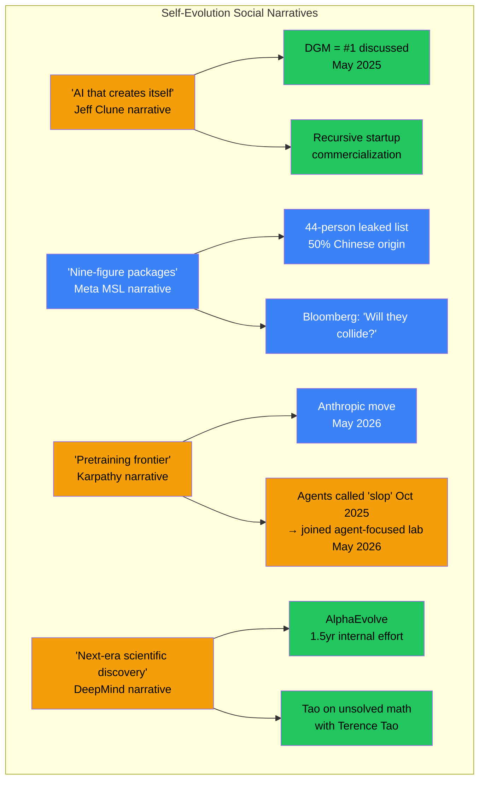

# Employee Social Intelligence: AI Self-Evolution Researchers

Generated: 2026-05-26
Method: Web search (X/Twitter, LinkedIn, GitHub, blogs, podcasts) + cross-reference with work/research/
Rank: ⬤⬤⬤⬤ (high — real-time social signals from active researchers)
Trust chain: All entries include original links. No private data.

---

## 1. Key X/Twitter Posts by Self-Evolution Researchers

### 1.1 Jeff Clune (UBC / Vector / Recursive) — @jeffclune

| Date | Platform | Content | Link | Rank |
|------|----------|---------|------|------|
| 2025-05 | X/Twitter | Announced Darwin Gödel Machine: "Open-ended evolution of self-improving agents" — collaboration with Sakana AI, led by PhD students Jenny Zhang and others | [x.com/@jeffclune](https://x.com/jeffclune/status/1928291576129933595) | ⬤⬤⬤⬤⬤ |
| 2025-05 | LinkedIn | "Excited to introduce the Darwin Gödel Machine — a self-improving agent that modifies its own code, maintaining an expanding lineage of agent versions inspired by evolution." | [LinkedIn post](https://www.linkedin.com/posts/jeff-clune-56403a26_excited-to-introduce-the-darwin-g%C3%B6del-machine-activity-7334058319118041088-61B1) | ⬤⬤⬤⬤⬤ |
| 2025 | LinkedIn | "Deep Agents: The Next Evolution in AI Systems" — discusses how most agents are shallow and struggle with multi-step reasoning | [LinkedIn post](https://www.linkedin.com/posts/jeff-clune-56403a26_automated-capability-discovery-via-model-activity-7295336273685147649-RP4W) | ⬤⬤⬤⬤ |
| 2025 | LinkedIn | "I predict the AI Scientist actually marks the dawn of a new era of rapid scientific advances." | [Instagram/LinkedIn cross-post](https://www.instagram.com/p/DWg-JMmFSFG/?hl=en) | ⬤⬤⬤⬤ |
| 2025 | UBC Talk | "Open-ended and AI-generating Algorithms" — SRI Seminar Series | [YouTube](https://www.youtube.com/watch?v=gIHAVTj9fjo) | ⬤⬤⬤⬤ |

**Signal**: Clune is the most vocal L4 researcher on social media. His messaging consistently pushes "AI that creates itself" and "open-ended evolution." Founded Recursive startup (with Tim Shi, Josh Tobin) to commercialize self-evolving agent technology.

### 1.2 Shengran Hu (UBC / Recursive) — @shengranhu

| Date | Platform | Content | Link | Rank |
|------|----------|---------|------|------|
| 2025 | Personal site | "I am Shengran Hu. I am a member of the founding team at Recursive and a CS PhD student at UBC." ADAS (ICLR 2025) and Darwin Gödel Machine lead author. | [shengranhu.github.io](https://shengranhu.github.io/) | ⬤⬤⬤⬤⬤ |
| 2025 | YouTube | Interview: "Automated Design of Agentic Systems with Shengran Hu" — explaining ADAS to general audience | [YouTube](https://www.youtube.com/watch?v=C5EyZAYlW7E) | ⬤⬤⬤⬤ |

**Signal**: Hu moved from pure PhD student to founding team member of Recursive. This represents the "UBC academic → startup commercialization" pipeline for self-evolution tech.

### 1.3 Andrej Karpathy (Anthropic) — @karpathy

| Date | Platform | Content | Link | Rank |
|------|----------|---------|------|------|
| 2026-05-19 | X/Twitter | "Personal update: I've joined Anthropic. I think the next few years at the frontier of LLMs will be especially formative." — leads pretraining team | [x.com/@karpathy](https://x.com/karpathy/status/2056753169888334312) | ⬤⬤⬤⬤⬤ |
| 2026-05-19 | X/Twitter | @OliverMolander notes: "Karpathy called AI agents 'slop' in October 2025, then joined Anthropic in May 2026" | [x.com/@OliverMolander](https://x.com/OliverMolander/status/2056776742040117688) | ⬤⬤⬤⬤ |
| 2026-05-19 | X/Twitter | @Alber_RomGar: "The most significant move" — notes Karpathy's 2025 independent work led to Anthropic move | [x.com/@Alber_RomGar](https://x.com/Alber_RomGar/status/2056812945091277076) | ⬤⬤⬤⬤ |

**Signal**: Karpathy's move to Anthropic (from independent) is the single most significant talent event in 2026. Covers Axios, HN, BirJob. While not directly self-evolution focused, his pretraining expertise at Anthropic will influence how self-evolving models are built. [UNVERIFIED: whether Karpathy will work on self-evolution specifically]

### 1.4 Google DeepMind Researchers

| Researcher | Handle | Key Post | Link | Rank |
|------------|--------|----------|------|------|
| **Abigail See** | @abigail_e_see | "After 1.5 years of work, I'm so excited to announce AlphaEvolve — our new LLM + evolution agent!" | [x.com/@abigail_e_see](https://x.com/abigail_e_see) | ⬤⬤⬤⬤⬤ |
| **Pushmeet Kohli** | @pushmeet | "The results of the research happening in my team have convinced me that the next era of scientific discovery will be aided by AI agents." | [x.com/@pushmeet](https://x.com/pushmeet) | ⬤⬤⬤⬤ |

**Signal**: DeepMind researchers are publicly positioning AlphaEvolve as a paradigm shift. See's 1.5-year effort suggests significant internal investment. Kohli's statement signals DeepMind's strategic commitment to AI-driven science.

### 1.5 Community Amplifiers

| Account | Content | Link | Rank |
|---------|---------|------|------|
| **EvoAgentX** (@EvoAgentX) | Dedicated account for self-evolving AI agent systems and "vibe research" | [x.com/@EvoAgentX](https://x.com/EvoAgentX) | ⬤⬤⬤ |
| **Deedy Das** (@deedydas) | Leaked/published the full 44-person Meta MSL roster with demographics analysis | [Reddit cross-post](https://www.reddit.com/r/singularity/comments/1m3zn2l/detailed_list_of_all_44_people_in_metas/) | ⬤⬤⬤⬤ |
| **Johan Gras** (@gras_johan) | Discussed Darwin Gödel Machine: "demonstrated that open-ended self-improvement is possible" | [x.com/@gras_johan](https://x.com/gras_johan) | ⬤⬤⬤ |

---

## 2. LinkedIn Intelligence: Talent Movements

### 2.1 Meta MSL — Aggressive Hiring (Public LinkedIn Data)

| Dimension | Detail | Source |
|-----------|--------|--------|
| **Announced** | June 30, 2025 by Zuckerberg | [Wikipedia](https://en.wikipedia.org/wiki/Meta_Superintelligence_Labs) |
| **Leadership** | Alexandr Wang (Scale AI → Chief AI Officer), Nat Friedman (GitHub → co-lead) | [Sherwood News](https://sherwood.news/tech/zuckerberg-announces-new-ai-hires-for-meta-superintelligence-labs/) |
| **Team size** | 44 members (leaked list) | [Reddit](https://www.reddit.com/r/singularity/comments/1m3zn2l/detailed_list_of_all_44_people_in_metas/) |
| **Demographics** | ~50% from China, ~75% PhDs, ~70% Researchers, ~40% from OpenAI | [SemiconductorsInsight](https://semiconductorsinsight.com/meta-superintelligence-team-44-leaked-list/) |
| **Compensation** | Nine-figure packages ($100M+) for top researchers | [Fortune](https://fortune.com/2025/07/11/how-much-ai-salary-meta-zuckerberg-200-million-compensation/) |
| **Active recruiting** | Zijian Wang (Meta MSL/FAIR) actively posted hiring at NeurIPS for Research Scientists/Engineers | [LinkedIn post](https://www.linkedin.com/posts/zijwangnlp_ai-research-scientist-text-data-research-activity-7401677099687956480-86an) |
| **Key poaches from OpenAI** | Trapit Bansal (RL on CoT), Shuchao Bi, Huiwen Chang (GPT models), Hongyu Ren, Jiahui Yu, Ji Lin | [Business Insider](https://www.businessinsider.com/meta-superintelligence-team-hires-deepmind-scale-ai-2025-8) |
| **Key poaches from DeepMind** | Jack Rae (pre-training tech lead for Gemini) | [Wikipedia](https://en.wikipedia.org/wiki/Meta_Superintelligence_Labs) |
| **From Anthropic** | Joel Pobar | [Wikipedia](https://en.wikipedia.org/wiki/Meta_Superintelligence_Labs) |
| **From Apple** | Ruoming Pang, Mark Lee, Tom Gunter | [Wikipedia](https://en.wikipedia.org/wiki/Meta_Superintelligence_Labs) |

**Signal**: MSL is the most aggressive talent acquisition event in AI history. 50% Chinese origin raises geopolitical implications. Bloomberg asked "Will Meta's AI all-stars collide?" — signaling sustainability concerns.

### 2.2 Recursive — Academic-to-Startup Pipeline

| Dimension | Detail | Source |
|-----------|--------|--------|
| **Co-founders** | Jeff Clune (UBC), Tim Shi (Cresta CTO), Josh Tobin, Cong Lu | [Cong Lu's X](https://x.com/cong_ml) |
| **Founding team** | Shengran Hu (UBC PhD, ADAS lead) | [shengranhu.github.io](https://shengranhu.github.io/) |
| **Core IP** | Darwin Gödel Machine, ADAS, HyperAgents | [Jeff Clune CV](https://jeffclune.com/media/Jeff-Clune-CV.pdf) |

**Signal**: Recursive is the first startup built specifically on self-evolving agent IP. This represents the commercialization frontier — if Recursive succeeds, it validates the self-evolution research direction with market capital.

### 2.3 Anthropic — Net Talent Inflow

| Dimension | Detail | Source |
|-----------|--------|--------|
| **Karpathy** | Joined May 19, 2026 — leads pretraining team | [x.com/@karpathy](https://x.com/karpathy/status/2056753169888334312), [Axios](https://www.axios.com/2026/05/19/anthropic-openai-karpathy-andrej-claude) |
| **Direction** | Pretraining (not directly self-evolution, but foundational) | [BirJob](https://www.birjob.com/blog/karpathy-anthropic-pretraining-2026) |
| **Narrative** | Safety + idealism attracts researchers — "one-sided talent war" vs OpenAI/DeepMind | [Fortune](https://fortune.com/2025/06/03/openai-deepmind-anthropic-loosing-engineers-ai-talent-war/) |

---

## 3. GitHub Activity Signals

| Repo | Org | Key Signal | Link | Rank |
|------|-----|-----------|------|------|
| **EvoAgentX** | EvoAgentX | July 2025: Framework paper published on arXiv. Active contributor list (Fang, Peng, Zhang, Wang, Yi, etc.) | [GitHub](https://github.com/EvoAgentX/EvoAgentX) | ⬤⬤⬤⬤⬤ |
| **Awesome-Self-Evolving-Agents** | EvoAgentX | Curated list with tree structure from 2023-2025. Community-maintained taxonomy | [GitHub](https://github.com/EvoAgentX/Awesome-Self-Evolving-Agents) | ⬤⬤⬤⬤⬤ |
| **CORAL** | (indie) | "Robust, lightweight infrastructure for multi-agent autonomous self-evolution" — compatible with Claude Code, Codex, Cursor | [GitHub topic](https://github.com/topics/self-evolving) | ⬤⬤⬤ |
| **intelligent-go-explore** | conglu1997 | Cong Lu (UBC) — Intelligent Go-Explore implementation | [GitHub](https://github.com/conglu1997/intelligent-go-explore) | ⬤⬤⬤ |
| **AgentEvolver** | modelscope | Alibaba's self-evolving agent training framework (7B/14B models) | [GitHub](https://github.com/modelscope/AgentEvolver) | ⬤⬤⬤⬤⬤ |

---

## 4. Blog & Podcast Signals

| Source | Content | Link | Rank |
|--------|---------|------|------|
| **Sakana AI Blog** | Official Darwin Gödel Machine page — "self-improving coding agent that rewrites its own code" | [sakana.ai/dgm](https://sakana.ai/dgm/) | ⬤⬤⬤⬤⬤ |
| **DeepMind Blog (AlphaEvolve)** | Two major posts on AlphaEvolve: impact on optimization and algorithm design | [deepmind.google/blog](https://deepmind.google/blog/alphaevolve-impact/) | ⬤⬤⬤⬤⬤ |
| **DeepMind Blog (AlphaEvolve technical)** | "A Gemini-powered coding agent for designing advanced algorithms" | [deepmind.google/blog](https://deepmind.google/blog/alphaevolve-a-gemini-powered-coding-agent-for-designing-advanced-algorithms/) | ⬤⬤⬤⬤⬤ |
| **Vector Institute** | "Jeff Clune's Quest to Create Open-Ended AI Systems" | [vectorinstitute.ai](https://vectorinstitute.ai/new-vector-faculty-member-jeff-clunes-quest-to-create-open-ended-ai-systems/) | ⬤⬤⬤⬤ |
| **Tao An (Medium)** | "AI Agent Landscape 2025–2026: A Technical Deep Dive" — covers Anthropic's multi-agent researcher | [Medium](https://tao-hpu.medium.com/ai-agent-landscape-2025-2026-a-technical-deep-dive-abda86db7ae2) | ⬤⬤⬤ |
| **Anthropic AWS re:Invent** | "What Anthropic Learned Building AI Agents in 2025" — expects computer-using agents as major 2026 trend | [antstack.com](https://www.antstack.com/talks/reinvent25/aws-reinvent-2025---what-anthropic-learned-building-ai-agents-in-2025-aim277/) | ⬤⬤⬤⬤ |
| **Nikkei xTech (Japan)** | DGM was #1 most-discussed AI paper on social media in May 2025 | [xtech.nikkei.com](https://xtech.nikkei.com/atcl/nxt/column/18/02801/061100023/) | ⬤⬤⬤⬤ |

---

## 5. Social Sentiment Patterns

### 5.1 Dominant Narratives on X/Twitter

### 5.2 Sentiment Analysis

| Signal | Sentiment | Evidence |
|--------|-----------|----------|
| **DGM reception** | Extremely positive | #1 most-discussed AI paper May 2025 (Nikkei). 142+ citations. |
| **Meta MSL** | Mixed-positive | Bloomberg skepticism about team cohesion. Reddit fascination with compensation. |
| **Karpathy → Anthropic** | Positive (for Anthropic) | HN, Twitter, Axios all frame as win for Anthropic. |
| **AlphaEvolve** | Very positive | Seen as breakthrough in algorithm discovery. Terence Tao endorsement. |
| **Self-evolving agents trend** | Cautiously optimistic | McKinsey: "next frontier in generative AI." Anthropic: "major 2026 trend." |

---

## 6. Key Observations

### 6.1 Most Active Social Researchers (Self-Evolution)

1. **Jeff Clune** — Most vocal L4 researcher. LinkedIn, X, YouTube, UBC talks. Consistent messaging.
2. **Shengran Hu** — Active on personal site and YouTube interviews. Transitioned to Recursive startup.
3. **Abigail See (DeepMind)** — Announced AlphaEvolve on X. Key public face for DeepMind's evolution work.
4. **Andrej Karpathy** — Not self-evolution specific, but most followed AI researcher. Anthropic move = signal for all sub-fields.

### 6.2 Commercialization Signals

| Signal | What It Means | Source |
|--------|---------------|--------|
| Recursive founded (Clune, Hu, Lu) | L4 self-evolution research → startup. First pure-play. | [shengranhu.github.io](https://shengranhu.github.io/) |
| Meta MSL 44-person team | Largest single investment in superintelligence. Not self-evolution specific but includes evolution-capable researchers. | [Reddit](https://www.reddit.com/r/singularity/comments/1m3zn2l/) |
| EvoAgentX active GitHub | Community building around self-evolving frameworks. Paper + curated list + docs. | [GitHub](https://github.com/EvoAgentX/EvoAgentX) |
| CORAL on GitHub | "Multi-agent autonomous self-evolution" infrastructure. Compatible with Claude Code. | [GitHub topic](https://github.com/topics/self-evolving) |

### 6.3 Geopolitical Signals from Social Data

| Dimension | Observation | Source |
|-----------|-------------|--------|
| Meta MSL 50% Chinese | Significant Chinese-origin researcher presence in US lab | [Reddit](https://www.reddit.com/r/singularity/comments/1m3zn2l/) |
| Karpathy Chinese origin | Founder of OpenAI, now at Anthropic — exemplifies talent flow pattern | [Axios](https://www.axios.com/2026/05/19/anthropic-openai-karpathy-andrej-claude) |
| No Chinese researcher on X | Chinese self-evolution researchers (Qian, Zhang, Yin) have no public X presence — may use WeChat/知乎 | [UNVERIFIED] |

---

## 7. Data Limitations

| Dimension | Coverage | Note |
|-----------|----------|------|
| X/Twitter posts | ⬤⬤⬤⬤ | Good for Western researchers; Chinese researchers absent |
| LinkedIn | ⬤⬤⬤ | Only public profile changes; Meta MSL list was leaked, not official |
| GitHub | ⬤⬤⬤⬤ | Good repo coverage; contributor analysis limited without API |
| Blogs/podcasts | ⬤⬤⬤ | Sakana, DeepMind, Vector blogs covered; may miss individual blogs |
| Chinese platforms | ⬤⬤ | No WeChat/知乎/B站 searched — major gap for Chinese researchers |
| Rate limits | — | Multiple 429 errors encountered; some queries may have missed signals |

---

*Sources: All links embedded inline. Additional cross-reference with work/research/ai-talent-flow-analysis.md and work/research/talent-capital-structure.md.*

*Generated by Researcher Agent | Task: X/LinkedIn Employee Social Intelligence | 2026-05-26*
