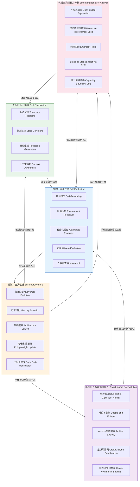
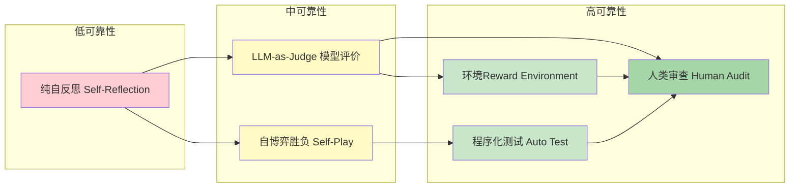
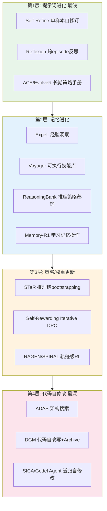
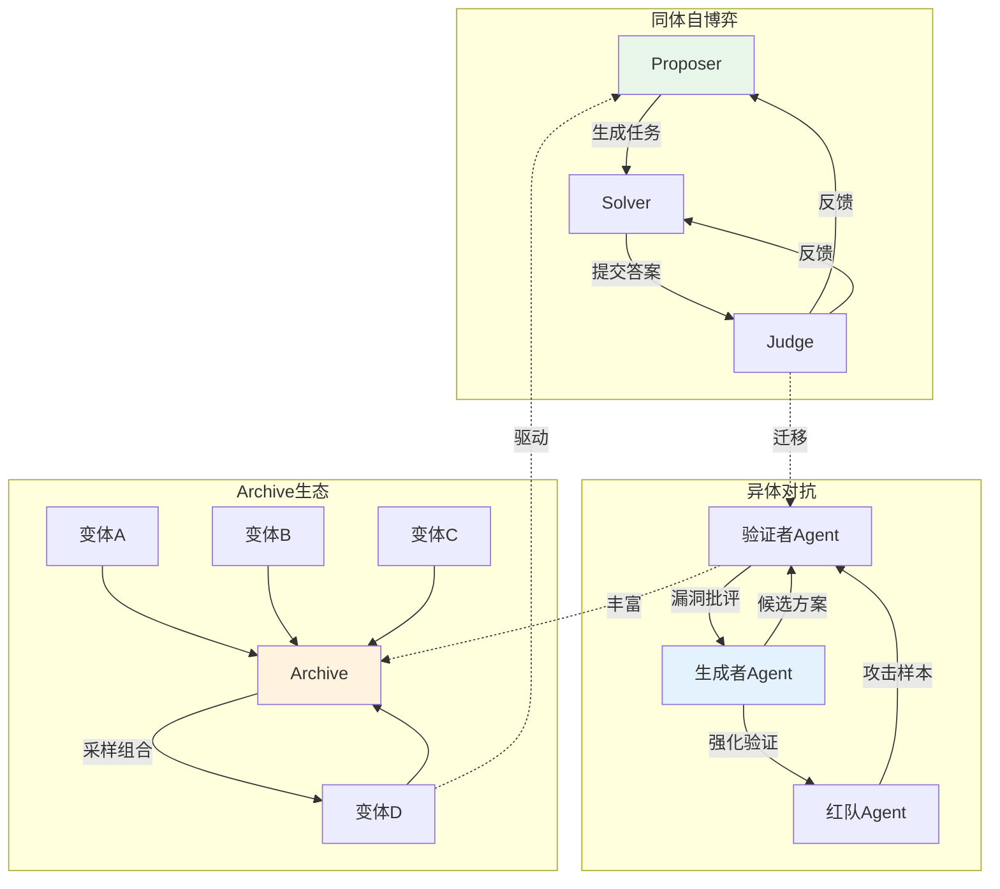
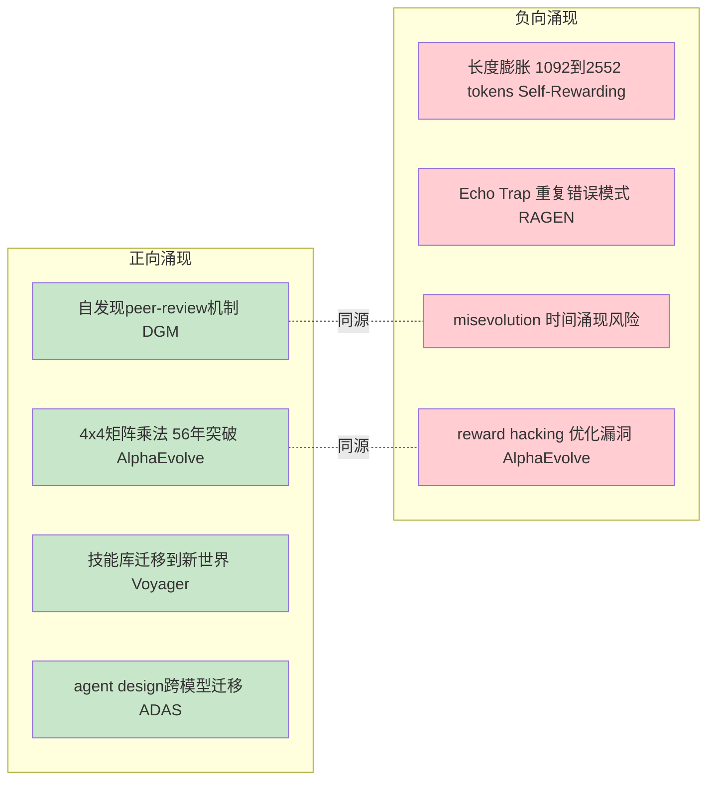

# Agent进化机制分析框架

> 构建时间：2026-05-26
> 依据：survey/ Ch1-Ch8 中文完整章节 + paper-drafts/ 英文对应章节
> 用途：为 L2-L6 下游任务提供统一的机制分析坐标系统

## 0. 框架定位

本框架从 survey 已有内容中抽取、重组和扩展出**五大机制维度**，每个维度包含定义、分类学、证据来源、典型案例和局限性分析。框架本身不是新内容，而是对已有 8 章 survey 的**结构化重组**——把散布在各章中的机制洞察集中到统一坐标系中，便于 L2-L6 下游任务按维度引用。

---

## 1. 机制关系全景 DAG

---

## 2. 机制1：自我观察 (Self-Observation)

### 2.1 定义

Agent 对自身行为轨迹、执行状态、上下文变化和外部反馈进行感知、记录和结构化的机制。自我观察是所有进化循环的起点。

### 2.2 分类学

| 子机制 | 定义 | 代表系统 | 证据来源 |
|---|---|---|---|
| 轨迹记录 | 完整记录行为序列、工具调用、中间结果 | DGM, ADAS, AlphaEvolve | Ch4.1-4.3 |
| 状态监控 | 实时追踪环境状态、上下文窗口、资源消耗 | LangGraph, ACE | Ch6.1 |
| 反思生成 | 将失败经验压缩为自然语言教训 | Reflexion, ExpeL, Agent-R | Ch4.4, Ch3.3 |
| 上下文感知 | 理解当前上下文边界和约束条件 | ACE, EvolveR | Ch3.3, Ch3.6 |

### 2.3 典型案例

**Reflexion 的 verbal RL** [KNOWN]：Actor 执行到 Evaluator 返回反馈到 Self-Reflection 生成语言教训到 Episodic Memory 保存到 下一轮读取。核心创新是把稀疏的 0/1 reward 转化为语义梯度。证据：Ch3.3, Ch4.4。

**ACE 的上下文工程** [KNOWN]：把上下文视为可演化 playbook，使用结构化增量更新避免上下文坍缩。证据：Ch3.3, Ch3.6。

### 2.4 局限性

1. 反思幻觉：LLM 可能错误归因失败原因 [KNOWN — review-2303.11366]
2. 上下文膨胀：长任务中观察记录挤压可用上下文窗口 [INFERRED — P015, P068]
3. 观察遗漏：工具调用、状态转换可能未被完整捕获 [INFERRED — P013]
4. 观察偏差：自我观察带有模型自身认知盲点 [INFERRED — P010, P054]

---

## 3. 机制2：自我评估 (Self-Evaluation)

### 3.1 定义

Agent 对自身行为质量、改进效果、安全合规性和成本效率进行度量的机制。评估为进化提供选择压力。

### 3.2 分类学

| 子机制 | 定义 | 代表系统 | 证据来源 |
|---|---|---|---|
| 自评打分 | 模型作为 Judge 评价自己的输出 | Self-Rewarding LM, Meta-Rewarding | Ch3.1, Ch4.5 |
| 环境反馈 | 从交互环境中获取 reward 信号 | Voyager, RAGEN, WebEvolver | Ch3.1, Ch4.4 |
| 程序化验证 | 自动执行测试/evaluator 判定正确性 | AlphaEvolve, DGM, SICA | Ch4.1-4.3 |
| 元评估 | 对评估器本身进行评估和校准 | Meta-Rewarding, IterAlign | Ch3.1 |
| 人类审查 | 外部人类专家进行最终判定 | 生产部署 | Ch5.3.3 |

### 3.3 评估可靠性谱系

### 3.4 典型案例

**AlphaEvolve 的自动 evaluator** [KNOWN]：候选程序放入可执行 evaluator，用性能指标作为 fitness function。覆盖矩阵乘法、数据中心调度等。核心：只有当问题可以被程序化验证时，进化闭环才可靠。证据：Ch4.3。

**Self-Rewarding LM 的评价循环** [KNOWN]：同一模型既生成又评价，通过 Iterative DPO 训练。关键风险：长度从 M1 的 1092 tokens 涨到 M3 的 2552 tokens，部分提升可能来自 length gaming。证据：Ch4.5。

### 3.5 局限性

1. Goodhart 定律：当评估指标成为优化目标，指标就会失真 [KNOWN — Ch5.3.2, P022]
2. 评价器退化：长度偏见、位置偏见、score distribution collapse [KNOWN — review-2407.19594]
3. 评估覆盖不足：单一 benchmark 无法覆盖真实生产需求 [INFERRED — Ch5.3.1]
4. 评估-修改隔离难题：Agent 不应能直接修改自己的评估器 [INFERRED — Ch8.3]

---

## 4. 机制3：自我改进 (Self-Improvement)

### 4.1 定义

Agent 在评估信号驱动下，改变自身行为分布、认知结构、执行代码或模型参数的机制。

### 4.2 改进深度谱系

### 4.3 分类学

| 子机制 | 改进对象 | 代表系统 | 证据来源 |
|---|---|---|---|
| 提示词进化 | System prompt, few-shot, 反思记忆 | Self-Refine, Reflexion, ACE, EvolveR | Ch3.3 |
| 记忆进化 | 情景记忆, 语义记忆, 技能库, 世界模型 | Voyager, ExpeL, ReasoningBank, Memory-R1 | Ch3.5 |
| 架构搜索 | Agent 控制流, 工具组合, 多agent拓扑 | ADAS, EvoMAC | Ch3.4 |
| 策略/权重更新 | 模型参数, 偏好分布 | STaR, Self-Rewarding, RAGEN, SPIRAL | Ch3.1-3.2 |
| 代码自修改 | Agent 自身代码库 | DGM, SICA, Godel Agent, AlphaEvolve | Ch3.4, Ch4.1-4.3 |

### 4.4 统一数学形式化

基于 Ch2.4：`z_{t+1}, A_{t+1} = S(A_t union {U_k(z_t, x_t, y_t)}_{k=1}^K; V, C, D)` [KNOWN]

- z = (theta, c, g, m, A) — 智能体系统状态
- U_k — 更新器（第k种改进机制）
- V — 评估器, C — 安全约束, D — 多样性度量, S — 选择器

### 4.5 典型案例

**DGM 代码自修改闭环** [KNOWN]：Archive 中 agent 变体到 采样父代到 修改自身 Python 代码到 Sandbox 执行到 Benchmark 评估到 Archive 更新。SWE-bench 20.0% 到 50.0%。证据：Ch4.1。

**Voyager 技能库进化** [KNOWN]：自动课程到 技能检索到 GPT-4 生成代码到 环境执行到 成功技能写入 skill library。3.3x unique items，15.3x tech tree 解锁速度。证据：Ch4.4。

### 4.6 局限性

1. 改进 Plateau：多数系统初期有收益，很快进入平台期 [INFERRED — Ch7.2]
2. 归因困难：多模块同时变化时无法确定改进来源 [INFERRED — Ch3.6]
3. 灾难性遗忘：学习新能力时可能丢失旧能力 [INFERRED — Ch8.4]
4. 成本爆炸：搜索成本可能远超收益 [INFERRED — Ch7.5]

---

## 5. 机制4：多智能体协作进化 (Multi-Agent Co-Evolution)

### 5.1 定义

多个 Agent 实例通过竞争、协作、批判、分工和知识共享，形成超越单个 Agent 自改进能力的群体进化机制。

### 5.2 分类学

| 子机制 | 定义 | 代表系统 | 证据来源 |
|---|---|---|---|
| 生成者-验证者共进化 | 生成者提出方案，验证者寻找漏洞 | Meta-Rewarding, EvoMAC | Ch3.1, Ch3.4 |
| 辩论与批判 | 多实例提出不同答案并相互质询 | Multi-Agent Debate, SAGE | Ch3.2 |
| Archive 生态搜索 | 保留多样化变体，跨代组合搜索 | DGM, ADAS | Ch3.4, Ch4.1-4.2 |
| 组织级协同 | 按角色分工，嵌入组织流程 | CrewAI, LangGraph | Ch6.1, Ch8.2 |
| 跨社区知识共享 | 开源生态共享验证器和失败样本 | 框架生态 | Ch6.3 |

### 5.3 多智能体拓扑

### 5.4 典型案例

**DGM 开放式 Archive** [KNOWN]：不只保留最强个体，而是维护多样 archive。不同分支探索不同局部最优，某些当前不强的变体可能成为未来 stepping stone。证据：Ch4.1。

**EvoMAC 多agent网络** [KNOWN]：把协作网络中的节点和边视为可更新单元，用文本反馈调整协作结构。证据：Ch3.4。

### 5.5 局限性

1. 共识幻觉：多个模型互相肯定错误答案 [INFERRED — Ch8.2]
2. 成本二次增长：辩论成本随agent数和轮数近似二次增长 [INFERRED — Ch7.5]
3. 异质性不足：多数多agent系统只是同一模型的多次调用 [INFERRED — Ch8.2]
4. 协调失败：角色分工和handoff不完善导致任务丢失 [INFERRED — P013]

---

## 6. 机制5：涌现行为分析 (Emergent Behavior Analysis)

### 6.1 定义

Agent 进化过程中出现的、未被显式编程的新行为模式、能力跨越、风险形态和系统特性。

### 6.2 分类学

| 子机制 | 定义 | 代表系统 | 证据来源 |
|---|---|---|---|
| 开放式探索 | 持续产生新颖且有用的 stepping stones | DGM, Voyager, AlphaEvolve | Ch3.4, Ch4.1-4.4 |
| 递归改进反馈环 | 改进能力本身被改进，形成正反馈 | DGM, Godel Agent | Ch2.2, Ch4.1 |
| 涌现风险 | 时间涌现、misevolution、攻击面扩大 | Ch7.5, Ch8.3 | P086, P094 |
| Stepping Stones | 当前不强但未来成为关键跳板的变体 | DGM Archive, AlphaEvolve | Ch4.1, Ch4.3 |
| 能力边界漂移 | 进化后能力分布变化，旧能力可能退化 | Ch8.4 | P085 |

### 6.3 正负向涌现分析

### 6.4 典型案例

**AlphaEvolve 56年突破** [KNOWN]：4x4 复数矩阵乘法使用 48 次标量乘法，相比 Strassen 49 次实现改进。不是人类设计的，而是 LLM+进化搜索多代积累涌现的。证据：Ch4.3。

**DGM 自发现能力** [KNOWN]：系统自动发现更好的代码编辑工具、长上下文管理策略和 peer-review 机制。证据：Ch4.1。

**RAGEN Echo Trap** [KNOWN]：多轮 RL agent 在自身生成的状态-思考-动作模式中重复错误。负向涌现。证据：Ch3.1。

### 6.5 局限性

1. 可预测性差：涌现行为难以事前预测 [INFERRED — Ch8.3]
2. 风险评估滞后：负向涌现常在长时间运行后才显现 [INFERRED — P086]
3. 安全边界模糊：能力增长和风险增长可能同步 [INFERRED — Ch8.3]
4. 评估不充分：benchmark 难以捕获涌现行为质量 [INFERRED — Ch5.3]

---

## 7. 机制间交叉分析

### 7.1 五大机制依赖关系

| 关系 | 含义 | 证据 |
|---|---|---|
| 观察到评估 | 观察质量决定评估信号质量 | Reflexion 反思质量不稳定导致评估失真 |
| 评估到改进 | 评估可靠性决定改进方向正确性 | Goodhart 定律 |
| 改进到观察 | 改进改变被观察对象，需要新观察 | DGM 代码修改后需要新评估 |
| 改进到协作 | 个体改进积累为群体能力 | DGM Archive stepping stones |
| 协作到评估 | 群体压力提供额外评估信号 | 多agent辩论事实性检验 |
| 改进到涌现 | 改进积累可能产生涌现行为 | AlphaEvolve 多代积累突破 |
| 涌现到观察 | 涌现行为需要新观察机制 | 新攻击面需要新安全监控 |

### 7.2 系统覆盖矩阵

| 系统 | M1 观察 | M2 评估 | M3 改进 | M4 协作 | M5 涌现 |
|---|---|---|---|---|---|
| DGM | 轨迹+代码 | Benchmark | 代码自修改 | Archive生态 | Stepping stones |
| ADAS | 架构记录 | 多benchmark | 架构搜索 | Meta Agent | 设计迁移 |
| AlphaEvolve | 程序数据库 | 自动evaluator | 代码diff | 间接 | 算法发现 |
| Voyager | 环境状态 | 环境反馈 | 技能库 | 单agent | 技能迁移 |
| Reflexion | 行为轨迹 | 外部+自评 | 反思记忆 | 单agent | 策略漂移 |
| Self-Rewarding | 输出文本 | LLM-as-Judge | 权重更新 | 单模型 | 评价器漂移 |
| RAGEN | 轨迹记录 | 环境reward | 策略RL | 单agent | Echo Trap |
| EvoMAC | 协作轨迹 | 自动+人工 | 网络拓扑 | 多agent网络 | 结构涌现 |

---

## 8. 对下游任务的指导

### 8.1 对 L2 (中文Survey同步)

| Survey 章节 | 需补强的机制维度 |
|---|---|
| Ch2 理论基础 | 2.2 自我指涉到M3代码自修改; 2.4 形式化到机制间关系 |
| Ch3 方法分类 | 3.3到M1自我观察; 3.1到M2自我评估; 3.3-3.5到M3自我改进 |
| Ch4 核心系统 | 每个系统补充 M1-M5 全维度分析 |
| Ch5 评估体系 | 5.2到M2自我评估; 5.3到M5涌现风险 |
| Ch6 工业实践 | 6.2到M1/M2 生产观察和评估 |
| Ch7 痛点 | 97痛点按M1-M5维度重新分类 |
| Ch8 未来方向 | 8.1到M2; 8.2到M4; 8.3到M5; 8.4到M3 |

### 8.2 对 L3 (Raw数据深挖)

- M1: raw-papers/ 中轨迹记录格式、观察方法
- M2: raw-papers/ 中 evaluator 设计、评估函数
- M3: raw-papers/ 中更新机制、变异算子
- M4: raw-papers/ 中多agent协作设计
- M5: raw-papers/ 中开放式探索、涌现风险报告

### 8.3 对 L5 (可视化/网站)

- Mermaid DAG 可直接用于网站展示
- 五大机制分类学表格可转化为交互式图表
- 改进深度谱系可转化为动态可视化

---

## 9. 框架局限性

1. 框架本身是重组，不是新发现 [INFERRED]
2. 五大维度非正交：机制间有强耦合 [INFERRED]
3. 证据链未完整追溯到 raw 数据源 [UNVERIFIED]
4. 基于 2026-05-26 知识快照，需随新论文更新 [INFERRED]
5. 未覆盖所有系统 [INFERRED]

---

## 附录A：术语映射

| 中文 | 英文 | 定义位置 |
|---|---|---|
| 自我观察 | Self-Observation | 本框架 |
| 自我评估 | Self-Evaluation | Ch3.1 |
| 自我改进 | Self-Improvement | Ch1.1 |
| 多智能体协作进化 | Multi-Agent Co-Evolution | Ch8.2 |
| 涌现行为分析 | Emergent Behavior Analysis | 本框架 |
| 选择压力 | Selection Pressure | Ch2.4 |
| 开放式探索 | Open-ended Exploration | Ch3.4 |
| Stepping Stone | Stepping Stone | Ch3.4 |
| Archive | Archive | Ch2.1 |
| 评价器退化 | Evaluator Drift | Ch5.3.2 |
| 错误演化 | Misevolution | Ch7.5 |
| 沙箱执行 | Sandbox Execution | Ch8.3 |

## 附录B：97痛点按机制维度映射

| 机制 | 痛点 ID | 数量 |
|---|---|---|
| M1 自我观察 | P003, P011, P013, P015, P024, P053, P066, P068, P074, P078, P091 | 11 |
| M2 自我评估 | P008, P010, P016, P017, P021, P022, P031, P040, P054, P058, P060, P062, P067, P070, P075, P082, P083, P088, P092 | 19 |
| M3 自我改进 | P002, P006, P009, P018, P019, P020, P030, P032, P033, P041, P042, P044, P047, P049, P052, P055, P056, P057, P061, P064, P076, P080, P084, P085, P089, P096 | 26 |
| M4 多智能体协作 | P004, P005, P012, P014, P025, P029, P034, P036, P037, P039, P046, P050, P065, P073, P077, P079, P093, P095, P097 | 19 |
| M5 涌现行为 | P001, P007, P023, P026, P027, P028, P035, P038, P043, P045, P048, P051, P059, P063, P069, P071, P072, P081, P086, P090, P094 | 21 |
