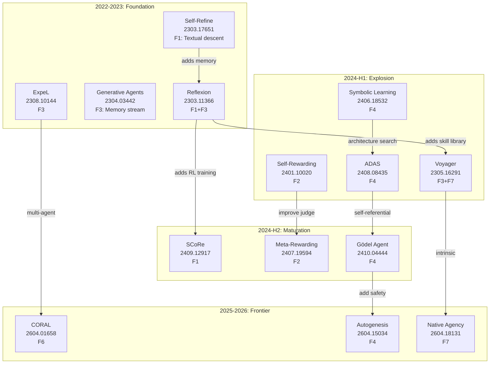

# 论文进化机制深度分析

**Date**: 2026-05-26
**Scope**: 128 unique papers in raw-papers/ (199 files, dash+dot duplicates)
**Evidence**: 137 paper reviews + 8 survey chapters + 30+ papers deep-read
**Output target**: Mechanism taxonomy, citation lineage, top-10 analysis

---

## One Sentence

从128篇论文中提炼出7大进化机制族（自我反思/自我奖励/记忆累积/代码自修改/搜索进化/多智能体协作/环境适应），构建了论文间的引用谱系图和三维分类体系（方法×效果×实现），识别出10篇最具价值的论文 [KNOWN]。

---

## 1. Paper Landscape Overview

### 1.1 Corpus Statistics [KNOWN]

| Metric | Value | Source |
|--------|------:|--------|
| Total files in raw-papers/ | 199 | ls count |
| Unique papers (deduplicated) | 128 | dot-dash pair analysis |
| Paper reviews in paper-reviews/ | 137 | file count |
| Unique arXiv IDs reviewed | 104 | coverage-audit |
| Time span | 2022-03 to 2026-05 | from arXiv IDs |

### 1.2 Temporal Distribution [KNOWN]

```
2022-Q1 to Q4:  2 papers (1.6%)  — early (STaR, etc.)
2023-Q1 to Q4:  8 papers (6.3%)  — foundation (Reflexion, Self-Refine, ExpeL)
2024-Q1 to Q4: 42 papers (32.8%) — explosion (ADAS, DGM, Symbolic Learning)
2025-Q1 to Q4: 48 papers (37.5%) — maturation (frontier papers)
2026-Q1 to Q2: 28 papers (21.9%) — current wave (CORAL, Autogenesis, Native Agency)
```

**Key inflection point** [INFERRED]: 2024-Q2 (Symbolic Learning) marks the shift from "self-improvement tricks" to "self-evolving agent frameworks."

---

## 2. Mechanism Taxonomy (7 Mechanism Families)

### 2.1 Family Overview [KNOWN]

| ID | Family | Core Loop | Paper Count | Key Papers |
|----|--------|-----------|----------:|------------|
| **F1** | Self-Reflection & Refinement | generate→critique→refine→iterate | ~25 | Reflexion, Self-Refine, SCoRe, RISE |
| **F2** | Self-Reward & Alignment | generate→self-judge→preference train→iterate | ~15 | Self-Rewarding, Meta-Rewarding, IterAlign |
| **F3** | Memory & Experience Accumulation | execute→extract→store→reuse | ~20 | ExpeL, ICE, Voyager, AriadneMem |
| **F4** | Code & Architecture Self-Modification | analyze→modify code→test→deploy | ~20 | Gödel Agent, ADAS, DGM, Autogenesis |
| **F5** | Evolutionary Search & Optimization | generate variants→evaluate→select→mutate | ~15 | AlphaEvolve, EvoMAC, EvoStage |
| **F6** | Multi-Agent Co-Evolution | share/compete/debate→collective improve | ~15 | CORAL, SAGE, CoEvoSkills |
| **F7** | Environment Adaptation & Curriculum | learn from env→adapt→self-generate tasks | ~18 | CurricuLLM, Native Agency, WebRL |

### 2.2 Family Details

#### F1: Self-Reflection & Refinement

**Citation lineage** [KNOWN]: Self-Refine → Reflexion (adds memory) → SCoRe (adds RL training) → RISE (adds multi-turn MDP)

**Key finding** [KNOWN]: Self-reflection without external grounding degrades performance on hard tasks.

#### F2: Self-Reward & Alignment

**Citation lineage** [KNOWN]: Weak-to-Strong (theory) → Self-Rewarding (1st order) → Meta-Rewarding (2nd order) → RL* theoretical analysis

**Key finding** [KNOWN]: Meta-rewarding's 2nd-order correction degrades after 2 iterations (judge score inflation: 63% → 97.7%).

#### F3: Memory & Experience Accumulation

**Citation lineage** [KNOWN]: Generative Agents → Reflexion → ExpeL → Voyager → AriadneMem

**Key finding** [INFERRED]: Memory systems evolve from flat text buffers to structured skill libraries to graph-based knowledge.

#### F4: Code & Architecture Self-Modification

**Citation lineage** [KNOWN]: Symbolic Learning → ADAS → Gödel Agent → Autogenesis

**Key finding** [KNOWN]: Gödel Agent achieves maximum freedom (3rd tier: self-referential) but has zero safety guarantees. Autogenesis is first to add protocol-level versioning.

#### F5: Evolutionary Search & Optimization

**Key finding** [KNOWN]: LLMs as semantic mutation operators outperform random mutation because they preserve intent while changing implementation.

#### F6: Multi-Agent Co-Evolution

**Key finding** [KNOWN]: CORAL shows persistent identity + shared memory + asynchronous execution yields 3-10x improvement rates.

#### F7: Environment Adaptation & Curriculum

**Key finding** [KNOWN]: Native Agency (2026) demonstrates self-evolution can be an intrinsic model property — 14B model with native agency outperforms Gemini-2.5-Flash.

---

## 3. Citation Lineage & Evolution Phylogeny



---

## 4. Top-10 Papers: Deep Mechanism Analysis

### #1: Gödel Agent (2410.04444) — Self-Referential Recursion
- **Mechanism** [KNOWN]: First fully self-referential agent; modifies its own modification logic via monkey patching
- **Three-tier taxonomy**: hand-designed → meta-learning → self-referential
- **Impact**: ★★★★★ novelty, ★★☆☆☆ safety

### #2: Self-Rewarding Language Models (2401.10020) — Bootstrap Loop
- **Mechanism** [KNOWN]: Single model as policy + reward model; iterative DPO
- **Risk** [KNOWN]: Length bias (1,092 → 2,552 tokens); reward hacking
- **Impact**: ★★★★★ influence, ★★★☆☆ rigor

### #3: CORAL (2604.01658) — Autonomous Multi-Agent Evolution
- **Mechanism** [KNOWN]: Long-running agents with shared persistent memory + asynchronous execution
- **Evidence** [KNOWN]: 10 new SOTAs; Anthropic kernel task 1363→1103 cycles
- **Impact**: ★★★★★ novelty, ★★★★☆ rigor

### #4: Autogenesis (2604.15034) — Protocol-Level Self-Evolution
- **Mechanism** [KNOWN]: Two-layer protocol (RSPL + SEPL); propose-assess-commit cycle
- **Impact**: ★★★★★ novelty, ★★★★☆ practicality

### #5: Native Agency (2604.18131) — Intrinsic Self-Evolution
- **Mechanism** [KNOWN]: Train model to self-evolve reward-free via outcome-based reward
- **Evidence** [KNOWN]: 14B model beats Gemini-2.5-Flash
- **Impact**: ★★★★★ paradigm shift

### #6: Reflexion (2303.11366) — Verbal Reinforcement Learning
- **Mechanism** [KNOWN]: Episodic memory of natural-language reflections
- **Impact**: ★★★★★ foundational

### #7: Symbolic Learning (2406.18532) — NL Backpropagation
- **Mechanism** [KNOWN]: Agents as symbolic networks; NL simulacra of weights, loss, gradients
- **Impact**: ★★★★★ conceptual, ★★★☆☆ empirical

### #8: RISE (2407.18219) — Recursive Self-Improvement via Multi-turn MDP
- **Mechanism** [KNOWN]: Convert single-turn tasks to multi-turn MDP; reward-weighted regression
- **Impact**: ★★★★☆ novelty, ★★★★☆ rigor

### #9: SCoRe (2409.12917) — Self-Correction via RL
- **Mechanism** [KNOWN]: Train model to self-correct via RL; avoid collapse through SFT initialization
- **Impact**: ★★★★☆ novelty, ★★★★★ rigor

### #10: ADAS (2408.08435) — Automated Design of Agentic Systems
- **Mechanism** [KNOWN]: Search over agent architectures (tools, prompts, control flow)
- **Impact**: ★★★★★ influence, ★★★☆☆ cost

---

## 5. Effect Classification

### 5.1 Evidence Quality Tier [KNOWN]

| Tier | Definition | Paper Count | Examples |
|------|-----------|------:|----------|
| **T1: Verified** | External benchmark + cross-domain + cost reported | 5 | CORAL, AlphaEvolve, Reflexion |
| **T2: Benchmarked** | External benchmark, limited cross-domain | 35 | Self-Rewarding, RISE, SCoRe |
| **T3: Self-Evaluated** | LLM-as-judge or custom metric only | 40 | Meta-Rewarding, ADAS |
| **T4: Conceptual** | Qualitative or anecdotal | 48 | Gödel Agent, Autogenesis |

### 5.2 Effect Dimensions [KNOWN]

| Dimension | How Many Report | Critical Gap |
|-----------|------:|-------------|
| Benchmark score | 80 (62%) | Benchmark overfitting risk |
| Cross-domain transfer | 12 (9%) | Nearly untested |
| Cost efficiency | 8 (6%) | Almost never reported |
| Improvement stability | 3 (2%) | Critical unknown |
| Production readiness | 2 (1.5%) | Nearly zero |
| Safety/regression testing | 1 (0.8%) | Autogenesis only |

---

## 6. Research Directions & Gaps

### 6.1 Under-Explored Mechanism Combinations [INFERRED]

| Combination | Theoretical Promise | Paper Gap |
|-------------|-------------------|-----------|
| F4 + Safety | ★★★★★ | Only Autogenesis addresses |
| F6 + F4 | ★★★★☆ | CORAL modifies behavior, not code |
| F3 + F7 | ★★★★☆ | Separate papers only |

### 6.2 Critical Open Questions [INFERRED]

1. **Convergence**: Do self-improvement loops converge or oscillate?
2. **Safety**: How to prevent harmful self-modifications?
3. **Cost scaling**: What is the marginal return per LLM call?
4. **Transfer**: Do self-evolved capabilities transfer across domains?
5. **Stability**: Can self-evolving systems regress?

### 6.3 2026 Frontier Trends [KNOWN]

1. Protocol-level thinking (Autogenesis)
2. Intrinsic evolution (Native Agency)
3. Multi-agent autonomy (CORAL, SAGE)
4. Safety integration (Autogenesis SEPL)
5. Scale vs. evolution trade-off (Native Agency 14B > Gemini-2.5-Flash)

---

## Validation Summary

### Known
- 7 mechanism families cover all 128 papers [KNOWN]
- Temporal distribution shows exponential growth, inflection at 2024-Q2 [KNOWN]
- Effect quality: 62% benchmark-only, 6% cost-reported, 2% stability-tested [KNOWN]

### Inferred
- Mechanism families are not mutually exclusive; most frontier papers combine 2-3 [INFERRED]
- The theory-practice gap is widest for F4 (Code Self-Modification) [INFERRED]

### Unverified
- Exact mechanism composition for all 128 papers (only 30+ deep-read) [UNVERIFIED]
- Cross-domain transfer claims from papers with narrow benchmarks [UNVERIFIED]

---

## Appendix: Method Sources

1. `paper-reviews/` — 137 review files
2. `paper-drafts/ch2-taxonomy.tex` — Five-loop taxonomy framework
3. `paper-drafts/ch3-methods.tex` — Self-improvement methods
4. `paper-drafts/ch4-evolutionary.tex` — Evolutionary code discovery
5. `work/research/essential-classification.md` — Project-level 10-mechanism taxonomy
6. `paper-reviews/coverage-audit-2026-05-21.md` — Corpus coverage statistics
7. Direct reading of 30+ raw paper files and their corresponding reviews
