# Raw-Papers Mechanism Analysis

> **Source**: raw-papers/ (128 unique papers, 199 files) + paper-reviews/ (137 reviews)
> **Rank**: A — Deep analysis of 30+ core papers with cross-validation
> **Ingested**: 2026-05-26
> **Trust chain**: All claims traceable to arXiv IDs and review files

---

## One Sentence

From 128 papers, extracted 7 mechanism families (F1-F7), built citation lineage with 5 evolution paths, identified top-10 papers, and mapped effect/implementation dimensions.

---

## 7 Mechanism Families

| ID | Family | Core Loop | Papers | Key Insight |
|----|--------|-----------|------:|-------------|
| **F1** | Self-Reflection & Refinement | generate→critique→refine→iterate | ~25 | Without external grounding, degrades on hard tasks |
| **F2** | Self-Reward & Alignment | generate→self-judge→preference train→iterate | ~15 | Evaluator quality bounds improvement quality |
| **F3** | Memory & Experience Accumulation | execute→extract→store→reuse | ~20 | Evolved from flat text to structured graph memory |
| **F4** | Code & Architecture Self-Modification | analyze→modify code→test→deploy | ~20 | Maximum freedom but zero safety in most papers |
| **F5** | Evolutionary Search & Optimization | generate variants→evaluate→select→mutate | ~15 | LLMs as semantic mutation operators |
| **F6** | Multi-Agent Co-Evolution | share/compete/debate→collective improve | ~15 | Value is knowledge reuse, not parallel search |
| **F7** | Environment Adaptation & Curriculum | learn from env→adapt→self-generate tasks | ~18 | Evolution can substitute for raw scale (Native Agency) |

---

## Top-10 Papers

| # | Paper | arXiv | Family | Key Mechanism |
|---|-------|-------|--------|--------------|
| 1 | Gödel Agent | 2410.04444 | F4 | Self-referential recursive modification |
| 2 | Self-Rewarding LM | 2401.10020 | F2 | Bootstrap via self-judgment DPO |
| 3 | CORAL | 2604.01658 | F5+F6 | Multi-agent + shared persistent memory |
| 4 | Autogenesis | 2604.15034 | F4 | Protocol-level propose-assess-commit |
| 5 | Native Agency | 2604.18131 | F7 | Intrinsic evolution, reward-free inference |
| 6 | Reflexion | 2303.11366 | F1+F3 | Verbal RL through language memory |
| 7 | Symbolic Learning | 2406.18532 | F4 | NL backpropagation over agent networks |
| 8 | RISE | 2407.18219 | F1 | Multi-turn MDP + reward-weighted regression |
| 9 | SCoRe | 2409.12917 | F1 | RL-trained self-correction skill |
| 10 | ADAS | 2408.08435 | F4+F5 | Turing-complete agent architecture search |

---

## 5 Citation Lineages

```mermaid
graph TD
    subgraph "Reflection Path"
        SR["Self-Refine"] --> REF["Reflexion"] --> SCORE["SCoRe"] --> RISE["RISE"]
    end
    subgraph "Self-Reward Path"
        W2S["Weak-to-Strong"] --> SRW["Self-Rewarding"] --> META["Meta-Rewarding"]
    end
    subgraph "Architecture Path"
        SYM["Symbolic Learning"] --> ADAS["ADAS"] --> GODEL["Gödel Agent"] --> AUTO["Autogenesis"]
    end
    subgraph "Memory Path"
        GA["Generative Agents"] --> EXPEL["ExpeL"] --> VOY["Voyager"] --> ARIA["AriadneMem"]
    end
    subgraph "Multi-Agent Path"
        DEB["Multi-Agent Debate"] --> CORAL["CORAL"] --> SAGE["SAGE"]
    end
```

---

## Effect Quality Distribution

| Tier | Definition | Papers | Key Concern |
|------|-----------|------:|------------|
| T1 Verified | External benchmark + cross-domain + cost + reproducible | 5 | Gold standard |
| T2 Benchmarked | External benchmark, limited cross-domain | 35 | Benchmark overfitting risk |
| T3 Self-Evaluated | LLM-as-judge or custom metric | 40 | Circular evaluation |
| T4 Conceptual | Qualitative/anecdotal | 48 | Unverified claims |

**Critical gaps**: Only 6% report cost, 2% stability, 1% production readiness.

---

## Key Findings

1. **2024-Q2 inflection**: Papers shift from "tricks" to "frameworks" (Symbolic Learning)
2. **Theory-practice gap widest for F4**: Most papers but zero production tools
3. **F4+Safety is highest-priority gap**: Only Autogenesis addresses; Gödel Agent has zero safety
4. **Evolution > Scale**: Native Agency 14B beats Gemini-2.5-Flash
5. **Multi-agent value = knowledge reuse** (CORAL mechanistic analysis), not parallel exploration

---

## Cross-References

- **Complements**: `work/research/essential-classification.md` (project-level M1-M10 taxonomy)
- **Feeds into**: `paper-drafts/ch2-taxonomy.tex` (five-loop), `paper-drafts/ch4-evolutionary.tex` (F4+F5)
- **Contradicts nothing** in existing wiki (additive perspective)
- **Related concepts**: [架构搜索](../concepts/architecture-search.md), [奖励驱动进化](../concepts/reward-based-evolution.md), [自我改进](../concepts/self-improvement.md)

---

## Source Trace

- `paper-reviews/coverage-audit-2026-05-21.md` — Corpus statistics
- `paper-reviews/progress-51-88.md` — Review coverage tracking
- `paper-drafts/ch2-taxonomy.tex` — Five-loop formal framework
- `paper-drafts/ch3-methods.tex` — Self-improvement methods
- `paper-drafts/ch4-evolutionary.tex` — Evolutionary code discovery
- `work/research/essential-classification.md` — Project-level taxonomy
- Direct deep-reading of 30+ paper reviews
- 6 parallel background agents reading remaining papers
