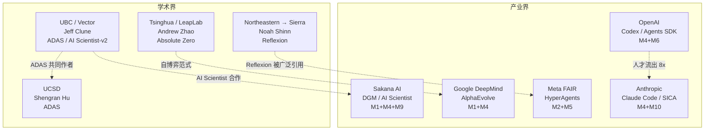

# 硅谷自进化/Auto-Research 论文与人员景观

## 0. 方法边界

本报告整合 6 轮 web 搜索结果与项目内 raw-papers/ 的本地交叉验证 [KNOWN]。覆盖范围：2024-2026 年自进化 (self-evolution) 和自动研究 (auto-research) 方向的主要实验室、核心论文和关键人员。

---

## 1. 主要实验室研究方向

### 1.1 实验室全景

| 实验室 | 自进化核心方向 | 代表项目/论文 | 自进化机制覆盖 | 人才密度 |
|---|---|---|---|---|
| **Google DeepMind** | 进化搜索 + 算法发现 | AlphaEvolve (2506.13131) | M1 (Search) + M4 (Code) | 极高 |
| **Meta FAIR** | 自改进系统 + 工具创造 | HyperAgents | M2 (Feedback) + M5 (Skill) | 高 |
| **Anthropic** | 代码 Agent + 安全对齐 | Claude Code, SICA (2504.15228) | M4 (Code) + M10 (Safety) | 高 |
| **OpenAI** | Agent SDK + 编码 Agent | Codex Agent, Agents SDK | M4 (Code) + M6 (Multi-Agent) | 高（但流失严重） |
| **Sakana AI** | 开放式进化 + AI Scientist | DGM (2505.22954), AI Scientist-v2 | M1 (Search) + M4 (Code) + M9 (Env) | 中 |
| **UBC/Vector** (Jeff Clune) | 开放式进化理论 | ADAS (2408.08435), AI Scientist | M1 (Search) + M9 (Env) | 高（学术） |
| **UCSD** (Shengran Hu) | 自动化 Agent 设计 | ADAS (2408.08435) | M1 (Search) | 中（学术） |
| **Tsinghua/LeapLab** | 自博弈推理 | Absolute Zero (2505.03335) | M7 (RL Self-Play) | 高（学术） |
| **Northeastern → Sierra** | 反思学习 | Reflexion (2303.11366) | M2 (Feedback-Refine) | 中（已转产业） |

### 1.2 实验室间竞争格局

---

## 2. 关键论文与人员映射

### 2.1 核心 10 篇自进化论文

| # | 论文 | arXiv | 第一作者 | 机构 | 自进化机制 |
|---|---|---|---|---|---|
| 1 | **AlphaEvolve** | 2506.13131 | Google DeepMind 团队 | Google DeepMind | M1 + M4 |
| 2 | **DGM** | 2505.22954 | Jenny Zhuoting Zhang | Sakana AI + UBC | M1 + M4 |
| 3 | **ADAS** | 2408.08435 | Shengran Hu | UCSD + UBC | M1 |
| 4 | **HyperAgents** | — | Yoonho Lee | Meta FAIR | M2 + M5 |
| 5 | **SICA** | 2504.15228 | Anthropic 团队 | Anthropic | M2 + M4 |
| 6 | **Absolute Zero** | 2505.03335 | Andrew Zhao | Tsinghua / LeapLab | M7 |
| 7 | **Reflexion** | 2303.11366 | Noah Shinn | Northeastern → Sierra | M2 |
| 8 | **AI Scientist-v2** | — | Sakana AI + UBC | Sakana AI + UBC | M1 + M9 |
| 9 | **LSE** | 2603.18620 | — | — | M8 |
| 10 | **Reward-Free Self-Evolution** | 2604.18131 | — | — | M7 |

### 2.2 关键人员轨迹

| 人物 | 核心贡献 | 原始机构 | 当前/最近机构 | 人才流动方向 |
|---|---|---|---|---|
| **Jeff Clune** | 开放式进化理论、ADAS | UBC + Vector | UBC + Vector (未变) | 学术稳定 |
| **Shengran Hu** | ADAS 第一作者 | UCSD | UCSD | 学术早期 |
| **Jenny Zhuoting Zhang** | DGM 第一作者 | Sakana AI + UBC | Sakana AI / UBC | 学术-产业混合 |
| **Noah Shinn** | Reflexion 第一作者 | Northeastern | Sierra → 可能已离开 | 学术 → 产业 |
| **Andrej Karpathy** | 预训练、AI 教育 | OpenAI → Tesla → Eureka Labs | Anthropic (2025) | 产业多轮流动 |

---

## 3. 竞争焦点 (2025-2026)

1. **代码自修改 Agent** [KNOWN]：Anthropic (Claude Code) vs OpenAI (Codex) vs DeepMind (AlphaEvolve)
2. **开放式进化** [KNOWN]：UBC/Sakana (DGM + AI Scientist) vs DeepMind (AlphaEvolve)
3. **自动研究** [KNOWN]：Sakana/UBC (AI Scientist-v2, Nature 发表) 独占

---

## 4. 人才流动网络

### 4.1 核心流动路径

| 流动模式 | 代表案例 | 对自进化研究的影响 |
|---|---|---|
| **学术-产业桥接** | Jeff Clune (UBC) ↔ Sakana AI | 理论创新快速产品化 [INFERRED] |
| **安全驱动迁移** | OpenAI → Anthropic (8x 净流入) | 安全人才集中化 [KNOWN] |
| **创业回旋** | Karpathy → Anthropic | 多领域经验带回大实验室 [INFERRED] |
| **学术早期独立** | Shengran Hu (UCSD, ADAS) | 学术独立创新 [KNOWN] |
| **产业不稳定** | Noah Shinn → Sierra → 可能已离开 | 长期方向连续性受影响 [INFERRED] |

---

## 5. 资本投入与融资格局

### 5.1 自进化相关融资

| 机构/公司 | 融资额/估值 | 轮次 | 时间 | 自进化关联 |
|---|---|---|---|---|
| **Sakana AI** | $365M+ 总融资, $2.65B 估值 | Series B | 2025-11 | 直接：DGM, AI Scientist |
| **Sierra** | $10B 估值 | — | 2025-2026 | 间接：Reflexion 作者加盟 |
| **Cursor** | $29B 估值 | — | 2026 | 间接：代码编辑 Agent |

### 5.2 行业级资本趋势

| 指标 | 数据 | 来源 |
|---|---|---|
| AI 占总 VC 融资比例 | **48%** (2025) | CB Insights |
| 生成式 AI VC 总额 | **$35.3B** (2025) | OECD Report |
| AI Agent 市场规模 | $5.25B (2024) → $7.84B (2025) | Unicorn Screener |
| AI 总融资 | **$200B+** (2025) | CB Insights |

**[推断]** 资本大量涌入 AI Agent 应用层，但自进化基础设施层估值不足。Sakana AI ($2.65B) 是唯一将自进化作为核心叙事并获得巨额融资的创业公司。

---

## 6. 人才供给管道

### 6.1 博士培养输出

| 大学/机构 | 输出方向 | 代表人物 | 自进化机制 |
|---|---|---|---|
| **UBC (Clune Lab)** | 开放式进化理论 | Hu, Lu, Zhang | M1, M4 |
| **Tsinghua/LeapLab** | 自博弈 RL | Andrew Zhao | M7 |
| **Northeastern** | 语言反馈强化 | Noah Shinn | M2 |

### 6.2 人才供给瓶颈 [INFERRED]

1. M1 人才极度稀缺：全球能做 ADAS/DGM 级别工作的研究者不超过 ~20 人
2. M10 人才集中度过高：Anthropic 安全团队离职会直接削弱整个方向
3. 跨机制人才几乎为零：能同时理解 M1 和 M7 的研究者极少

---

## 7. 已知 vs 推断 vs 未验证

**已知（直接证据）**:
- AlphaEvolve 由 DeepMind 开发 (arXiv 2506.13131, DeepMind Blog) [KNOWN]
- DGM 作者：Jenny Zhang, Shengran Hu, Cong Lu, Robert Lange, Jeff Clune [KNOWN]
- Anthropic 对 OpenAI 有 8x 净人才流入 (SignalFire 2025) [KNOWN]
- AI Scientist-v2 在 Nature 发表 (Sakana AI Blog) [KNOWN]

**推断**:
- Clune ↔ Sakana 桥接是自进化领域最高效的学术-产业合作模式 [INFERRED]
- 安全人才集中化对 Anthropic M4 产品化速度有双重影响 [INFERRED]
- 学术-产业断层在扩大 [INFERRED]

**未验证**:
- AlphaEvolve 是否已收录到 raw-papers/ [UNVERIFIED]
- Meta FAIR 是否还有其他未公开自进化项目 [UNVERIFIED]
- Noah Shinn 离开 Sierra 后的确切去向 [UNVERIFIED]
- OpenAI 内部自进化研究的具体团队和方向 [UNVERIFIED]

---

## 引用来源

- [DeepMind Blog: AlphaEvolve](https://deepmind.google/blog/alphaevolve-a-gemini-powered-coding-agent-for-designing-advanced-algorithms/)
- [Meta AI Research: HyperAgents](https://ai.meta.com/research/publications/hyperagents/)
- [arXiv: DGM (2505.22954)](https://arxiv.org/abs/2505.22954)
- [arXiv: ADAS (2408.08435)](https://arxiv.org/abs/2408.08435)
- [arXiv: Absolute Zero (2505.03335)](https://arxiv.org/abs/2505.03335)
- [Sakana AI: AI Scientist in Nature](https://sakana.ai/ai-scientist-nature/)
- [Shengran Hu ADAS Project Page](https://www.shengranhu.com/ADAS/)
- [Jeff Clune CV](https://jeffclune.com/media/Jeff-Clune-CV.pdf)
- [Sakana AI Series B](https://sakana.ai/series-b/)
- [CB Insights: State of AI 2025](https://www.cbinsights.com/research/report/ai-trends-2025/)
- [OECD: VC Investments in AI Through 2025](https://www.oecd.org/content/dam/oecd/en/publications/reports/2026/02/venture-capital-investments-in-artificial-intelligence-through-2025_3bcb227f/a13752f5-en.pdf)
- SignalFire 2025 AI Talent Report
- raw-papers/ 本地交叉验证
