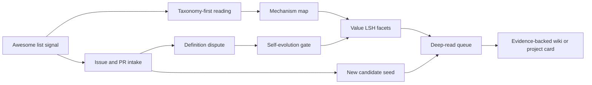

# Awesome-Self-Evolving-Agents Collaboration Learning

## Layered Compression

**1 sentence:** Learn its collaboration and taxonomy logic, not its list contents: use it as a source-router and definition stress test for our value LSH pipeline.

**3 sentences:** EvoAgentX/Awesome-Self-Evolving-Agents is strongest as a public coordination surface: visual taxonomy first, then curated sections, then community issue/PR intake. Its weakness is also instructive: community suggestions expose definition disputes about whether an item is genuinely self-evolving, so the list cannot be treated as proof by itself. Our adaptation should be a rubric-driven intake path that maps suggestions into time, mechanism, evidence, implementation, continuity, and empirical-value facets before deep read.

**5 sentences:** This page is a learning note, not a copied catalog. The repo's structure teaches an ordering pattern: show the evolution map before individual resources, so readers know why each item belongs. Its issues and PRs show how a community list becomes a discovery funnel, but also how weak inclusion criteria can accumulate borderline work. For our pipeline, every awesome-list signal should enter as a candidate seed with low proof weight until raw source, implementation, issue/resource, and benchmark evidence are checked. The durable lesson is to turn collaboration energy into a typed intake queue, not to import another project's taxonomy or ordering.

## Evidence Chain

- [KNOWN] Local raw capture records the repository as `evoagentx/awesome-self-evolving-agents`, with source URL, `content_timestamp: 2026-05-21`, and a README organized around framework, single-agent optimization, multi-agent optimization, domain-specific optimization, and evaluation sections. Source: `raw-github/evoagentx_awesome-self-evolving-agents.md`.
- [KNOWN] The existing project card already classifies it as a survey/resource index rather than runnable code, and summarizes its taxonomy around single-agent, multi-agent, domain-specific optimization, and evaluation. Source: `projects/41-awesome-self-evolving.md`.
- [KNOWN] Our methodology guide already used this list for implementation snowballing, e.g. `EvoAgentX -> Awesome-Self-Evolving-Agents list -> CharlesQ9/Self-Evolving-Agents`. Source: `research/survey-methodology-guide.md`.
- [KNOWN] The current value repair queue marks `github:evoagentx/awesome-self-evolving-agents` as a high-value candidate with `value_score: 74.84`, lane `deep-read-needed`, and gaps around deep report, frontier queue, implementation clarity, and evidence chain. Source: `analysis/value-evidence-repair-queue.json`.
- [KNOWN] Live GitHub API review on 2026-06-02 showed the repo is still recently active: created 2025-05-08, pushed 2026-05-16, updated 2026-06-01, with 2193 stars, 159 forks, 24 watchers, 30 issues, 10 pull requests, MIT license, README/assets/LICENSE only, and no issue or pull-request templates. Source: GitHub repo metadata and contents API.
- [KNOWN] Recent commits are mostly merged contribution intake, including #32 ReasoningBank, #42 Live-SWE-agent, #54 CORAL, and #45 AIDE around 2026-05-16. Source: GitHub commits API.
- [KNOWN] Live issue/PR list review on 2026-06-02 showed many community requests to add new works, including a definition challenge in issue #37, open 2026 suggestions such as #51 AutoSearch, and a recent open PR #60 proposing empirical-analysis additions. Source: GitHub issues and PRs.

## Mirror Chain



## What To Learn

1. **Taxonomy before inventory.** The valuable move is not the resource list; it is the cognitive map that lets readers locate each work by mechanism. Our equivalent should be `mechanism taxonomy x evidence maturity x recency`, then entries.

2. **Visual map before detail.** Their README uses framework/path/tree visuals as first-navigation. Our public surface and wiki should similarly show a map before asking readers to read hundreds of rows.

3. **Community intake is a signal stream.** Open issues and PRs are not just maintenance overhead; they are a live radar for new papers, repos, disputed categories, and missing empirical dimensions.

4. **Definition disputes are high-value evidence.** Issue #37-style disagreement is exactly the material our `Self-Evolution Definition Criteria` should absorb: candidate items must pass change-object, feedback, candidate-generation, validation, retention, and audit gates before being promoted.

5. **Empirical analysis is the maturity jump.** PR #60-style movement toward empirical analysis shows the next stage after curation: compare claims against benchmark, reproduction, adoption, issue history, and implementation evidence.

6. **An awesome list is a seed, not proof.** A curated entry should increase discovery priority, but should not by itself raise implementation confidence or self-evolution confidence.

7. **No templates means weak governance.** The repo has active collaboration but lacks visible issue/PR templates; our pipeline can improve on this by turning every suggestion into a typed intake record with required evidence fields.

## 可迁移协作经验

**一句话:** 把别人的 awesome list 当作候选源和协作雷达，不当作价值结论。

**三句话:** 它的强点是先给读者一张机制地图，再让社区通过 issue/PR 补充候选。它的风险是纳入标准会被社区热情稀释，所以每个新条目都要先过 definition gate 和 evidence gate。我们要学的是协作入口、分类组织、争议吸收和 empirical matrix 的升级路径，不学它的条目顺序、表述和资产。

**落地到本仓库:**

| 学到的动作 | 我们的转化方式 | 避免的问题 |
|---|---|---|
| 先给 evolution map，再给列表 | README/网站/wiki 先展示机制图、时间轴和证据成熟度 | 读者只看到链接堆 |
| issue/PR 作为候选入口 | 每个建议进入 typed intake record，再进入 value LSH | 热门建议直接污染 ranking |
| 定义争议公开暴露 | 把争议映射到 `Self-Evolution Definition Criteria` 六个 gate | 把普通 agent workflow 误判为自进化 |
| empirical analysis PR 代表成熟阶段 | 在 matrix 中区分 benchmark/reproduction/adoption/user-report | awesome entry 被当成 proof |
| 没有模板也能协作，但治理弱 | 我们自己的入口要求时间、机制、代码、benchmark、issue/resource 字段 | 后续 agent 无法比较和追溯 |

## Value LSH Facets To Add Or Emphasize

| Facet | Signal | Suggested value |
|---|---|---:|
| `taxonomy_first` | Provides a coherent map before entries | +1 |
| `community_intake_active` | Issues/PRs continuously propose additions | +1 |
| `definition_dispute_present` | Debate about whether items truly self-evolve | +1 for review priority |
| `empirical_matrix_present` | Benchmarks/comparisons included, not just links | 0 now, +1 when merged/verified |
| `implementation_runnable` | Runnable code, tests, package layout | -1 for this repo itself |
| `source_router_value` | Helps discover downstream papers/repos | +1 |
| `proof_weight` | Can support final claims without downstream verification | -1 |

## What Not To Copy

- Do not import its entries, ordering, badges, assets, or README wording into this repository.
- Do not treat its categories as final truth; map them into our own mechanism and evidence schema.
- Do not treat star count as current value; keep star history as an adoption prior and use recent activity plus evidence coverage for ranking.
- Do not close the `implementation_unclear` gap by saying the awesome list is useful. For this repo, the correct classification is source-router/resource-index; runnable implementation evidence must come from downstream projects such as EvoAgentX or individual candidate repos.

## Pipeline Adaptation

For future community or awesome-list derived materials, use this intake skeleton before adding them to high-value clusters:

```yaml
candidate:
  source_type: awesome-list-seed | issue-suggestion | pr-suggestion | paper | repo
  proposed_item: ""
  source_router: ""
  proposed_mechanism_class: ""
  publication_or_activity_date: ""
  self_evolution_gate:
    change_object: unknown
    feedback_signal: unknown
    candidate_generation: unknown
    validation: unknown
    retention: unknown
    audit_or_rollback: unknown
  evidence:
    paper: missing
    code: missing
    runnable_entrypoint: missing
    benchmark_or_eval: missing
    issues_or_user_reports: missing
  lsh_facets:
    recency: 0
    continuity: 0
    implementation_depth: 0
    empirical_strength: 0
    taxonomy_router_value: 1
    proof_weight: -1
  action: reject | keep_as_seed | deep_read | promote_to_model_card
```

## Bottom Line

The experience worth preserving is this: community curation should become a structured comparison engine. EvoAgentX/Awesome-Self-Evolving-Agents teaches how to make a readable field map and attract additions; our improvement is to attach every addition to value facets, definition gates, and evidence chains before it affects rankings.
