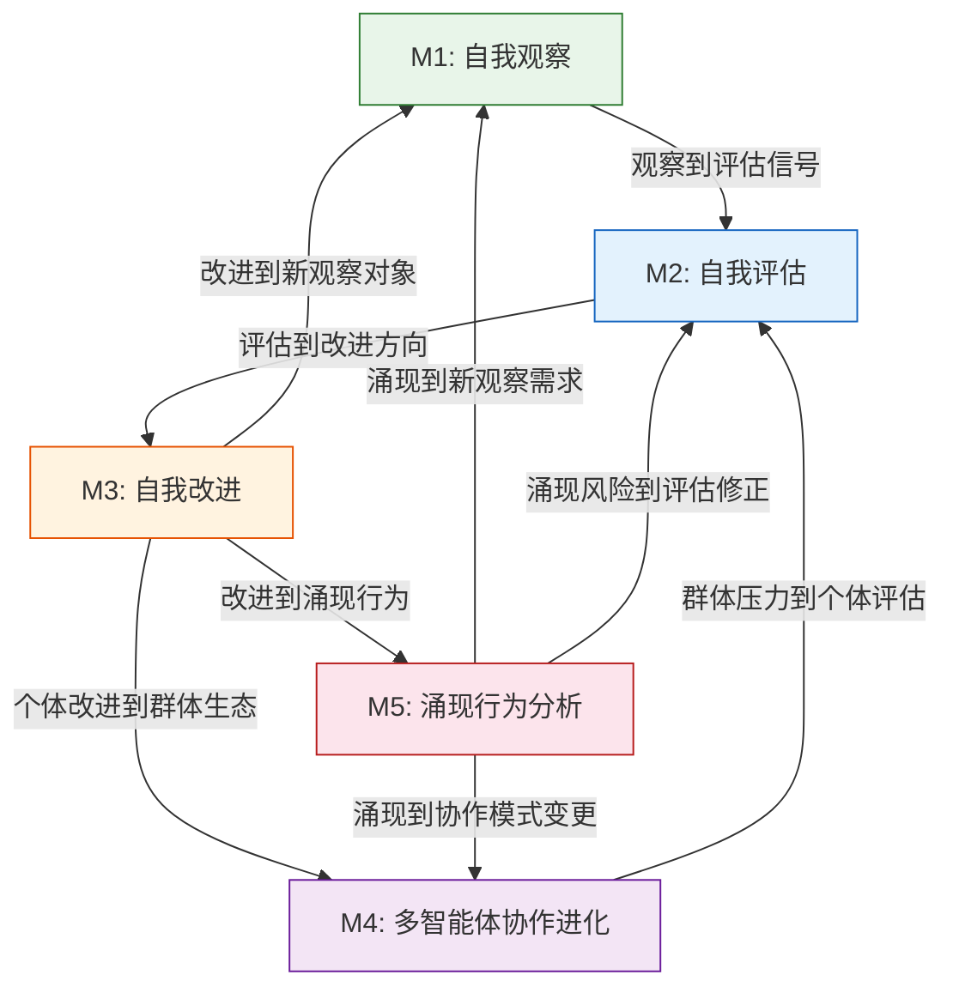

# Agent进化机制分析框架

> 五大机制维度的统一坐标系统，为survey深挖和下游任务提供分析骨架。
> Source: work/research/mechanism-analysis-framework.md (L1产出)

## 全景DAG

## 五大维度概览

| 机制 | 核心问题 | 子机制数 | 概念页 |
|---|---|---|---|
| M1 自我观察 | Agent如何感知自身行为？ | 4 | [[self-observation]] |
| M2 自我评估 | Agent如何度量行为质量？ | 5 | [[self-evaluation]] |
| M3 自我改进 | Agent如何改变自身？ | 5 | [[self-improvement]] |
| M4 多智能体协作进化 | 多Agent如何共同进化？ | 5 | [[multi-agent-coevolution]] |
| M5 涌现行为分析 | 进化中涌现了什么？ | 5 | [[emergent-behavior]] |

## 系统覆盖矩阵

| 系统 | M1 | M2 | M3 | M4 | M5 |
|---|---|---|---|---|---|
| DGM | 轨迹+代码 | Benchmark | 代码自修改 | Archive生态 | Stepping stones |
| ADAS | 架构记录 | 多benchmark | 架构搜索 | Meta Agent | 设计迁移 |
| AlphaEvolve | 程序数据库 | 自动evaluator | 代码diff | 间接 | 算法发现 |
| Voyager | 环境状态 | 环境反馈 | 技能库 | 单agent | 技能迁移 |
| Reflexion | 行为轨迹 | 外部+自评 | 反思记忆 | 单agent | 策略漂移 |
| Self-Rewarding | 输出文本 | LLM-as-Judge | 权重更新 | 单模型 | 评价器漂移 |
| RAGEN | 轨迹记录 | 环境reward | 策略RL | 单agent | Echo Trap |
| EvoMAC | 协作轨迹 | 自动+人工 | 网络拓扑 | 多agent网络 | 结构涌现 |

## 97痛点映射

| 机制 | 数量 | 痛点ID |
|---|---|---|
| M1 | 11 | P003, P011, P013, P015, P024, P053, P066, P068, P074, P078, P091 |
| M2 | 19 | P008, P010, P016, P017, P021, P022, P031, P040, P054, P058, P060, P062, P067, P070, P075, P082, P083, P088, P092 |
| M3 | 26 | P002, P006, P009, P018, P019, P020, P030, P032, P033, P041, P042, P044, P047, P049, P052, P055, P056, P057, P061, P064, P076, P080, P084, P085, P089, P096 |
| M4 | 19 | P004, P005, P012, P014, P025, P029, P034, P036, P037, P039, P046, P050, P065, P073, P077, P079, P093, P095, P097 |
| M5 | 21 | P001, P007, P023, P026, P027, P028, P035, P038, P043, P045, P048, P051, P059, P063, P069, P071, P072, P081, P086, P090, P094 |

## Cross-references
- [[self-observation]] — M1 概念页
- [[self-evaluation]] — M2 概念页
- [[self-improvement]] — M3 概念页
- [[multi-agent-coevolution]] — M4 概念页
- [[emergent-behavior]] — M5 概念页
