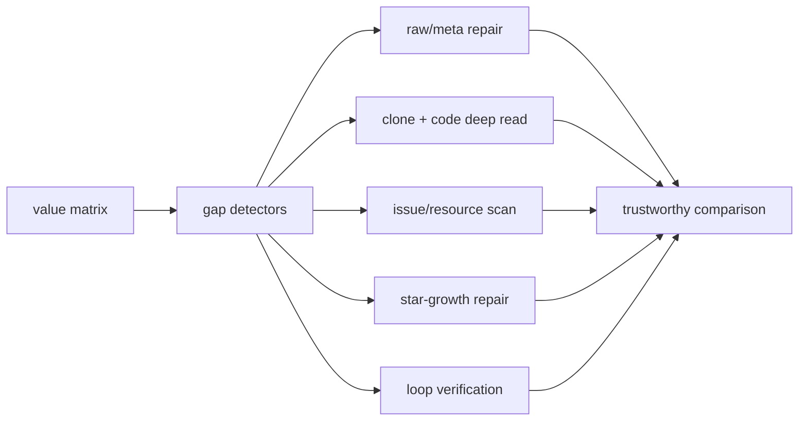

# Value Evidence Repair Queue

> Value-LSH 已经不只是排名：它现在能指出哪些 GitHub 项目因为 raw/meta、deep report、issue/resource、star-growth 或 loop evidence 缺口而不能被放心比较。

## One Sentence

[CLAIM] 当前 repair queue 从 704 个 GitHub rows 中找出 672 个仍有证据修复动作的项目，并把它们分到 raw-meta-repair、deep-read-needed、issue-resource-scan、star-growth-repair、loop-verification。 — Source: `analysis/value-evidence-repair-queue.json`

## Three Sentences

[CLAIM] 最大缺口是 `deep-read-needed`：456 个 GitHub 项目缺少 clone/code deep read 后形成的 model-card/public report。 — Source: `analysis/value-evidence-repair-queue.json`

[CLAIM] 52 个项目缺 raw/meta capture，7 个项目缺 star-growth coverage，323 个项目 issue/resource signal 仍不清楚。 — Source: `analysis/value-evidence-repair-queue.json`

[CLAIM] repair score 是行动优先级，不是质量分；它的作用是把高价值或高矛盾项目推到“补证据”队列前面。 — Source: `analysis/value-evidence-repair-queue.md`

## Flow

## Current Lane Counts

| Lane | Count | Meaning |
|---|---:|---|
| `deep-read-needed` | 456 | clone/read code and create model-card style deep report |
| `issue-resource-scan` | 128 | scan GitHub issues, releases, discussions, PRs, linked resources |
| `raw-meta-repair` | 52 | create or repair raw GitHub capture with complete metadata |
| `loop-verification` | 35 | verify mutable artifact, feedback, verifier, retention, rollback |
| `star-growth-repair` | 1 | fetch/rebuild 2026 stargazer history coverage |

## Trust Chain

- [KNOWN] Queue input is generated value matrix rows, not live GitHub claims. Source: `data-engine/value-lsh-index/value-matrix.jsonl`.
- [KNOWN] The queue records concrete next actions per gap. Source: `analysis/value-evidence-repair-queue.json`.
- [INFERRED] A high repair score means high action priority, not final value quality.
- [UNVERIFIED] Live issue/release/code conclusions remain unverified until the repair action is actually executed.
