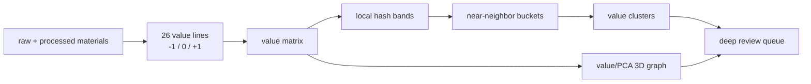

# Value LSH Index

> 2219 个去重后素材已经被同一套 `-1/0/+1` value lines 遍历，形成可复跑的局部哈希索引、风险队列和 3D 映射入口。

## One Sentence

[CLAIM] Value LSH 把“谁有价值、谁没有价值”的问题变成 26 条 value lines 上的离散比较，然后用 LSH buckets 找近邻、用 evidence refs 保持可追溯。 — Source: `analysis/value-lsh-index.md`

## Three Sentences

[CLAIM] 当前全量运行扫描 2219 条去重后材料：717 GitHub、197 papers、650 social/X、655 blogs。 — Source: `analysis/value-lsh-index.json`

[CLAIM] 结果分为 856 个 `high-value-candidate`、1066 个 `needs-review`、297 个 `low-signal-or-risk`；low-signal 表示当前优先级证据弱或风险多，不等于永久无价值。 — Source: `analysis/value-lsh-index.json`

[CLAIM] 同一矩阵还生成 168 个 LSH buckets、3 个 LSH value clusters，以及 2219 节点的 value/PCA 3D graph。 — Source: `analysis/value-lsh-index.json`; `analysis/value-lsh-graph-3d.json`

## Flow

## Current Boundaries

`raw-social-rank` is a ranked seed subset, not a second corpus. Matching files are folded into canonical `raw-social` rows through `rank_seed` evidence refs, so the current run gives each social material one vote while preserving the seed signal.

| Class | Meaning |
|---|---|
| `high-value-candidate` | Score >= 68 and no more than one negative contribution line. |
| `needs-review` | Mixed evidence; keep in comparison pool rather than promote or discard. |
| `low-signal-or-risk` | Score <= 58 or at least three negative contribution lines; use as deprioritization / evidence-repair queue. |

## Useful Next Queries

1. Inspect `analysis/value-lsh-index.md` for the top candidates and risk queue.
2. Use `data-engine/value-lsh-index/value-matrix.csv` for spreadsheet-level facet comparison.
3. Use `data-engine/value-lsh-index/signatures.jsonl` and `buckets.json` to answer “what else looks locally like this item?”
4. Use `analysis/value-lsh-graph-3d.json` for visualization or gbrain-style graph ingestion.

## Trust Chain

- [KNOWN] Raw layers were read but not edited. Source: `scripts/build_value_lsh_index.mjs`.
- [KNOWN] The generated matrix preserves source paths and evidence refs per material. Source: `data-engine/value-lsh-index/value-matrix.jsonl`.
- [INFERRED] The first value lines are heuristic separators and should be calibrated with false positives, false negatives, Mom Test facets, issue/resource scans, and code-level evidence.
- [UNVERIFIED] Live GitHub issue/release scans and remote repo code inspection are not yet part of this run unless already present in local processed inputs.
